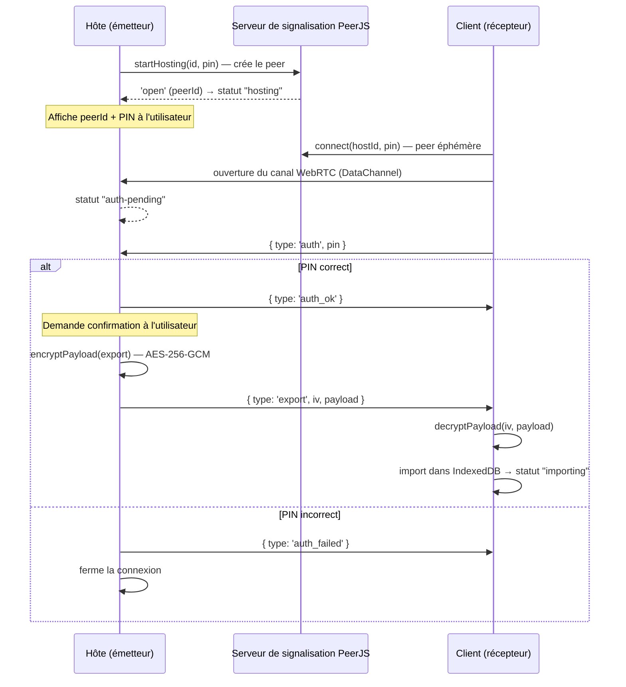

# ADR 0002 — Synchronisation P2P chiffrée (PeerJS + AES-GCM)

- **Statut** : Accepté
- **Date** : 2026-06-29

## Contexte

Locapilot est offline-first et sans backend ([ADR 0001](./0001-offline-first-indexeddb.md)).
Un utilisateur peut néanmoins vouloir **transférer ses données d'un appareil à un
autre** (migration vers un nouveau téléphone, copie poste fixe → mobile). Sans
serveur central pour héberger ces données, il faut un mécanisme de transfert
**direct entre les deux appareils**, sécurisé, et qui ne fait transiter aucune
donnée en clair par un tiers.

Contraintes :

- Pas de stockage des données sur un serveur tiers.
- Données sensibles → chiffrement de bout en bout pendant le transfert.
- Appairage simple pour un utilisateur non technique.

## Décision

Mettre en place une **synchronisation pair-à-pair via WebRTC**, à l'aide de la
bibliothèque **PeerJS**, avec :

- un **appairage par code PIN** (l'appareil hôte affiche un identifiant + un PIN,
  le client les saisit) ;
- un **chiffrement applicatif AES-256-GCM** du payload transféré, en plus du
  chiffrement de transport WebRTC.

La clé AES est dérivée par **HKDF-SHA-256** à partir d'une graine
`locapilot:${APP_VERSION}:${BUILD_SECRET_KEY}`. Le `BUILD_SECRET_KEY` est injecté
au build (voir « Gestion du secret » ci-dessous), garantissant que seules deux
instances issues du **même déploiement** peuvent se déchiffrer mutuellement.

Implémentation : [`PeerSyncService`](../../src/features/settings/services/peerSyncService.ts).

### Flux d'appairage et de transfert



### Machine à états (`PeerStatus`)

`idle → creating → hosting → client-connected → connection-open → auth-pending →
auth-ok | auth-failed`, côté client : `connected → connection-open →
auth-pending → auth-ok → importing`. États transverses : `warning`, `error`,
`stopped`.

### Chiffrement

```typescript
// Graine = nom de l'app + version + secret de build
const seed = `${APP_NAME}:${APP_VERSION}:${BUILD_SECRET_KEY}`;
// HKDF-SHA-256 → clé AES-256-GCM, IV aléatoire de 12 octets par message
```

L'hôte ne répond à l'appairage que pour **une seule** connexion à la fois ; toute
connexion concurrente est rejetée.

### Gestion du secret de build (`BUILD_SECRET_KEY`)

- Injecté par Vite via `define: { __BUILD_SECRET_KEY__ }` (voir
  [`vite.config.ts`](../../vite.config.ts)).
- **Fail-fast** : un build de production sans `BUILD_SECRET_KEY` échoue
  (`process.exit(1)`), pour éviter qu'une clé vide soit partagée par toutes les
  instances (issue #58).
- Fourni en CI via le secret de dépôt
  `Settings > Secrets and variables > Actions > BUILD_SECRET_KEY`.

## Alternatives envisagées

- **Serveur de synchronisation central** — rejeté : contredit le choix sans
  backend, centralise des données sensibles, coût/maintenance.
- **Export/import de fichier manuel uniquement** — conservé en complément (le
  store `dataTransfer` gère la sauvegarde/restauration de fichier avec `Blob`),
  mais l'expérience appareil-à-appareil directe justifie le P2P.
- **WebRTC brut** — rejeté : PeerJS encapsule la signalisation et la gestion des
  `DataChannel`, réduisant fortement le code à maintenir.

## Conséquences

### Positives

- Transfert direct entre appareils, sans stockage des données chez un tiers.
- Double chiffrement (transport WebRTC + AES-GCM applicatif).
- Appairage simple par PIN pour l'utilisateur final.

### Négatives / compromis

- **Dépendance à un serveur de signalisation** PeerJS pour l'établissement de la
  connexion (il ne voit jamais les données, seulement les métadonnées de
  rendez-vous). Une connectivité réseau est donc requise _pour cette étape_.
- Le partage du `BUILD_SECRET_KEY` au sein d'un même déploiement signifie que la
  confidentialité repose sur le secret du build **et** le PIN d'appairage, pas
  sur une clé par-paire négociée dynamiquement.
- WebRTC peut être bloqué par certains pare-feux/NAT restrictifs (pas de serveur
  TURN configuré).

## Références

- [`src/features/settings/services/peerSyncService.ts`](../../src/features/settings/services/peerSyncService.ts)
- [`src/features/settings/views/SettingsView.vue`](../../src/features/settings/views/SettingsView.vue)
- [`vite.config.ts`](../../vite.config.ts) — injection et fail-fast du `BUILD_SECRET_KEY`
- Specs : [`specs/data-transfer.md`](../../specs/data-transfer.md)
- Issue #58 (fail-fast `BUILD_SECRET_KEY`)
