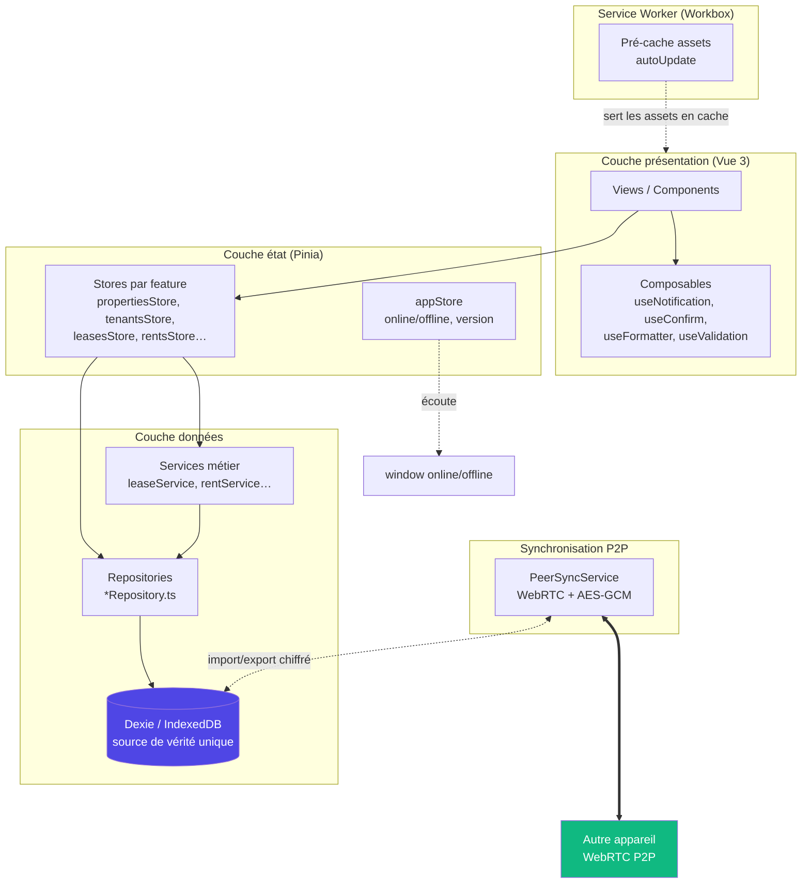

# Architecture

Locapilot est une **Progressive Web App offline-first** : aucun backend, toutes
les données vivent dans le navigateur (IndexedDB). L'application reste 100 %
fonctionnelle hors ligne ; l'échange de données entre deux appareils se fait via
un canal pair-à-pair (P2P) chiffré, sans serveur intermédiaire qui stockerait
les données.

## Stack technique

| Domaine       | Technologie                               | Version    |
| ------------- | ----------------------------------------- | ---------- |
| Framework UI  | Vue 3 (Composition API, `<script setup>`) | 3.5        |
| Langage       | TypeScript (strict)                       | 5.9        |
| Build / dev   | Vite                                      | 8.x        |
| PWA / cache   | `vite-plugin-pwa` + Workbox               | 1.3 / 7.4  |
| État          | Pinia                                     | 3.0        |
| Routing       | Vue Router                                | 4.6        |
| Persistance   | Dexie.js (IndexedDB)                      | 4.2        |
| Composants UI | PrimeVue                                  | 4.4        |
| Validation    | Zod                                       | 4.1        |
| Synchro P2P   | PeerJS (WebRTC)                           | 1.5        |
| Tests         | Vitest + Playwright                       | 4.1 / 1.56 |

## Vue en couches

L'application suit une architecture **feature-based** où chaque module métier
(`properties`, `tenants`, `leases`, `rents`, `documents`, `inventories`,
`dashboard`, `settings`) est isolé et structuré de la même façon. Le flux de
données est **unidirectionnel** : un composant déclenche une action du store, le
store appelle le repository, le repository accède à Dexie.



### Responsabilité des couches

- **Views / Components** : affichage et interactions. Aucune logique d'accès
  direct à la base de données.
- **Composables** : logique transverse réutilisable (notifications, dialogues
  de confirmation, formatage, validation Zod).
- **Stores Pinia** : état réactif par feature + orchestration des actions. Le
  store `appStore` (global) suit l'état réseau (`isOnline`) et la version de
  l'app.
- **Repositories** : seul point d'accès à Dexie pour une feature. Garde les
  stores testables (on mocke le repository).
- **Services métier** : logique applicative complexe (ex. cascade de
  résiliation d'un bail, génération automatique des loyers).
- **Dexie / IndexedDB** : **source de vérité unique**. Pas de contraintes de
  clés étrangères ; les jointures sont faites manuellement (`bulkGet`).

## Initialisation de l'application

`src/main.ts` orchestre le démarrage :

1. `initializeDatabase()` — ouvre IndexedDB et applique les migrations Dexie en
   attente (voir [migrations-dexie.md](./migrations-dexie.md)).
2. Création de l'app Vue + Pinia + Vue Router + PrimeVue.
3. `appStore.initializeNetworkListeners()` — branche les écouteurs
   `window.online` / `window.offline`.
4. En développement uniquement : `seedDemoData()` injecte un jeu de données.

## Frontière PWA / hors ligne

- Le Service Worker (configuré dans [`vite.config.ts`](../vite.config.ts)) est
  généré par Workbox en mode `registerType: 'autoUpdate'`.
- Stratégie de pré-cache : `globPatterns: ['**/*.{js,css,html,ico,png,svg,woff2}']`,
  avec `cleanupOutdatedCaches` et `clientsClaim`.
- Le composant `PWAUpdatePrompt.vue` (via `virtual:pwa-register/vue`) propose à
  l'utilisateur de recharger quand une nouvelle version est disponible
  (`onNeedRefresh`).
- Base path en production : `/locapilot/`.
- Décision détaillée : [ADR 0004](./adr/0004-pwa-service-worker-workbox.md).

## Canal de synchronisation P2P

L'échange de données entre deux appareils repose sur **PeerJS (WebRTC)** avec un
appairage par code PIN et un chiffrement **AES-256-GCM** dont la clé est dérivée
du `BUILD_SECRET_KEY` de déploiement. Détails et schéma de séquence :
[ADR 0002](./adr/0002-synchronisation-p2p-chiffree.md).

## Arborescence `src/`

```
src/
├── core/            # Infrastructure globale (layout, router, appStore, vues globales)
├── db/              # Couche données Dexie
│   ├── schema.ts        # Classe LocapilotDB, versions du schéma, types
│   ├── database.ts      # Ré-export de l'instance `db`
│   ├── migrations.ts    # Helpers de migration (historique, logging)
│   └── seed.ts          # Données de démo (DEV)
├── features/        # Modules métier (stores / repositories / services / views / components)
└── shared/          # Composants UI, composables, utils, styles partagés
```

Chaque feature suit le même pattern :

```
features/<feature>/
├── stores/          # defineStore('<feature>')
├── repositories/    # accès Dexie (*Repository.ts)
├── services/        # logique métier (optionnel)
├── views/           # pages
└── components/       # composants spécifiques
```
