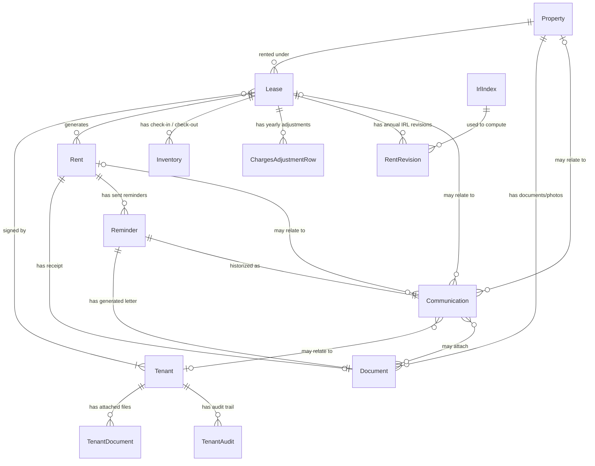
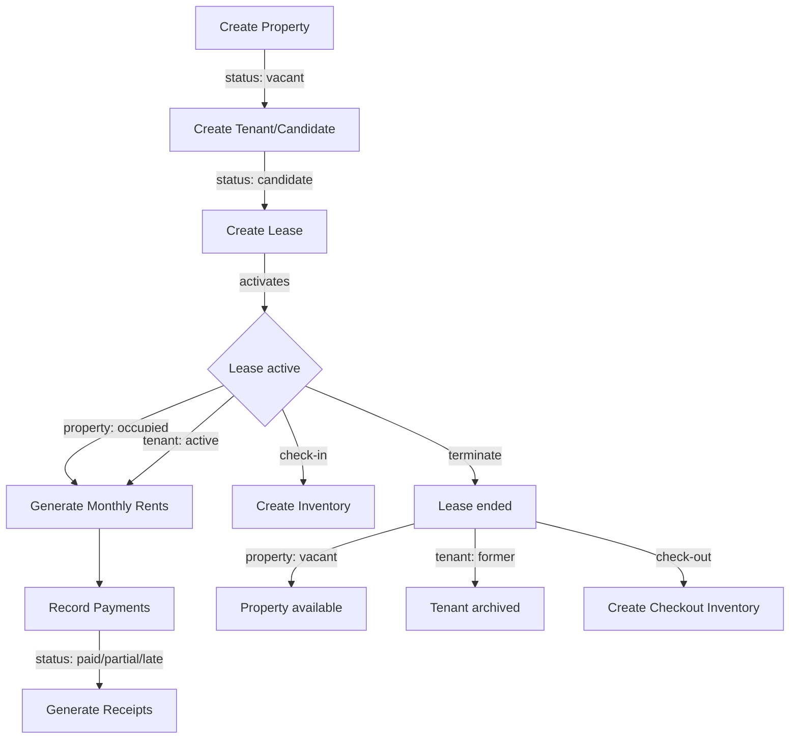

# Locapilot — Functional Specifications Index

This directory contains the functional specifications for all domains of the Locapilot property management application. Each file covers one domain with an overview, data model, business rules, Mermaid diagrams, and exhaustive Gherkin user stories and scenarios.

## Domains

| Domain         | File                                     | Description                                              |
| -------------- | ---------------------------------------- | -------------------------------------------------------- |
| Properties     | [properties.md](./properties.md)         | Real estate assets, statuses, photos, announcements      |
| Tenants        | [tenants.md](./tenants.md)               | Tenant profiles, candidacy workflow, audit trail         |
| Leases         | [leases.md](./leases.md)                 | Rental contracts, lifecycle, charges adjustments         |
| Indexation     | [indexation.md](./indexation.md)         | Annual IRL rent revision, quarterly indices, letters     |
| Rents          | [rents.md](./rents.md)                   | Monthly payments, auto-generation, overdue tracking      |
| Reminders      | [reminders.md](./reminders.md)           | Automated rent-arrears follow-up letters and escalation  |
| Communications | [communications.md](./communications.md) | Journal of exchanges and generated letters per entity    |
| Documents      | [documents.md](./documents.md)           | File attachments for all entities                        |
| Inventories    | [inventories.md](./inventories.md)       | Check-in / check-out property inspections                |
| Dashboard      | [dashboard.md](./dashboard.md)           | Portfolio overview and activity summary                  |
| Settings       | [settings.md](./settings.md)             | Application configuration                                |
| Data Transfer  | [data-transfer.md](./data-transfer.md)   | Backup export and restore import                         |
| Error Handling | [error-handling.md](./error-handling.md) | Global error capture, error boundary, structured logging |

## Entity Relationships

## Core Lifecycle Flow

## Maintenance Rule

**Any functional change or bug fix must update the corresponding spec file.**
See CLAUDE.md for the full spec maintenance protocol.
