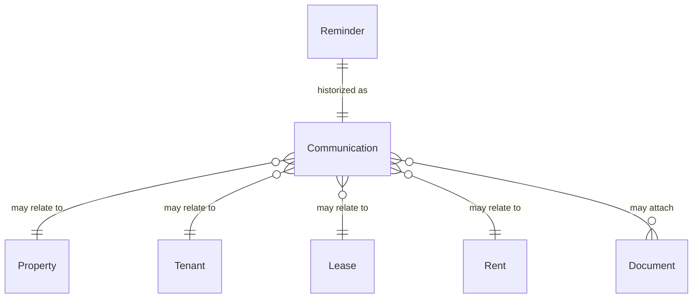

# Communications Specifications

## Overview

The **communications** module is the landlord's single, chronological journal of every exchange and
generated correspondence tied to a tenant, a lease, a property, an applicant, or a rent. The
`communications` table has existed in the database since migration v1 and is already written to by the
[Reminders module](./reminders.md) (each reminder letter is historized as an outbound `letter`
communication) and populated by the seed data — but until this module it had **no dedicated UI, list
view, or manual-entry workflow**. This module surfaces that data and lets the landlord read, filter,
and manually log communications.

Because Locapilot is a fully offline, backend-less PWA, this module does **not** send emails, SMS, or
letters over any network. It is a **journal / history**: outbound items are either (a) generated
elsewhere in the app (reminder letters, IRL revision letters, rent receipts) and automatically logged,
or (b) manually recorded by the landlord to keep a trace of a phone call, meeting, e-mail, or letter
that happened outside the app.

This module is the shared foundation ("F5") referenced by the reminders/notice workflow: any future
letter-generating feature historizes its output here so the landlord has one place to see the full
communication timeline of a tenant or lease.

## Data Model

### Communication

| Field               | Type     | Description                                                                                   |
| ------------------- | -------- | --------------------------------------------------------------------------------------------- |
| `id`                | number   | Auto-generated primary key                                                                    |
| `relatedEntityType` | enum     | `property` \| `tenant` \| `lease` \| `applicant` \| `rent` — the entity the exchange is about |
| `relatedEntityId`   | number   | Id of the related entity                                                                      |
| `type`              | enum     | `email` \| `phone` \| `sms` \| `meeting` \| `letter` — channel of the exchange                |
| `direction`         | enum     | `inbound` (received from tenant/candidate) \| `outbound` (sent by landlord)                   |
| `subject`           | string   | Optional short subject / title                                                                |
| `content`           | string   | Free-text body / notes describing the exchange                                                |
| `date`              | Date     | Date (and optionally time) the exchange took place                                            |
| `attachments`       | number[] | Optional list of `Document` ids attached to the communication                                 |
| `createdAt`         | Date     | Record creation timestamp                                                                     |

Indexed on `id` (auto), `relatedEntityType`, `relatedEntityId`, `date`, and `type`.

There are **no foreign-key constraints** in IndexedDB: resolving the related entity label and the
attachment names requires manual joins with `bulkGet()`.

### Relationships



## Business Rules

- A communication is **immutable-by-convention for auto-generated entries**: entries created by the
  reminders module (or other letter generators) are logged automatically and should not be manually
  editable, only manual entries may be edited or deleted.
- `date` may be in the past (logging something that already happened) but not in the future. The
  check is done at **day granularity**: a communication dated today is always accepted, whatever
  the current time of day (a call logged in the morning must not be rejected as "future").
- Deleting a communication does **not** delete its attached `Document` records (they may be shared,
  e.g. the reminder letter is also referenced by the `Reminder` row).
- When the related entity (tenant, lease, property, rent) is deleted, its communications are **not**
  cascade-deleted automatically by this module; orphaned communications simply no longer resolve a
  label and are shown with a generic "(entité supprimée)" marker.
- Filtering is available by `relatedEntityType`, `type`, `direction`, and free-text search over
  `subject` + `content`. The default ordering is most-recent-first by `date`.

## User Stories

### Story: Consult the communications journal

**As a** landlord
**I want to** see a chronological list of all logged communications
**So that** I have one place to review every exchange and generated letter

#### Scenario: View all communications most-recent-first

```gherkin
Given several communications exist across different tenants and leases
When I open the Communications page from the sidebar
Then I see every communication listed, ordered by date descending
And each row shows the date, channel type, direction, related entity label, and subject
```

#### Scenario: Empty journal

```gherkin
Given no communication has ever been recorded
When I open the Communications page
Then I see an empty-state message inviting me to log the first communication
```

### Story: Filter and search communications

**As a** landlord
**I want to** filter the journal by entity, channel, direction, and free text
**So that** I can quickly find a specific exchange

#### Scenario: Filter by channel type

```gherkin
Given communications of type "letter", "phone" and "meeting" exist
When I select the "letter" type filter
Then only communications with type "letter" are displayed
```

#### Scenario: Filter by direction

```gherkin
Given inbound and outbound communications exist
When I select the "outbound" direction filter
Then only communications sent by the landlord are displayed
```

#### Scenario: Search by text

```gherkin
Given a communication whose content mentions "chaudière"
When I type "chaudière" in the search box
Then only communications matching that text in subject or content are displayed
```

#### Scenario: Combine filters with no match

```gherkin
Given communications exist
When I apply a combination of filters that matches nothing
Then I see an empty result message and can clear the filters in one click
```

### Story: View a tenant's or lease's communication timeline

**As a** landlord
**I want to** see the communications attached to a specific tenant or lease from its detail page
**So that** I keep the full context of my relationship with that tenant

#### Scenario: Tenant timeline

```gherkin
Given a tenant with two logged communications
When I open that tenant's detail page and select the Communications section
Then I see only that tenant's communications, most-recent-first
```

#### Scenario: Lease timeline includes historized reminders

```gherkin
Given a lease whose overdue rent had a "Relance amiable" letter sent
And the reminder was historized as an outbound "letter" communication on the rent
When I open the lease detail page Communications section
Then the historized reminder letter appears in the timeline with a link to its generated document
```

### Story: Log a communication manually

**As a** landlord
**I want to** record a phone call, meeting, e-mail, or letter that happened outside the app
**So that** the journal reflects the complete history

#### Scenario: Successful manual entry

```gherkin
Given I am on the Communications page
When I open the "Log a communication" form
And I select a related tenant, choose type "phone", direction "inbound"
And I enter a subject, a content and a past date
And I submit
Then a new communication is created and appears at the top of the journal
```

#### Scenario: Accept a communication dated today submitted in the morning

```gherkin
Given I am filling the "Log a communication" form at 08:00 in the morning
When I keep today's date and submit
Then the communication is created without a validation error
And it appears in the journal dated today
```

#### Scenario: Reject a future date

```gherkin
Given I am filling the "Log a communication" form
When I set the date to a day in the future and submit
Then the form shows a validation error and no communication is created
```

#### Scenario: Reject empty content

```gherkin
Given I am filling the "Log a communication" form
When I leave the content field empty and submit
Then the form shows a validation error and no communication is created
```

#### Scenario: Attach a document to a manual entry

```gherkin
Given I am logging a communication of type "letter"
When I attach an existing document from the related entity
Then the created communication references that document id in its attachments
And the attachment is downloadable from the communication row
```

### Story: Edit or delete a manual communication

**As a** landlord
**I want to** correct or remove a communication I logged by hand
**So that** the journal stays accurate

#### Scenario: Edit a manual entry

```gherkin
Given a manually-logged communication
When I edit its subject and content and save
Then the updated values are shown in the journal
```

#### Scenario: Delete a manual entry keeps attachments

```gherkin
Given a manually-logged communication that attaches a document
When I delete the communication and confirm
Then the communication is removed from the journal
And the attached document still exists in the Documents module
```

#### Scenario: Auto-generated reminder entries are read-only

```gherkin
Given a communication automatically created by the reminders module
When I view it in the journal
Then no edit or delete action is offered for that entry
```

## Backup / Restore

The `communications` table is included in the backup export and the restore import
(see [Data Transfer spec](./data-transfer.md)). A restore replaces the communications journal with the
imported one.
