# Dashboard Specifications

## Overview

The **dashboard** is the home screen of Locapilot. It provides a high-level overview of the landlord's rental portfolio at a glance: occupancy status, financial summary, recent activity, and upcoming events. It does not allow data modification — it is read-only and aggregates information from all domains.

## Domain Rules

- All data shown on the dashboard is computed from the current state of Properties, Leases, Tenants, Rents, Documents, Rent Revisions, Charges Adjustments, and Inventories
- The dashboard has no editable fields
- "Recent activity" reflects the most recently created or updated records across domains
- "Upcoming events" shows rent due dates and lease expiries within the next 30 days
- An empty state message is shown for each section when no data exists
- An **alerts banner** at the top of the dashboard surfaces critical situations requiring landlord action:
  - Active leases ending within the next 30 days (same window as the "expiring leases" list)
  - Unpaid rents (`late` or `partial`) whose arrears have reached the **critical arrears threshold** ("critical arrears")
  - Diagnostic documents (`type: diagnostic`) whose `expiresAt` date is in the past
- The **critical arrears threshold follows the reminder thresholds configured in Settings** (issue #40) — letters and dashboard alerts always derive from the same single configuration:
  - it is the number of days of the enabled "mise en demeure" level (61 days by default)
  - if that level is disabled, the highest enabled threshold applies
  - if all levels are disabled, the highest default threshold (61 days) applies
  - the comparison uses the same `daysLate >= threshold` semantics as the reminder letters, so shortening or lengthening the thresholds in Settings changes the letters and the dashboard alerts together
- The alerts banner is hidden entirely when no alert exists
- Alerts are ordered by severity: critical arrears first, then expired diagnostics, then lease expiries
- Each alert is clickable and navigates directly to the screen where the situation can be handled
- An **action schedule** ("Échéancier") section lists the next actions to perform, sorted by date:
  - Upcoming IRL rent revisions: active leases whose anniversary date falls within the next 30 days and that have no `applied` revision for the current revision year
  - Pending charges regularizations: active leases without a charges adjustment row for the previous calendar year
  - Scheduled inventories (check-in / check-out) with a date in the future
- Each schedule item is clickable and navigates directly to the corresponding action screen
- An **analysis charts** section renders read-only visualisations aggregated over the last 12 months:
  - a revenue / cash-flow line curve (monthly sum of paid amounts)
  - an occupancy-rate evolution line curve (monthly percentage of properties with an active lease)
  - a revenue-per-property breakdown (paid amounts grouped by property via `rent.leaseId → lease.propertyId`)
- Charts use a bundled charting library (no network calls) so the dashboard remains fully offline
- Each chart shows an empty-state message when it has no data to display

## Data Sources

```mermaid
graph TD
    P[Properties] -->|occupancy rate, revenue| D[Dashboard]
    T[Tenants] -->|active count, candidates| D
    L[Leases] -->|active leases, expiring soon| D
    R[Rents] -->|upcoming due dates, payment rate| D
    P & T & L & R -->|recent changes| Activity[Recent Activity]
    L -->|ending < 30 days| Alerts[Alerts Banner]
    R -->|arrears >= configured threshold| Alerts
    S[Settings: reminder thresholds] -->|critical arrears threshold| Alerts
    Doc[Documents] -->|expired diagnostics| Alerts
    Rev[Rent Revisions] -->|upcoming anniversaries| Schedule[Action Schedule]
    Adj[Charges Adjustments] -->|missing yearly regularization| Schedule
    Inv[Inventories] -->|scheduled check-in / check-out| Schedule
    R -->|monthly paid amounts| Charts[Analysis Charts]
    P & L -->|monthly occupancy| Charts
    L -->|rent-to-property join| Charts
```



The **analysis charts** section aggregates historical data (default: last 12 months) into three read-only visualisations: a revenue/cash-flow curve, an occupancy-rate trend, and a revenue-per-property breakdown. All series are computed client-side; rents are joined to their property via `rent.leaseId → lease.propertyId`.

---

## User Stories

### Story: View portfolio overview

**As a** landlord  
**I want to** see a summary of my entire portfolio on the home screen  
**So that** I have situational awareness without navigating to each module

#### Scenario: View key statistics

```gherkin
Given I have 4 properties: 3 occupied, 1 vacant
And 5 active tenants and 2 candidates
And 3 active leases
When I open the Dashboard
Then I see stat cards showing:
  - Total properties: 4
  - Occupied properties: 3
  - Vacant properties: 1
  - Occupancy rate: 75%
  - Active tenants: 5
  - Candidates awaiting decision: 2
  - Active leases: 3
```

#### Scenario: Empty portfolio

```gherkin
Given no properties, tenants, or leases exist
When I open the Dashboard
Then each stat shows 0 or "—"
And an onboarding message suggests adding a first property
```

---

### Story: View recent activity

**As a** landlord  
**I want to** see what has changed recently across all modules  
**So that** I can quickly pick up where I left off

#### Scenario: Recent activity list

```gherkin
Given the following recent changes exist:
  - Tenant "Marie Dupont" created 2 hours ago
  - Lease #12 terminated yesterday
  - Rent for "Studio Belleville" paid this morning
When I view the "Recent Activity" section
Then the activity items appear in reverse-chronological order
And each item shows: action type, entity name, and relative time ("2 hours ago")
```

#### Scenario: Empty recent activity

```gherkin
Given no data has been created or modified
When I view the "Recent Activity" section
Then an empty state message appears: "No recent activity"
```

---

### Story: View upcoming events

**As a** landlord  
**I want to** see rent due dates and lease expiries in the next 30 days  
**So that** I can proactively follow up with tenants

#### Scenario: Upcoming rent payments

```gherkin
Given today is 2026-06-01
And a rent is due on 2026-06-10 (pending) for "Appart Gambetta"
And a rent is due on 2026-07-05 (pending, beyond 30 days)
When I view the "Upcoming" section
Then only the 2026-06-10 rent appears
And it shows: property name, amount, and due date
```

#### Scenario: Upcoming lease expiry

```gherkin
Given today is 2026-06-01
And a lease for "Studio Belleville" ends on 2026-06-25 (24 days)
When I view the "Upcoming" section
Then a lease expiry event appears for "Studio Belleville" on 2026-06-25
```

#### Scenario: Empty upcoming section

```gherkin
Given no rents are due and no leases are expiring within 30 days
When I view the "Upcoming" section
Then an empty state message appears: "Nothing upcoming in the next 30 days"
```

---

### Story: View proactive alerts

**As a** landlord  
**I want to** see a banner of critical alerts at the top of the dashboard  
**So that** I never miss a lease expiry, a critical arrear, or an expired diagnostic

#### Scenario: Alert for a lease ending within 30 days

```gherkin
Given today is 2026-06-01
And an active lease for "Studio Belleville" ends on 2026-06-20 (19 days)
When I open the Dashboard
Then the alerts banner shows a warning alert: lease for "Studio Belleville" ends in 19 days
And clicking the alert navigates to the detail page of that lease
```

#### Scenario: Alert for critical arrears reaching the configured threshold

```gherkin
Given today is 2026-06-01
And the reminder thresholds are the defaults (mise en demeure at 61 days)
And a rent for "Appart Gambetta" is late with due date 2026-03-15 (78 days ago)
And a rent for "Studio Belleville" is late with due date 2026-05-10 (22 days ago)
When I open the Dashboard
Then the alerts banner shows a critical alert for the "Appart Gambetta" rent (arrears >= 61 days)
And no alert appears for the "Studio Belleville" rent
And clicking the alert navigates to the Rents view
```

#### Scenario: Arrears alert follows a shortened reminder threshold

```gherkin
Given today is 2026-06-01
And the "mise en demeure" reminder threshold was lowered to 15 days in Settings
And a rent is late with due date 2026-05-10 (22 days ago)
When I open the Dashboard
Then the alerts banner shows a critical arrears alert for that rent
And the reminder letters schedule proposes the "mise en demeure" letter for the same rent
```

#### Scenario: Arrears threshold falls back when mise en demeure is disabled

```gherkin
Given the "mise en demeure" reminder level is disabled in Settings
And the highest enabled reminder threshold is "recommandée" at 31 days
And a rent is late by 40 days
When I open the Dashboard
Then the alerts banner shows a critical arrears alert for that rent (threshold 31 days)
```

#### Scenario: Partial payment counts as critical arrears

```gherkin
Given today is 2026-06-01
And a rent with status "partial" has due date 2026-03-01 (92 days ago)
When I open the Dashboard
Then the alerts banner shows a critical arrears alert for that rent
```

#### Scenario: Alert for an expired diagnostic

```gherkin
Given a diagnostic document "DPE - Studio Belleville" linked to a property has expiresAt 2026-05-01
And today is 2026-06-01
When I open the Dashboard
Then the alerts banner shows an alert: diagnostic "DPE - Studio Belleville" expired
And clicking the alert navigates to the documents of the linked property
```

#### Scenario: Diagnostic without expiry date is not alerted

```gherkin
Given a diagnostic document exists with no expiresAt value
When I open the Dashboard
Then no expired-diagnostic alert appears for that document
```

#### Scenario: Alerts ordered by severity

```gherkin
Given a rent has arrears beyond the configured critical threshold
And a diagnostic document is expired
And an active lease ends in 15 days
When I open the Dashboard
Then the alerts banner lists the critical arrears alert first
And the expired diagnostic alert second
And the lease expiry alert third
```

#### Scenario: No alerts

```gherkin
Given no lease ends within 30 days
And no rent has arrears beyond the configured critical threshold
And no diagnostic document is expired
When I open the Dashboard
Then the alerts banner is not displayed at all
```

#### Scenario: Ended lease does not trigger an expiry alert

```gherkin
Given a lease with status "ended" has an endDate 10 days from now
When I open the Dashboard
Then no lease expiry alert appears for that lease
```

---

### Story: View action schedule

**As a** landlord  
**I want to** see an "Échéancier" listing the next actions to perform (rent revisions, charges regularizations, inventories)  
**So that** I can anticipate my obligations instead of reacting to them

#### Scenario: Upcoming IRL rent revision

```gherkin
Given today is 2026-06-01
And an active lease for "Studio Belleville" started on 2024-06-15 (anniversary in 14 days)
And no revision with status "applied" exists for that lease for 2026
When I view the "Échéancier" section
Then a schedule item "Réviser le loyer" appears for "Studio Belleville" dated 2026-06-15
And clicking the item navigates to the Indexation view
```

#### Scenario: Revision already applied is not scheduled

```gherkin
Given today is 2026-06-01
And an active lease has its anniversary on 2026-06-15
And a revision with status "applied" exists for that lease for 2026
When I view the "Échéancier" section
Then no rent revision item appears for that lease
```

#### Scenario: Pending charges regularization

```gherkin
Given today is 2026-06-01
And an active lease for "Appart Gambetta" has no charges adjustment row for year 2025
When I view the "Échéancier" section
Then a schedule item "Régulariser les charges 2025" appears for "Appart Gambetta"
And clicking the item navigates to the charges adjustment screen of that lease
```

#### Scenario: Regularization already done is not scheduled

```gherkin
Given an active lease has a charges adjustment row for year 2025
When I view the "Échéancier" section
Then no charges regularization item appears for that lease
```

#### Scenario: Scheduled inventory

```gherkin
Given today is 2026-06-01
And a check-out inventory is scheduled on 2026-06-25 for the lease of "Studio Belleville"
When I view the "Échéancier" section
Then a schedule item "État des lieux de sortie" appears dated 2026-06-25
And clicking the item navigates to the Inventories view
```

#### Scenario: Schedule items sorted by date

```gherkin
Given a rent revision is due on 2026-06-15
And an inventory is scheduled on 2026-06-10
When I view the "Échéancier" section
Then the inventory item appears before the revision item
```

#### Scenario: Empty action schedule

```gherkin
Given no revision is due, no regularization is pending, and no inventory is scheduled
When I view the "Échéancier" section
Then an empty state message appears: "Aucune action à venir"
```

---

### Story: View analysis charts

**As a** landlord  
**I want to** see visual charts analysing my portfolio (revenue over time, occupancy trend, revenue split per property)  
**So that** I can understand the performance and evolution of my portfolio at a glance

#### Scenario: Revenue / cash-flow curve over the last 12 months

```gherkin
Given today is 2026-07-14
And rents with status "paid" or "partial" exist across the last 12 months
When I open the Dashboard
Then a "Trésorerie" line chart shows one point per month for the last 12 months
And each month's value is the sum of the paid amounts (paidAmount, falling back to amount) of rents paid that month
And the months are ordered chronologically from oldest to newest
And each month is labelled with its short month name and year (e.g. "juil. 2026")
```

#### Scenario: Occupancy rate evolution over the last 12 months

```gherkin
Given today is 2026-07-14
And properties and leases exist with varying active periods over the last 12 months
When I open the Dashboard
Then an "Évolution du taux d'occupation" line chart shows one point per month for the last 12 months
And each month's value is the percentage of properties that had at least one active lease during that month
And a lease is considered active for a month when its startDate is on or before the end of that month and its endDate is empty or on or after the start of that month
And the value is rounded to one decimal place
```

#### Scenario: Revenue distribution per property

```gherkin
Given active and past leases link rents to their properties via leaseId then lease.propertyId
And rents have been paid across several properties over the last 12 months
When I open the Dashboard
Then a "Répartition des revenus par bien" chart shows one slice/bar per property
And each property's value is the sum of paid amounts of its rents over the last 12 months
And the properties are ordered by descending revenue
And each slice/bar is labelled with the property name
```

#### Scenario: Rent without a resolvable property is ignored in the distribution

```gherkin
Given a rent references a leaseId whose lease no longer exists
When the "Répartition des revenus par bien" chart is computed
Then that rent is excluded from every property's total
And no error is thrown
```

#### Scenario: Empty analysis charts

```gherkin
Given no paid rents and no properties exist
When I open the Dashboard
Then each analysis chart shows an empty state message: "Pas encore de données à analyser"
And no chart is rendered with zero data points
```

#### Scenario: Charts stay within the offline PWA constraints

```gherkin
Given the application runs fully offline
When the Dashboard charts are rendered
Then the charts are drawn using a bundled charting solution with no network request
And all chart data is computed client-side from IndexedDB
```
