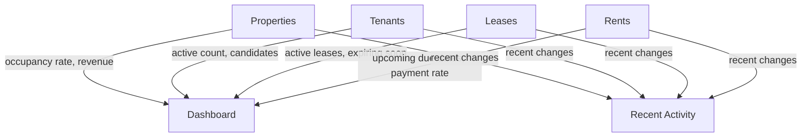

# Dashboard Specifications

## Overview

The **dashboard** is the home screen of Locapilot. It provides a high-level overview of the landlord's rental portfolio at a glance: occupancy status, financial summary, recent activity, and upcoming events. It does not allow data modification — it is read-only and aggregates information from all domains.

## Domain Rules

- All data shown on the dashboard is computed from the current state of Properties, Leases, Tenants, and Rents
- The dashboard has no editable fields
- "Recent activity" reflects the most recently created or updated records across domains
- "Upcoming events" shows rent due dates and lease expiries within the next 30 days
- An empty state message is shown for each section when no data exists

## Data Sources



---

## User Stories

### Story: View portfolio overview

**As a** landlord  
**I want to** see a summary of my entire portfolio on the home screen  
**So that** I have situational awareness without navigating to each module

#### Scenario: View key statistics

```gherkin
Given I have 4 properties: 3 occupied, 1 vacant
And 5 active tenants and 2 candidates
And 3 active leases
When I open the Dashboard
Then I see stat cards showing:
  - Total properties: 4
  - Occupied properties: 3
  - Vacant properties: 1
  - Occupancy rate: 75%
  - Active tenants: 5
  - Candidates awaiting decision: 2
  - Active leases: 3
```

#### Scenario: Empty portfolio

```gherkin
Given no properties, tenants, or leases exist
When I open the Dashboard
Then each stat shows 0 or "—"
And an onboarding message suggests adding a first property
```

---

### Story: View recent activity

**As a** landlord  
**I want to** see what has changed recently across all modules  
**So that** I can quickly pick up where I left off

#### Scenario: Recent activity list

```gherkin
Given the following recent changes exist:
  - Tenant "Marie Dupont" created 2 hours ago
  - Lease #12 terminated yesterday
  - Rent for "Studio Belleville" paid this morning
When I view the "Recent Activity" section
Then the activity items appear in reverse-chronological order
And each item shows: action type, entity name, and relative time ("2 hours ago")
```

#### Scenario: Empty recent activity

```gherkin
Given no data has been created or modified
When I view the "Recent Activity" section
Then an empty state message appears: "No recent activity"
```

---

### Story: View upcoming events

**As a** landlord  
**I want to** see rent due dates and lease expiries in the next 30 days  
**So that** I can proactively follow up with tenants

#### Scenario: Upcoming rent payments

```gherkin
Given today is 2026-06-01
And a rent is due on 2026-06-10 (pending) for "Appart Gambetta"
And a rent is due on 2026-07-05 (pending, beyond 30 days)
When I view the "Upcoming" section
Then only the 2026-06-10 rent appears
And it shows: property name, amount, and due date
```

#### Scenario: Upcoming lease expiry

```gherkin
Given today is 2026-06-01
And a lease for "Studio Belleville" ends on 2026-06-25 (24 days)
When I view the "Upcoming" section
Then a lease expiry event appears for "Studio Belleville" on 2026-06-25
```

#### Scenario: Empty upcoming section

```gherkin
Given no rents are due and no leases are expiring within 30 days
When I view the "Upcoming" section
Then an empty state message appears: "Nothing upcoming in the next 30 days"
```
