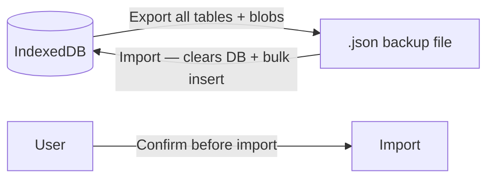

# Data Transfer Specifications

## Overview

The **data transfer** module allows the landlord to export all application data as a backup file and import it later to restore the application state. Since Locapilot is an offline-first PWA with no backend, this is the primary mechanism for data safety, device migration, and disaster recovery. The export includes binary document blobs to ensure full fidelity of the backup.

## Domain Rules

- **Export** serializes all tables (properties, tenants, leases, rents, documents, tenantDocuments, tenantAudits, inventories, communications, chargesAdjustments, settings) into a single file
- **Import** completely replaces the current database content — it is a destructive operation
- The user must explicitly confirm before an import proceeds
- Document `Blob` data is included in the export to preserve attached files
- The raw `exportData()` function (from schema.ts) does NOT include Blob data — only the `dataTransferService` export does full binary preservation
- Import is transactional: if it fails, the database is not left in a partial state
- **Strict validation before destruction**: every record of every table in an imported payload MUST be validated against a strict per-entity schema (Zod, `.strict()`, derived from `db/schema.ts` types) BEFORE any `clear()` or write is performed on the database
- A single non-conforming record (wrong type, missing required field, unknown extra field) rejects the **entire** import — no partial import
- The same strict validation applies to every import channel: JSON file import AND data received from a P2P peer — there is exactly one validated import path (`importFromObject`)

### P2P security model

- **No shared, build-time key**: the AES-GCM key protecting a P2P transfer MUST NOT be derived from `BUILD_SECRET_KEY` or any other secret baked into the public bundle. Such a key is identical for every installation of a version and is publicly extractable from the JavaScript shipped on GitHub Pages, so it provides no real confidentiality.
- **Per-pairing session key**: each pairing derives a fresh, unique encryption key bound to the PIN and to random material exchanged during the handshake. Two different pairings (or the same pair reconnecting) MUST produce different keys. Acceptable schemes: ephemeral ECDH (X25519) with a Short Authentication String confirmed via the PIN, or `PBKDF2(PIN + random salt exchanged at handshake)` with a high iteration count and a per-session random salt (never an all-zero salt, never an empty `info`).
- **Cryptographically random identifiers**: the host session ID and the 6-digit PIN MUST be generated with `crypto.getRandomValues` (session ID ≥ 122 bits of entropy, e.g. UUID v4). The session ID MUST NOT embed a timestamp, `Math.random()` output, or any other guessable/enumerable component.
- **Brute-force protection**: the host counts failed PIN attempts and, after a small threshold (3–5), destroys its `Peer` and stops accepting connections; retries are throttled with an exponential back-off. A human `confirm()` dialog is never the sole barrier against PIN guessing.
- **Truthful UI**: the interface only claims the connection is "chiffrée" when the confidentiality guarantee is real (per-pairing session key), not when it relies on a publicly derivable key.

## Export Format

```json
{
  "version": 1,
  "exportDate": "2026-06-28T10:00:00.000Z",
  "properties": [...],
  "tenants": [...],
  "leases": [...],
  "rents": [...],
  "documents": [...],
  "tenantDocuments": [...],
  "tenantAudits": [...],
  "inventories": [...],
  "communications": [...],
  "chargesAdjustments": [...],
  "settings": [...]
}
```

## Data Flow



---

## User Stories

### Story: Export data as a backup

**As a** landlord  
**I want to** download all my data as a JSON backup file  
**So that** I can store it safely and restore it if needed

#### Scenario: Successful full export

```gherkin
Given I have properties, tenants, leases, rents, and documents in the database
When I navigate to Settings and click "Export data"
Then a JSON file is downloaded to my filesystem
And the filename contains the export date (e.g. "locapilot-export-2026-06-28.json")
And the file contains all entity tables including document binary data
```

#### Scenario: Export with an empty database

```gherkin
Given the database contains no data
When I trigger an export
Then a valid JSON file is downloaded
And it contains empty arrays for all tables
And it includes the schema version and export date
```

#### Scenario: Export progress feedback

```gherkin
Given I have a large dataset with many document attachments
When I click "Export data"
Then a loading indicator appears while the export is being prepared
And a success notification appears when the download starts
```

---

### Story: Import data from a backup

**As a** landlord  
**I want to** restore my data from a previously exported backup  
**So that** I can recover from data loss or migrate to a new device

#### Scenario: Successful import

```gherkin
Given I have a valid "locapilot-export-2026-06-28.json" backup file
When I navigate to Settings and click "Import data"
And I select the backup file
And I read the warning: "This will replace ALL current data"
And I confirm the import
Then the current database is completely cleared
And all data from the backup file is loaded into IndexedDB
And a success notification appears: "Data imported successfully"
And I can navigate to Properties and see the restored properties
```

#### Scenario: Import is cancelled by the user

```gherkin
Given I am on the import dialog
When I see the confirmation warning
And I click "Cancel"
Then no data is modified
And the current database remains intact
```

#### Scenario: Import with an invalid or corrupted file

```gherkin
Given I select a file that is not a valid Locapilot export (wrong format, truncated)
When the import process begins
Then an error appears: "Invalid backup file — import aborted"
And the database is NOT modified (transaction rollback)
And a notification suggests using a valid backup file
```

#### Scenario: Import rejected when a record does not match its entity schema

```gherkin
Given my database contains 5 properties and 10 tenants
And I select a backup file where one tenant record has "email" set to a number instead of a string
When I confirm the import
Then the strict schema validation fails BEFORE any table is cleared
And an error appears indicating the import was rejected
And my existing 5 properties and 10 tenants are still intact
```

#### Scenario: Import rejected when a record contains unknown fields

```gherkin
Given I select a backup file where one property record contains an extra field "__proto__" (or any field not defined in the entity schema)
When I confirm the import
Then the strict schema validation rejects the unknown field
And the entire import is aborted
And the database is NOT modified
```

#### Scenario: Import rejected when a table is not an array of objects

```gherkin
Given I select a backup file where "rents" is a string instead of an array
When I confirm the import
Then the validation fails before any destructive operation
And an error appears: the file is reported as an invalid backup
And the database is NOT modified
```

#### Scenario: Valid backup passes strict validation and is imported

```gherkin
Given I select a backup file produced by the Locapilot export feature
And every record of every table conforms to its entity schema
When I confirm the import
Then validation succeeds for all 14 tables
And only then is the database cleared and repopulated in a single transaction
And a success notification appears
```

#### Scenario: Import on a device with existing data

```gherkin
Given my database has 5 properties and 10 tenants
When I import a backup that has 3 properties and 7 tenants
And I confirm the overwrite
Then my existing 5 properties and 10 tenants are deleted
And the 3 properties and 7 tenants from the backup are loaded
```

---

### Story: Migrate data to a new device

**As a** landlord  
**I want to** transfer my data from one device to another  
**So that** I can continue working on a different computer or browser

#### Scenario: Full migration workflow

```gherkin
Given I am on device A with all my data
When I export from device A (downloads "locapilot-export-2026-06-28.json")
And I copy the file to device B
And I open Locapilot on device B (fresh install, empty database)
And I import the backup file on device B
Then device B has all the same properties, tenants, leases, documents, and settings as device A
And photos and other binary documents are also present
```

---

### Story: Synchronise data between two devices via P2P

**As a** landlord  
**I want to** transfer my data directly from one browser to another without a file  
**So that** I can switch devices quickly without going through a manual export/import

> ⚠️ This feature is experimental. Authentication uses a shared PIN communicated out-of-band, and confidentiality relies on a per-pairing session key (see the P2P security model in Domain Rules).

#### Scenario: Successful P2P synchronisation with correct PIN

```gherkin
Given I am on device A (host) and open Settings > Synchronisation P2P
When I click "Héberger"
Then a session ID and a 6-digit PIN are displayed
And the session ID is generated with crypto.getRandomValues (≥122 bits, e.g. UUID v4)
And the PIN is generated with crypto.getRandomValues
And the PIN is NOT included in the session ID

Given I am on device B (client) and open Settings > Synchronisation P2P
When I enter the session ID and the PIN communicated verbally by device A
And I click "Se connecter"
Then a WebRTC connection is established
And device B sends an auth message containing the PIN
And device A verifies the PIN matches

Given the PIN matches
When both devices derive a per-pairing session key from the PIN and random handshake material
Then the session key does NOT depend on BUILD_SECRET_KEY
When device A confirms the transfer in the confirmation dialog
Then device A encrypts its full export payload (AES-GCM) with the session key and sends it
And device B decrypts the payload with the same session key
And device B shows a confirmation dialog before importing
And device B imports the data, replacing its local database
And a success message is shown: "Données synchronisées avec succès !"
```

#### Scenario: Session key is independent of any build-time secret

```gherkin
Given two installations built with the same version and the same BUILD_SECRET_KEY
When device A pairs with device B, and separately device C pairs with device D
Then each pairing derives a different session key from its own PIN and random salt
And an attacker who extracts BUILD_SECRET_KEY from the public bundle cannot derive any session key
And an attacker who relays or intercepts the signalling/TURN traffic cannot decrypt the transferred database without the PIN
```

#### Scenario: Session identifier is not guessable

```gherkin
Given device A starts hosting
Then the session ID contains no timestamp, no Math.random() output, and no predictable component
And enumerating the session-ID space is not feasible within the pairing window
```

#### Scenario: Connection rejected with wrong PIN

```gherkin
Given device A is hosting with PIN "123456"
When device B connects and sends PIN "000000"
Then device A sends an auth_failed message and closes the connection
And device A increments its failed-attempt counter
And device A shows status: "Connexion rejetée — PIN incorrect"
And device B shows status: "Authentification échouée — PIN incorrect"
And no data is transferred
```

#### Scenario: Host locks out after repeated wrong PINs (brute-force protection)

```gherkin
Given device A is hosting with PIN "123456"
When incoming connections send an incorrect PIN N times (N = the configured threshold, 3 to 5)
Then device A destroys its Peer and stops accepting further connections
And device A shows a lockout status to the user
And any further connection attempt to that session ID fails
And retries are throttled with an exponential back-off before a new session can be hosted
```

#### Scenario: Host rejects the transfer after authentication

```gherkin
Given device B has authenticated successfully with the correct PIN
When device A is prompted "Un appareil vient de s'authentifier..."
And device A clicks "Annuler"
Then no data is sent
And device A shows status: "Transfert annulé par l'hôte"
And no data is transferred to device B
```

#### Scenario: Client cancels import after receiving data

```gherkin
Given device B has received the encrypted payload from device A
When device B is prompted "Recevoir des données... va remplacer vos données locales"
And device B clicks "Annuler"
Then no import is performed
And device B's local database remains unchanged
```

#### Scenario: Malformed P2P payload is rejected by strict validation

```gherkin
Given device B has authenticated and confirmed the import prompt
When the decrypted payload from the peer contains a record that violates its entity schema (e.g. a lease with an unknown field or a wrong type)
Then the same strict schema validation used for file import rejects the payload
And the rejection happens BEFORE any table is cleared
And device B's local database remains unchanged
And an error status is shown to the user
```

#### Scenario: Version mismatch between devices

```gherkin
Given device A runs version "1.0.0" and device B runs version "1.1.0"
When device B enters device A's session ID
Then an error is shown: "Version mismatch: remote=... local=..."
And the connection is not attempted
```

#### Scenario: Second device attempts to connect while host is busy

```gherkin
Given device A is already connected to device B
When device C attempts to connect to device A's session ID
Then device A closes device C's connection immediately
And device C receives a connection error
```

#### Scenario: P2P confidentiality does not rely on the build secret

```gherkin
Given a production bundle deployed on GitHub Pages
When an attacker inspects the public JavaScript bundle
Then no value present in the bundle (including any former BUILD_SECRET_KEY) can be used to derive a P2P session key
And the AES-GCM key derivation no longer uses BUILD_SECRET_KEY, an all-zero salt, or an empty info parameter
```

### Story: Type the P2P synchronisation boundary

**As a** maintainer  
**I want to** the PeerJS boundary and its messages to be strongly typed rather than `any`  
**So that** the sync protocol is verified by the compiler and malformed messages are handled predictably

> The project runs TypeScript in `strict` mode. Untyped `any` at external boundaries (PeerJS handles, injected build constants) hides protocol errors and must be replaced by explicit types.

#### Scenario: P2P messages follow a typed protocol union

```gherkin
Given the peer synchronisation service exchanges messages over a data connection
When a message is sent or received
Then it conforms to a typed discriminated union of message kinds
And the recognised kinds are exactly "auth", "auth_ok", "auth_failed", and "export"
And an "auth" message carries a "pin" string
And an "export" message carries "iv" and "payload" base64 strings
```

#### Scenario: An unrecognised P2P message type is ignored safely

```gherkin
Given device B is connected and authenticated to device A
When device B receives a message whose "type" is not part of the known protocol union
Then the message is treated as a pass-through and no export/import is triggered
And the local database remains unchanged
And no unhandled exception is thrown
```

#### Scenario: New untyped `any` usages are flagged by linting

```gherkin
Given the project enforces TypeScript strict mode
And the ESLint rule "@typescript-eslint/no-explicit-any" is configured as "warn"
When a contributor introduces a new explicit `any` in a source file
Then `npm run lint` reports it as a warning
And the warning does not fail the build, so the large pre-existing `any` backlog (issue #63) is not blocking
```

> Note: the rule is intentionally set to `warn` rather than `error` for now, because the codebase still carries a substantial legacy `any` backlog. Tightening it to `error` — optionally with inline `eslint-disable-next-line @typescript-eslint/no-explicit-any` comments justifying each deliberate exception — is a future, aspirational step once the backlog is cleared.
