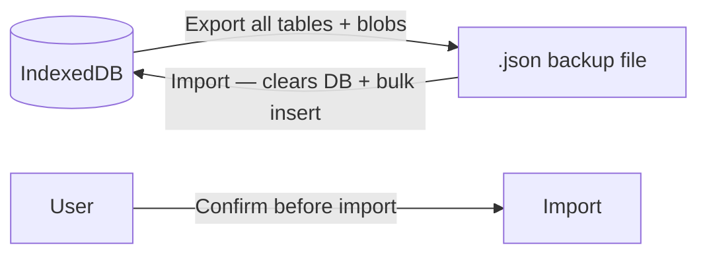
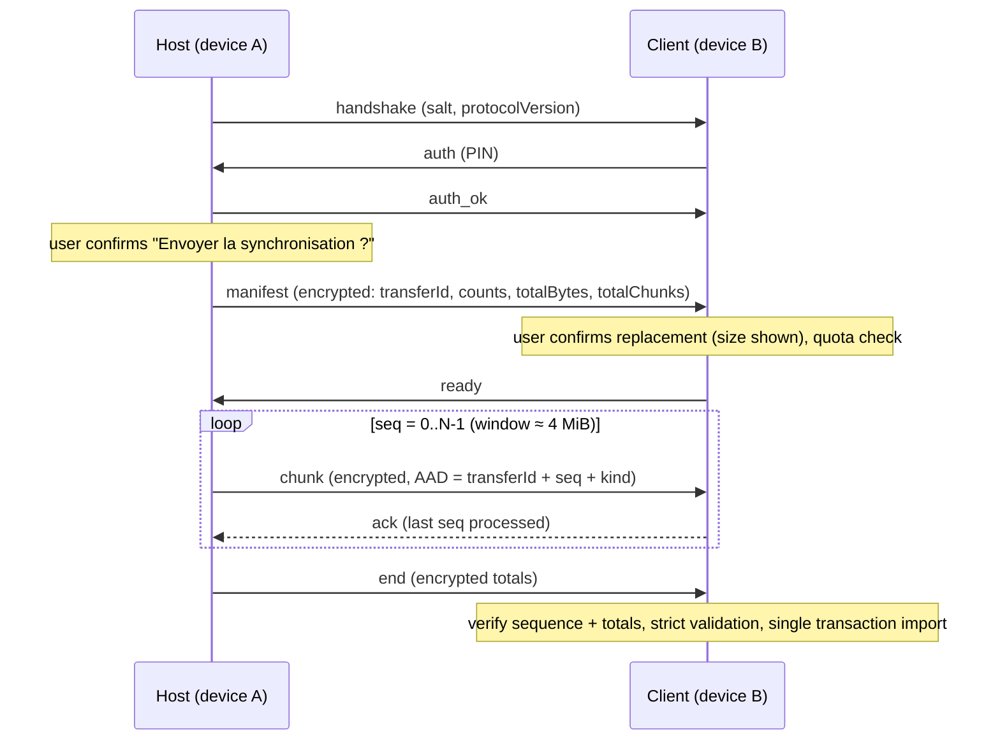

# Data Transfer Specifications

## Overview

The **data transfer** module allows the landlord to export all application data as a backup file and import it later to restore the application state. Since Locapilot is an offline-first PWA with no backend, this is the primary mechanism for data safety, device migration, and disaster recovery. The export includes binary document blobs to ensure full fidelity of the backup.

## Domain Rules

- **Export** serializes all tables (properties, tenants, leases, rents, documents, tenantDocuments, tenantAudits, inventories, communications, chargesAdjustments, irlIndices, rentRevisions, reminders, expenses, settings) into a single file
- Tables added after a backup was produced (e.g. `expenses`) are optional on import and default to an empty array, so older backups stay importable
- **Import** completely replaces the current database content — it is a destructive operation
- The user must explicitly confirm before an import proceeds
- Document `Blob` data is included in the export to preserve attached files
- The raw `exportData()` function (from schema.ts) does NOT include Blob data — only the `dataTransferService` export does full binary preservation
- Import is transactional: if it fails, the database is not left in a partial state
- **Strict validation before destruction**: every record of every table in an imported payload MUST be validated against a strict per-entity schema (Zod, `.strict()`, derived from `db/schema.ts` types) BEFORE any `clear()` or write is performed on the database
- A single non-conforming record (wrong type, missing required field, unknown extra field) rejects the **entire** import — no partial import
- The same strict validation applies to every import channel: JSON file import AND data received from a P2P peer — there is exactly one validated import path (`importFromObject`)

### P2P security model

- **No shared, build-time key**: the AES-GCM key protecting a P2P transfer MUST NOT be derived from `BUILD_SECRET_KEY` or any other secret baked into the public bundle. Such a key is identical for every installation of a version and is publicly extractable from the JavaScript shipped on GitHub Pages, so it provides no real confidentiality.
- **Per-pairing session key**: each pairing derives a fresh, unique encryption key bound to the PIN and to random material exchanged during the handshake. Two different pairings (or the same pair reconnecting) MUST produce different keys. Acceptable schemes: ephemeral ECDH (X25519) with a Short Authentication String confirmed via the PIN, or `PBKDF2(PIN + random salt exchanged at handshake)` with a high iteration count and a per-session random salt (never an all-zero salt, never an empty `info`).
- **Cryptographically random identifiers**: the host session ID and the 6-digit PIN MUST be generated with `crypto.getRandomValues`. The session ID MUST NOT embed a timestamp, `Math.random()` output, or any other guessable/enumerable component. Because the ID is dictated aloud for re-keying, it MUST be short (≈8 characters, a dozen at most including any prefix/separators) and drawn from an alphabet without characters that are ambiguous when spoken (no `0`/`O`, `1`/`I`/`L`, `U`); mapping bytes to that alphabet MUST be debiased (rejection sampling or unbiased modulo). ≈40 bits of entropy is sufficient to prevent trivial enumeration on the shared public PeerJS broker. The ID's non-predictability comes solely from the CSPRNG; it is NOT a secret — confidentiality and authentication rest on the PIN (PBKDF2 session key) and the brute-force lockout, never on the ID.
- **Brute-force protection**: the host counts failed PIN attempts and, after a small threshold (3–5), destroys its `Peer` and stops accepting connections; retries are throttled with an exponential back-off. A human `confirm()` dialog is never the sole barrier against PIN guessing.
- **Truthful UI**: the interface only claims the connection is "chiffrée" when the confidentiality guarantee is real (per-pairing session key), not when it relies on a publicly derivable key.

### P2P host session lifecycle

- A **hosting session** starts when the host clicks "Héberger" and lasts as long as its `Peer` is alive and listening. A client **connection** is a single attempt inside that session; the two MUST NOT be confused.
- A client connection closing (wrong PIN rejected by the host, client leaving before or without a transfer, transfer refused, cancelled, interrupted or timed out) does **not** end the hosting session: the `Peer` keeps listening and the host keeps displaying the session ID, the PIN, the QR code and the "Arrêter" button, so another attempt can be made on the same session.
- The hosting session ends — the `Peer` is destroyed, the session ID, PIN and QR code disappear, and "Héberger" is offered again — in exactly three cases:
  - the host clicks **"Arrêter"** (or leaves Settings);
  - the **lockout** threshold is reached (see "Brute-force protection");
  - the **transfer is complete**: the client has acknowledged the `end` message of the streamed transfer (see "P2P large-data transfer (streaming)") and then disconnects. A session is therefore single-use: syncing again requires a new session, with a new session ID and PIN.
- Failed PIN attempts are counted **per hosting session, across all its client connections**: a wrong PIN closes that connection but keeps the session open and counting, until the lockout destroys the `Peer`.
- Key material is **per connection**: the handshake salt and the derived session key are discarded when a client connection closes. A later connection never inherits them. An authentication that only completes after its connection closed is ignored.
- The UI never displays an interface that does not match the `Peer`: as long as the `Peer` listens, "Arrêter" is available. The view drives at most one `Peer` at a time: starting to host or connecting as a client first releases (destroys) any previous `Peer`.
- Status labels:
  - **Host side:** "Appareil déconnecté — en attente d'une nouvelle connexion" when a client leaves, "Connexion rejetée — PIN incorrect" after a wrong PIN, and "Données envoyées — session de synchronisation terminée" once the transfer is complete. When a transfer was refused ("Transfert refusé par l'appareil distant") or interrupted ("Transfert interrompu — …"), that outcome stays displayed when the client's connection then closes; it is not replaced by "Appareil déconnecté…".
  - **Client side:** tearing down the local `Peer` never replaces the last meaningful status, such as "Synchronisation terminée" or "Authentification échouée — PIN incorrect", with a raw "stopped".

### P2P pairing QR code

- While hosting, the host displays a **QR code** next to the session ID and PIN. Scanning it with the native camera of another device opens Locapilot on that device with the session ID and PIN pre-filled, so the user does not have to type them.
- The QR code is an **out-of-band channel equivalent to reading the screen**: it encodes nothing more than what is already displayed in plain text on the host screen (session ID + PIN). It therefore does not weaken the security model — confidentiality still rests on the PIN-derived per-pairing session key, and every wrong PIN still counts toward the host lockout.
- **Pairing link format**: `<origin><BASE_URL>#p2p=<sessionId>&pin=<pin>` (e.g. `https://stalina.github.io/locapilot/#p2p=LP7K4MQ2XB&pin=482913`). The link targets the application root (always served directly by GitHub Pages, without the `404.html` redirect, which drops URL fragments) and the app routes it to Settings.
- **Fragment only, never the query string**: the session ID and PIN MUST be carried in the URL fragment (`#…`), which browsers never send to the web server (GitHub Pages / CDN logs), the PeerJS broker, or any third party.
- **Generated locally**: the QR image MUST be generated in the browser by a bundled library (offline-first). It MUST NOT be produced by a remote QR-code API, which would leak the session ID and PIN and break offline use.
- **Consumed once, never persisted**: on arrival, the fragment is read, validated, and immediately removed from the address bar and the current history entry (`router.replace` / `history.replaceState`) so that a reload, the back button, or a bookmark cannot replay it. The PIN is never written to `localStorage`, `sessionStorage`, or IndexedDB.
- **No silent connection**: a pairing link only pre-fills the "ID de session de l'hôte" and "Code PIN" fields; the connection starts only when the user explicitly clicks "Se connecter". The existing host-side "envoyer ?" and client-side "remplacer vos données ?" confirmations remain mandatory.
- The QR code is only visible while the host session is active: it disappears when hosting is stopped, fails, is locked out or completes a transfer. It stays displayed when a client connection closes (wrong PIN, client leaving, transfer refused or interrupted), because the session is still open (see "P2P host session lifecycle").
- Scanning is done with the device's native camera app; an in-app camera scanner is out of scope.

### P2P large-data transfer (streaming)

A P2P synchronisation MUST succeed regardless of the volume of data, including datasets whose documents and photos exceed **500 MB**. The whole database is therefore never handled as one value on either device.

- **No single in-memory payload**: neither peer may build, encrypt, base64-encode, send, receive, decrypt or `JSON.parse` the whole database as one string or one buffer. (A single string is capped at ≈512 M characters by JavaScript engines, and mobile browsers run out of memory well before that.)
- **Streamed, chunked transfer**: after authentication the host sends a sequence of messages: a `manifest`, then the structured records (non-blob tables and document metadata) in batches, then each document `Blob` cut into binary chunks read with `Blob.slice()`, then an `end` message. Each chunk carries at most **64 KiB of plaintext**.
- **Binary on the wire**: document content is sent as raw bytes (`ArrayBuffer`/`Uint8Array`), never as base64 text and never as a data URL. Only the small structured record batches are JSON.
- **Same security measures for every chunk**: the PIN authentication, the per-pairing PBKDF2 session key, the host lockout and the host confirmation are unchanged. Every message after `auth_ok` that carries user data (`manifest`, record batches, blob chunks, `end`) is encrypted with AES-GCM under the per-pairing session key, with a **fresh 12-byte IV per chunk** (never reused under the same key). Each chunk is bound to its position through AES-GCM **additional authenticated data** (`transferId`, sequence number, chunk kind), so a reordered, replayed, duplicated, dropped or forged chunk fails authentication or the sequence check. No user data is ever sent in clear, and nothing is sent before `auth_ok`.
- **Integrity of the whole stream**: the `manifest` announces the transfer ID, the protocol version, the record count per table, the number of documents, the total byte size and the total chunk count. The `end` message repeats the totals. The client accepts the transfer only if every sequence number from 0 to N-1 was received exactly once, in order, and the received totals match the manifest. The data connection is therefore opened as an **ordered, reliable** channel (PeerJS `reliable: true`; its default is an unordered channel), so a well-behaved stream always arrives in order and any gap or reordering is a real integrity failure. The host considers the transfer complete only once the client has acknowledged the `end` message.
- **Flow control**: the host never lets data pile up in memory or in the WebRTC send buffer. It sends the next chunk only while the number of unacknowledged bytes stays inside a bounded window (≈4 MiB): the client acknowledges with `ack` messages carrying the last sequence number it processed (about every 1 MiB or 16 chunks, and at least every 5 seconds on a slow link). Duplicate acknowledgements and a second `ready` are ignored. The host also waits while `dataChannel.bufferedAmount` is above the same threshold. This prevents "send queue full" errors and the receiver being flooded.
- **Inactivity timeout, not a global timeout**: a large transfer can take several minutes, so there is no overall time limit. The transfer is aborted only when no message has been received for **60 seconds** (either side). Each incoming message resets the timer. The timer runs during the streaming phase only (from the client's `ready` until `end`); the time a user spends answering a confirmation dialog is not counted.
- **Confirmation before the bulk transfer**: the client asks the user to confirm the replacement of local data when it receives the `manifest`, which shows the total size (e.g. "≈ 612 Mo") and the number of documents. The host streams the data only after the client replies `ready`. If the client declines, it sends `cancel` and nothing more is sent.
- **Completion vs. hosting session**: the host considers a transfer complete only when the client has acknowledged the `end` message. The hosting session then ends when that client disconnects (see "P2P host session lifecycle"). A transfer that is refused (`cancel`, insufficient storage), interrupted (connection lost, `abort`, corrupted stream) or timed out only ends the client **connection**: the host keeps its session ID, PIN, QR code and "Arrêter", and keeps showing the outcome of the transfer, so a new synchronisation can be attempted on the same session.
- **Storage check**: before replying `ready`, the client checks the available quota (`navigator.storage.estimate()`, when supported). If the announced size cannot fit, it refuses the transfer with a clear message and its database is left unchanged. When supported, it also calls `navigator.storage.persist()` so the browser does not evict the data.
- **Received content is never decoded into strings**: the client puts the decrypted chunks of each document together as a `Blob` (`new Blob(parts, { type: mimeType })`), so the browser manages the storage (and may page it to disk).
- **Validate, then import atomically**: once `end` has been checked, the client validates every record with the same strict per-entity schemas as the file import. Then, in a single transaction, it clears the business tables and inserts the records with their `Blob`s. The P2P channel still goes through the single validated import path (`importFromObject`). The only difference is that a document's `data` arrives as a `Blob` instead of a data-URL string.
- **All or nothing**: if anything fails before the import transaction commits (disconnection, timeout, invalid chunk, a gap in the sequence, totals that don't match, validation error, cancellation), the client throws away everything it received and its local database stays **unchanged**. Resuming an interrupted transfer is out of scope: the user starts a new synchronisation.
- **Progress feedback**: both devices show the progress of the transfer (percentage and bytes, e.g. "Réception des données… 45 % (276 Mo / 612 Mo)"), updated at least once per second during the transfer.
- **Keep the device awake**: while a transfer is running, both devices request a Screen Wake Lock (`navigator.wakeLock.request('screen')`) when the browser supports it, and release it at the end, on error or on cancel. The lock is taken once the client has replied `ready`, not while a confirmation dialog is pending. If the request is unsupported or refused, the transfer continues anyway.
- **Protocol version**: the `handshake` message carries a `protocolVersion`. A client that doesn't support the host's protocol version stops before authentication and shows "Version de synchronisation incompatible — mettez à jour les deux appareils".
- **Client older than the streamed protocol (known limitation)**: a client that predates the protocol version (v1, e.g. a PWA not yet updated) ignores the version, authenticates, and then ignores the encrypted `manifest`. The host cannot tell this apart from a user who has not answered the confirmation yet, and there is deliberately no time limit on that human decision. The host therefore keeps showing "En attente de la confirmation de l'appareil distant…" until the user clicks "Arrêter". Updating both devices fixes it.

## Export Format

```json
{
  "version": 1,
  "exportDate": "2026-06-28T10:00:00.000Z",
  "properties": [...],
  "tenants": [...],
  "leases": [...],
  "rents": [...],
  "documents": [...],
  "tenantDocuments": [...],
  "tenantAudits": [...],
  "inventories": [...],
  "communications": [...],
  "chargesAdjustments": [...],
  "settings": [...]
}
```

## Data Flow


```mermaid
graph LR
    DB[(IndexedDB)] -->|Export all tables + blobs| JSON[.json backup file]
    JSON -->|Import — clears DB + bulk insert| DB
    User -->|Confirm before import| Import
```

### P2P streamed transfer sequence


```mermaid
sequenceDiagram
    participant H as Host (device A)
    participant C as Client (device B)
    H->>C: handshake (salt, protocolVersion)
    C->>H: auth (PIN)
    H->>C: auth_ok
    Note over H: user confirms "Envoyer la synchronisation ?"
    H->>C: manifest (encrypted: transferId, counts, totalBytes, totalChunks)
    Note over C: user confirms replacement (size shown), quota check
    C->>H: ready
    loop seq = 0..N-1 (window ≈ 4 MiB)
        H->>C: chunk (encrypted, AAD = transferId + seq + kind)
        C-->>H: ack (last seq processed)
    end
    H->>C: end (encrypted totals)
    Note over C: verify sequence + totals, strict validation, single transaction import
```

---

## User Stories

### Story: Export data as a backup

**As a** landlord  
**I want to** download all my data as a JSON backup file  
**So that** I can store it safely and restore it if needed

#### Scenario: Successful full export

```gherkin
Given I have properties, tenants, leases, rents, and documents in the database
When I navigate to Settings and click "Export data"
Then a JSON file is downloaded to my filesystem
And the filename contains the export date (e.g. "locapilot-export-2026-06-28.json")
And the file contains all entity tables including document binary data
```

#### Scenario: Export with an empty database

```gherkin
Given the database contains no data
When I trigger an export
Then a valid JSON file is downloaded
And it contains empty arrays for all tables
And it includes the schema version and export date
```

#### Scenario: Export progress feedback

```gherkin
Given I have a large dataset with many document attachments
When I click "Export data"
Then a loading indicator appears while the export is being prepared
And a success notification appears when the download starts
```

---

### Story: Import data from a backup

**As a** landlord  
**I want to** restore my data from a previously exported backup  
**So that** I can recover from data loss or migrate to a new device

#### Scenario: Successful import

```gherkin
Given I have a valid "locapilot-export-2026-06-28.json" backup file
When I navigate to Settings and click "Import data"
And I select the backup file
And I read the warning: "This will replace ALL current data"
And I confirm the import
Then the current database is completely cleared
And all data from the backup file is loaded into IndexedDB
And a success notification appears: "Data imported successfully"
And I can navigate to Properties and see the restored properties
```

#### Scenario: Import is cancelled by the user

```gherkin
Given I am on the import dialog
When I see the confirmation warning
And I click "Cancel"
Then no data is modified
And the current database remains intact
```

#### Scenario: Import with an invalid or corrupted file

```gherkin
Given I select a file that is not a valid Locapilot export (wrong format, truncated)
When the import process begins
Then an error appears: "Invalid backup file — import aborted"
And the database is NOT modified (transaction rollback)
And a notification suggests using a valid backup file
```

#### Scenario: Import rejected when a record does not match its entity schema

```gherkin
Given my database contains 5 properties and 10 tenants
And I select a backup file where one tenant record has "email" set to a number instead of a string
When I confirm the import
Then the strict schema validation fails BEFORE any table is cleared
And an error appears indicating the import was rejected
And my existing 5 properties and 10 tenants are still intact
```

#### Scenario: Import rejected when a record contains unknown fields

```gherkin
Given I select a backup file where one property record contains an extra field "__proto__" (or any field not defined in the entity schema)
When I confirm the import
Then the strict schema validation rejects the unknown field
And the entire import is aborted
And the database is NOT modified
```

#### Scenario: Import rejected when a table is not an array of objects

```gherkin
Given I select a backup file where "rents" is a string instead of an array
When I confirm the import
Then the validation fails before any destructive operation
And an error appears: the file is reported as an invalid backup
And the database is NOT modified
```

#### Scenario: Valid backup passes strict validation and is imported

```gherkin
Given I select a backup file produced by the Locapilot export feature
And every record of every table conforms to its entity schema
When I confirm the import
Then validation succeeds for all 15 tables (including expenses)
And only then is the database cleared and repopulated in a single transaction
And a success notification appears
```

#### Scenario: Import on a device with existing data

```gherkin
Given my database has 5 properties and 10 tenants
When I import a backup that has 3 properties and 7 tenants
And I confirm the overwrite
Then my existing 5 properties and 10 tenants are deleted
And the 3 properties and 7 tenants from the backup are loaded
```

---

### Story: Migrate data to a new device

**As a** landlord  
**I want to** transfer my data from one device to another  
**So that** I can continue working on a different computer or browser

#### Scenario: Full migration workflow

```gherkin
Given I am on device A with all my data
When I export from device A (downloads "locapilot-export-2026-06-28.json")
And I copy the file to device B
And I open Locapilot on device B (fresh install, empty database)
And I import the backup file on device B
Then device B has all the same properties, tenants, leases, documents, and settings as device A
And photos and other binary documents are also present
```

---

### Story: Synchronise data between two devices via P2P

**As a** landlord  
**I want to** transfer my data directly from one browser to another without a file  
**So that** I can switch devices quickly without going through a manual export/import

> ⚠️ This feature is experimental. Authentication uses a shared PIN communicated out-of-band, and confidentiality relies on a per-pairing session key (see the P2P security model in Domain Rules).

#### Scenario: Successful P2P synchronisation with correct PIN

```gherkin
Given I am on device A (host) and open Settings > Synchronisation P2P
When I click "Héberger"
Then a session ID and a 6-digit PIN are displayed
And the session ID is a short dictable code generated with crypto.getRandomValues (≈8 characters from an unambiguous alphabet, ≈40 bits)
And the PIN is generated with crypto.getRandomValues
And the PIN is NOT included in the session ID

Given I am on device B (client) and open Settings > Synchronisation P2P
When I enter the session ID (case-insensitively, ignoring spaces and dashes) and the PIN communicated verbally by device A
And I click "Se connecter"
Then a WebRTC connection is established
And device B sends an auth message containing the PIN
And device A verifies the PIN matches

Given the PIN matches
When both devices derive a per-pairing session key from the PIN and random handshake material
Then the session key does NOT depend on BUILD_SECRET_KEY
When device A confirms the transfer in the confirmation dialog
Then device A sends an encrypted manifest announcing the total size and record counts
And device B shows a confirmation dialog before any bulk data is transferred
When device B confirms
Then device A streams its data as AES-GCM chunks encrypted with the session key (see "P2P large-data transfer")
And device B decrypts each chunk with the same session key
And device B acknowledges the "end" message
And device B imports the data in a single transaction, replacing its local database
And a success message is shown: "Données synchronisées avec succès !"
And device B shows status: "Synchronisation terminée"
And device B disconnects from device A
And device A ends its hosting session: its Peer is destroyed
And device A shows status: "Données envoyées — session de synchronisation terminée"
And the session ID, PIN and QR code are no longer displayed on device A
And the "Héberger" button is available again on device A
```

#### Scenario: Session key is independent of any build-time secret

```gherkin
Given two installations built with the same version and the same BUILD_SECRET_KEY
When device A pairs with device B, and separately device C pairs with device D
Then each pairing derives a different session key from its own PIN and random salt
And an attacker who extracts BUILD_SECRET_KEY from the public bundle cannot derive any session key
And an attacker who relays or intercepts the signalling/TURN traffic cannot decrypt the transferred database without the PIN
```

#### Scenario: Session identifier is not guessable

```gherkin
Given device A starts hosting
Then the session ID is a short code (≈8 characters from an unambiguous, spoken-safe alphabet) prefixed to reduce cross-app broker collisions
And it contains no timestamp, no Math.random() output, and no predictable component
And its ≈40 bits of CSPRNG entropy make enumerating the session-ID space on the shared PeerJS broker infeasible within the pairing window
And the session ID is not treated as a secret — confidentiality relies on the PIN-derived session key and the host lockout, not on the ID
```

#### Scenario: Connection rejected with wrong PIN

```gherkin
Given device A is hosting with PIN "123456"
When device B connects and sends PIN "000000"
Then device A sends an auth_failed message and closes the connection
And device A increments its failed-attempt counter
And device A shows status: "Connexion rejetée — PIN incorrect"
And device A keeps hosting: the session ID, the PIN, the QR code and the "Arrêter" button stay displayed
And device A's Peer keeps listening on the same session ID
And device B shows status: "Authentification échouée — PIN incorrect", which is not replaced by "stopped" when device B releases its Peer
And no data is transferred
```

#### Scenario: Host locks out after repeated wrong PINs (brute-force protection)

```gherkin
Given device A is hosting with PIN "123456"
When successive connections to the same session send an incorrect PIN N times (N = the configured threshold, 3 to 5)
Then after each of the first N-1 wrong PINs, device A keeps hosting the same session and keeps counting
And on the N-th wrong PIN, device A destroys its Peer and stops accepting further connections
And device A shows a lockout status to the user
And any further connection attempt to that session ID fails
And retries are throttled with an exponential back-off before a new session can be hosted
```

#### Scenario: Host rejects the transfer after authentication

```gherkin
Given device B has authenticated successfully with the correct PIN
When device A is prompted "Un appareil vient de s'authentifier..."
And device A clicks "Annuler"
Then no data is sent
And device A shows status: "Transfert annulé par l'hôte"
And no data is transferred to device B
```

#### Scenario: Client cancels import after receiving the manifest

```gherkin
Given device B has received the encrypted manifest from device A
When device B is prompted "Recevoir des données... va remplacer vos données locales" (with the announced size)
And device B clicks "Annuler"
Then device B sends a "cancel" message to device A
And device A sends no record batch and no blob chunk
And device A shows status: "Transfert refusé par l'appareil distant"
And no import is performed
And device B's local database remains unchanged
When device B then disconnects
Then device A keeps hosting the same session: the session ID, the PIN, the QR code and the "Arrêter" button stay displayed
And device A still shows "Transfert refusé par l'appareil distant"
```

#### Scenario: Malformed P2P payload is rejected by strict validation

```gherkin
Given device B has authenticated and confirmed the import prompt
When the decrypted payload from the peer contains a record that violates its entity schema (e.g. a lease with an unknown field or a wrong type)
Then the same strict schema validation used for file import rejects the payload
And the rejection happens BEFORE any table is cleared
And device B's local database remains unchanged
And an error status is shown to the user
```

#### Scenario: Version mismatch between devices

```gherkin
Given device A runs version "1.0.0" and device B runs version "1.1.0"
When device B enters device A's session ID
Then an error is shown: "Version mismatch: remote=... local=..."
And the connection is not attempted
```

#### Scenario: Second device attempts to connect while host is busy

```gherkin
Given device A is already connected to device B
When device C attempts to connect to device A's session ID
Then device A closes device C's connection immediately
And device C receives a connection error
```

#### Scenario: P2P confidentiality does not rely on the build secret

```gherkin
Given a production bundle deployed on GitHub Pages
When an attacker inspects the public JavaScript bundle
Then no value present in the bundle (including any former BUILD_SECRET_KEY) can be used to derive a P2P session key
And the AES-GCM key derivation no longer uses BUILD_SECRET_KEY, an all-zero salt, or an empty info parameter
```

---

### Story: Keep a P2P host session open until it really ends

**As a** landlord  
**I want to** keep seeing my hosting session (session ID, PIN, QR code, "Arrêter") for as long as my device is actually listening  
**So that** a failed or interrupted attempt does not leave a hidden session accepting connections, and I can always stop it

> A client connection closing is not the end of the hosting session (see "P2P host session lifecycle" in Domain Rules). Only "Arrêter", the lockout, or a completed transfer end it.

#### Scenario: A device disconnecting does not end the host session

```gherkin
Given device A is hosting and displays its session ID, PIN, QR code and the "Arrêter" button
When device B connects and then disconnects without authenticating
Then device A shows status: "Appareil déconnecté — en attente d'une nouvelle connexion"
And the session ID, the PIN, the QR code and the "Arrêter" button stay displayed
And device A's Peer keeps listening on the same session ID
And the status never shows "stopped"
```

#### Scenario: A new attempt succeeds on the same session after a wrong PIN

```gherkin
Given device A is hosting with PIN "123456"
And device B was rejected with PIN "000000"
When device B connects again to the same session ID with PIN "123456"
Then device A accepts the connection and sends a fresh handshake salt
And device B authenticates successfully
And device A's failed-attempt counter still includes the earlier wrong PIN
```

#### Scenario: Wrong PINs from successive connections add up to the lockout

```gherkin
Given device A is hosting and the lockout threshold is 3
When three successive connections to the same session each send a wrong PIN
Then the first two connections are rejected while the session stays open
And the third wrong PIN locks the session out and destroys device A's Peer
And device A shows the lockout status and no longer displays the session ID, PIN or QR code
```

#### Scenario: A new connection does not inherit the previous connection's session key

```gherkin
Given device B authenticated on device A's session and then disconnected before any transfer
When device C connects to the same session without authenticating
And device A tries to send its data
Then the send is refused because no session key is established for device C's connection
And device A shows status: "Échec de l'envoi"
And no data is sent to device C
```

#### Scenario: An authentication finishing after the device left is ignored

```gherkin
Given device B sent the correct PIN to device A
When device B disconnects while device A is still deriving the session key
Then device A does not confirm the authentication
And device A does not ask "Un appareil vient de s'authentifier..."
And device A keeps hosting the same session
```

#### Scenario: The host session ends after a completed transfer

```gherkin
Given device B authenticated and device A streamed all its data
And device B acknowledged the "end" message
When device B disconnects
Then device A destroys its Peer
And device A shows status: "Données envoyées — session de synchronisation terminée"
And the session ID, the PIN and the QR code are no longer displayed
And the "Héberger" button is available again
And clicking "Héberger" starts a new session with a new session ID and a new PIN
```

#### Scenario: A refused or interrupted transfer does not end the host session

```gherkin
Given device B authenticated on device A's session and device A sent the manifest
When the transfer is refused by device B, or interrupted before device B acknowledged the "end" message
And device B's connection then closes
Then device A's Peer keeps listening on the same session ID
And the session ID, the PIN, the QR code and the "Arrêter" button stay displayed
And device A keeps showing the outcome ("Transfert refusé par l'appareil distant" or "Transfert interrompu — …")
And the outcome is not replaced by "Appareil déconnecté — en attente d'une nouvelle connexion"
And a new connection to the same session can start a new synchronisation
```

#### Scenario: The client keeps its final status after releasing its Peer

```gherkin
Given device B is connected to device A's session
When device B's sync ends, either with "Synchronisation terminée" or with "Authentification échouée — PIN incorrect"
And device B then releases its Peer
Then device B keeps showing that final status
And the status is not replaced by "stopped"
```

#### Scenario: Starting a new P2P role releases the previous Peer

```gherkin
Given Settings already holds a Peer, as host or as client
When I click "Héberger" or "Se connecter"
Then the previous Peer is destroyed before the new one is created
And if the previous Peer was hosting, its session ID, PIN and QR code are no longer displayed
And no Peer keeps listening without being shown in the interface
```

---

### Story: Synchronise a large dataset between two devices via P2P

**As a** landlord  
**I want to** synchronise my devices via P2P even when my data, documents and photos exceed 500 MB  
**So that** the synchronisation keeps working as my rental history grows, with the same security guarantees

> Regression covered: issue #122. The whole database used to be built as one JSON string with base64 blobs, encrypted in one go, base64-encoded again and sent as a single message. With a lot of data this failed on the client device (string length limit, memory exhaustion, apparent timeout). See "P2P large-data transfer (streaming)" in Domain Rules.

#### Scenario: Successful synchronisation of a dataset larger than 500 MB

```gherkin
Given device A holds 20 properties, 60 tenants, 3 000 rents and 900 documents and photos totalling 612 MB
And device B is authenticated with the correct PIN
And device A has confirmed "Envoyer la synchronisation ?"
When device B receives the manifest and confirms the replacement of its local data
Then device A streams the data as encrypted chunks of at most 64 KiB of plaintext
And device B shows a progress indicator such as "Réception des données… 45 % (276 Mo / 612 Mo)"
And device A shows a matching sending progress indicator
And after the "end" message device B imports all records in a single transaction
And device B shows "Données synchronisées avec succès !"
And device B has the same 20 properties, 60 tenants, 3 000 rents and 900 documents as device A
And every document on device B is a Blob with the same size, MIME type and content (byte-identical) as on device A
```

#### Scenario: Host never builds the whole database as a single payload

```gherkin
Given device A holds documents totalling more than 500 MB
When device A sends the synchronisation
Then device A never calls JSON.stringify on the whole database
And device A never base64-encodes a document Blob
And device A reads each document through Blob.slice() one chunk at a time
And the sending succeeds without a "RangeError: Invalid string length" or out-of-memory error
```

#### Scenario: Client never decodes the whole payload as a single string

```gherkin
Given device B is receiving a transfer of more than 500 MB
When the chunks arrive
Then device B decrypts each chunk on its own as it arrives
And device B puts each document together as a Blob from its decrypted binary parts
And device B never builds one string holding the whole payload and never calls atob or JSON.parse on it
```

#### Scenario: Small or empty dataset still synchronises through the streamed protocol

```gherkin
Given device A has an empty database (or only a few records and no documents)
When device A and device B complete a P2P synchronisation
Then the manifest announces 0 documents and the record counts of device A
And the transfer completes with a valid "end" message
And device B's database matches device A's
```

#### Scenario: Document without binary content is transferred as metadata only

```gherkin
Given device A has a document record whose data is null (content could not be read)
When device A sends the synchronisation
Then the document metadata is sent in a record batch with data null
And no blob chunk is sent for that document
And device B imports the document record with data null
```

#### Scenario: Every chunk is encrypted with the per-pairing session key

```gherkin
Given device A and device B have derived the per-pairing session key from the PIN and the handshake salt
When device A sends the manifest, the record batches, the blob chunks and the end message
Then each of these messages is encrypted with AES-GCM under the session key
And each message uses a fresh random 12-byte IV that is never reused for the same session key
And each message authenticates the transferId, its sequence number and its kind as additional authenticated data
And no user data travels in clear over the data channel
And the key never depends on BUILD_SECRET_KEY
```

#### Scenario: No data is streamed before authentication and client consent

```gherkin
Given device B has connected to device A
When device B has not yet been authenticated, or has not yet replied "ready" to the manifest
Then device A sends no record batch and no blob chunk
And any data message received by device B before "auth_ok" is ignored and does not change the database
```

#### Scenario: Tampered chunk aborts the transfer

```gherkin
Given a transfer is in progress between device A and device B
When a chunk's ciphertext, IV or authenticated data has been changed in transit
Then AES-GCM decryption of that chunk fails on device B
And device B sends "abort" to device A and closes the connection
And device B throws away everything it has received
And device B's local database remains unchanged
And device B shows: "Transfert interrompu — données corrompues"
```

#### Scenario: Reordered, duplicated or missing chunk aborts the transfer

```gherkin
Given a transfer is in progress and device B has processed chunks 0 to 41
When device B receives chunk 43 before chunk 42, or receives chunk 41 a second time
Then device B detects the gap or the duplicate in the sequence
And device B aborts the transfer without importing anything
And device B's local database remains unchanged
```

#### Scenario: End totals do not match the manifest

```gherkin
Given the manifest announced 1 200 chunks and 612 MB
When device B receives the "end" message after a different number of chunks or bytes
Then device B rejects the transfer
And no table is cleared
And device B's local database remains unchanged
```

#### Scenario: Connection lost in the middle of the transfer

```gherkin
Given device B has received 40 % of a 612 MB transfer
When the WebRTC connection closes (network loss, tab closed, host clicks "Arrêter")
Then device B throws away the partially received data
And device B's local database remains unchanged
And device B shows: "Transfert interrompu — aucune donnée n'a été modifiée"
And a new synchronisation can be started from the beginning
And unless device A clicked "Arrêter", device A shows "Transfert interrompu — aucune donnée n'a été modifiée" (or the timeout wording, when an abrupt network loss is only detected by the 60 s inactivity timeout)
And device A keeps hosting the same session: the session ID, the PIN, the QR code and the "Arrêter" button stay displayed
And when the network loss is reported as a connection error before the close, neither device replaces the "Transfert interrompu" message with a generic error
```

#### Scenario: Transfer stalls and hits the inactivity timeout

```gherkin
Given a transfer is in progress
When no message is received for 60 seconds by either device
Then the waiting device aborts the transfer and closes the connection
And device B's local database remains unchanged
And the status explains that the transfer timed out and can be restarted
And device A keeps hosting the same session, so the synchronisation can be restarted on it
```

#### Scenario: A long transfer is not cut by a global time limit

```gherkin
Given a 612 MB transfer over a slow connection lasts 8 minutes
And chunks keep arriving at least every few seconds
When the transfer runs
Then no timeout is triggered
And the transfer completes successfully
```

#### Scenario: Host respects flow control

```gherkin
Given device B processes chunks more slowly than device A can read them
When device A streams the data
Then device A never has more than ≈4 MiB of unacknowledged data in flight
And device A pauses while the data channel's bufferedAmount is above the threshold
And device A resumes when device B acknowledges processed chunks
And the data channel is never closed because its send queue is full
```

#### Scenario: Client has not enough storage for the announced transfer

```gherkin
Given the manifest announces 612 MB
And navigator.storage.estimate() on device B reports less free quota than needed
When device B receives the manifest
Then device B shows: "Espace de stockage insuffisant sur cet appareil pour recevoir 612 Mo"
And device B sends "cancel" to device A
And no data is streamed
And device B's local database remains unchanged
And device A shows "Transfert refusé par l'appareil distant" and keeps hosting the same session
```

#### Scenario: Storage estimate unavailable

```gherkin
Given navigator.storage.estimate() is not supported on device B
When device B receives the manifest
Then device B skips the quota check and shows the confirmation dialog with the announced size
```

#### Scenario: Strict validation still applies after the stream is reassembled

```gherkin
Given device B has received a complete and authenticated stream
When one received record violates its entity schema (unknown field or wrong type)
Then the same strict validation as the file import rejects the whole transfer
And the rejection happens BEFORE any table is cleared
And device B's local database remains unchanged
And an error status is shown to the user
```

#### Scenario: Import of the reassembled data is atomic

```gherkin
Given device B has received and validated the whole stream
When the import transaction fails while writing (e.g. QuotaExceededError)
Then the transaction is rolled back
And device B's local database is left exactly as it was before the synchronisation
And an error status is shown to the user
```

#### Scenario: Device screen is kept awake during the transfer

```gherkin
Given the browser supports the Screen Wake Lock API
When device B replies "ready" to the manifest and the transfer starts
Then each device holds a screen wake lock while the transfer runs
And neither device holds it while a confirmation dialog is still pending
And the wake lock is released when the transfer succeeds, fails or is cancelled
And if the wake lock is unsupported or refused, the transfer continues anyway
```

#### Scenario: Incompatible synchronisation protocol versions

```gherkin
Given device A uses the streamed protocol version 2
And device B only supports a different protocol version
When device B receives the handshake
Then device B does not send its PIN
And device B shows: "Version de synchronisation incompatible — mettez à jour les deux appareils"
And no data is transferred
```

#### Scenario: Host paired with a client older than the streamed protocol

```gherkin
Given device A uses the streamed protocol version 2
And device B runs an older Locapilot that predates the protocol version (v1)
When device B authenticates and device A confirms "Envoyer la synchronisation ?"
Then device A sends the encrypted manifest, which device B ignores
And device A sends no record batch and no blob chunk
And device A keeps showing "En attente de la confirmation de l'appareil distant…", with no time limit
And device A keeps its session ID, PIN, QR code and "Arrêter" button
When the user clicks "Arrêter" on device A
Then the session ends and device B's local database remains unchanged
```

---

### Story: Share a P2P synchronisation session with a QR code

**As a** landlord  
**I want to** display a QR code while hosting a P2P synchronisation, that my other device can scan to join the session  
**So that** I can start syncing without dictating or typing the session ID and PIN

> The QR code encodes a pairing link `<origin><BASE_URL>#p2p=<sessionId>&pin=<pin>` (see "P2P pairing QR code" in Domain Rules). It contains exactly the information already displayed in plain text on the host screen.

#### Scenario: Host displays a QR code while hosting

```gherkin
Given I am on device A and open Settings > Synchronisation P2P
When I click "Héberger"
And the host session is open (session ID "LP7K4MQ2XB" and PIN "482913" are displayed)
Then a QR code is displayed in the session information block, next to the session ID and PIN
And the QR code has an accessible label "QR code de synchronisation"
And a hint explains: "Scannez ce QR code avec l'appareil photo de l'autre appareil"
And the QR code encodes the pairing link "<origin><BASE_URL>#p2p=LP7K4MQ2XB&pin=482913"
And the session ID and PIN remain displayed in plain text for manual entry
```

#### Scenario: QR code is generated locally, without any network call

```gherkin
Given device A is offline or has no access to any QR-code web service
When I click "Héberger" and the host session opens
Then the QR code image is generated in the browser by a bundled library
And no HTTP request containing the session ID or the PIN is made to any server
```

#### Scenario: Pairing link carries the credentials in the URL fragment only

```gherkin
Given device A is hosting with session ID "LP7K4MQ2XB" and PIN "482913"
When the pairing link encoded in the QR code is built
Then the session ID and the PIN are placed after "#" (URL fragment)
And the link has no query string
And the link points to the application root under the deployment base path (e.g. "/locapilot/")
```

#### Scenario: QR code disappears when hosting stops

```gherkin
Given device A is hosting and the QR code is displayed
When I click "Arrêter"
Then the QR code, the session ID and the PIN are no longer displayed
And the "Héberger" button is available again
```

#### Scenario: QR code disappears when the host is locked out

```gherkin
Given device A is hosting and the QR code is displayed
When incoming connections send an incorrect PIN as many times as the lockout threshold
Then device A shows the lockout status
And the QR code is no longer displayed
```

#### Scenario: QR code stays displayed when a device disconnects or is rejected

```gherkin
Given device A is hosting and the QR code is displayed
When device B connects and disconnects, or is rejected for a wrong PIN below the lockout threshold
Then the QR code, the session ID, the PIN and the "Arrêter" button stay displayed
And scanning the same QR code again still joins the same session
```

#### Scenario: QR code disappears after a completed transfer

```gherkin
Given device A is hosting and the QR code is displayed
When device B has received device A's export and disconnects
Then the QR code is no longer displayed
And the "Héberger" button is available again
```

#### Scenario: QR code generation fails

```gherkin
Given device A is hosting
When the QR code image cannot be generated (library error)
Then no QR code is displayed
And the session ID and PIN are still displayed in plain text
And the hosting session keeps working for manual entry
And no blocking error dialog is shown
```

#### Scenario: Scanning the QR code opens Locapilot with the session pre-filled

```gherkin
Given device A is hosting with session ID "LP7K4MQ2XB" and PIN "482913"
When I scan the QR code with the camera of device B
And device B opens the pairing link "<origin><BASE_URL>#p2p=LP7K4MQ2XB&pin=482913"
Then device B is redirected to Settings
And the Synchronisation P2P card is scrolled into view
And the "ID de session de l'hôte" field contains "LP7K4MQ2XB"
And the "Code PIN" field contains "482913"
And a status invites me to check the session and click "Se connecter"
And no connection is attempted until I click "Se connecter"
```

#### Scenario: Pairing link is removed from the address bar once read

```gherkin
Given device B opened the pairing link "<origin><BASE_URL>#p2p=LP7K4MQ2XB&pin=482913"
When the Settings page has read the session ID and PIN from the fragment
Then the URL fragment is removed from the address bar and from the current history entry
And the URL becomes "<origin><BASE_URL>settings"
And reloading the page shows empty "ID de session de l'hôte" and "Code PIN" fields
And the PIN is not stored in localStorage, sessionStorage or IndexedDB
```

#### Scenario: Synchronisation completes after scanning the QR code

```gherkin
Given device B opened the pairing link and the fields are pre-filled
When I click "Se connecter" on device B
Then the standard P2P flow runs: handshake, PIN authentication, per-pairing session key derivation
And device A is still asked to confirm before sending its data
And device B is still asked to confirm before its local data is replaced
And device B shows "Données synchronisées avec succès !" once the import succeeds
```

#### Scenario: Pairing link opened from another page of the app

```gherkin
Given Locapilot is already open on device B, on any route
When device B navigates to a URL of the application whose fragment starts with "#p2p="
Then device B is redirected to Settings with the session ID and PIN pre-filled
And the fragment is removed from the address bar
```

#### Scenario: Pairing link with a lower-case or separated session ID

```gherkin
Given a pairing link whose fragment is "#p2p=lp7k-4mq2-xb&pin=482913"
When device B opens it
Then the session ID is normalised (uppercase, spaces and dashes removed)
And the "ID de session de l'hôte" field contains "LP7K4MQ2XB"
```

#### Scenario: Pairing link with an invalid session ID

```gherkin
Given a pairing link whose "p2p" value is not a valid Locapilot session ID (missing "LP" prefix, wrong length, or characters outside the session alphabet)
When device B opens it
Then neither the session ID nor the PIN field is pre-filled
And the status shows: "Lien de synchronisation invalide"
And no connection is attempted
And the fragment is removed from the address bar
```

#### Scenario: Pairing link without a valid PIN

```gherkin
Given a pairing link with a valid session ID "LP7K4MQ2XB" and a missing PIN or a PIN that is not exactly 6 digits
When device B opens it
Then the "ID de session de l'hôte" field contains "LP7K4MQ2XB"
And the "Code PIN" field stays empty
And the status invites me to enter the PIN given by the host
And no connection is attempted
```

#### Scenario: Pairing link for a session that is no longer hosted

```gherkin
Given device A has stopped hosting session "LP7K4MQ2XB"
When device B opens the pairing link for "LP7K4MQ2XB" and clicks "Se connecter"
Then the connection fails with the existing P2P error status
And device B's local database remains unchanged
```

#### Scenario: Wrong PIN in a pairing link counts toward the host lockout

```gherkin
Given device A is hosting with PIN "482913"
When device B opens a pairing link for device A's session with PIN "000000" and clicks "Se connecter"
Then device A rejects the connection exactly as for a manually typed wrong PIN
And device A increments its failed-attempt counter toward the lockout threshold
```

#### Scenario: Settings opened without a pairing link

```gherkin
Given device B opens Settings normally (no "#p2p=" fragment in the URL)
Then the "ID de session de l'hôte" and "Code PIN" fields are empty
And no pairing status is shown
```

> Known limitation: on iOS, a site added to the home screen keeps its storage separate from Safari. The native camera opens the pairing link in Safari, so the data is imported into Safari's Locapilot storage, not into the home-screen app. On such a device, enter the session ID and PIN manually in the installed app instead.

---

### Story: Type the P2P synchronisation boundary

**As a** maintainer  
**I want to** the PeerJS boundary and its messages to be strongly typed rather than `any`  
**So that** the sync protocol is verified by the compiler and malformed messages are handled predictably

> The project runs TypeScript in `strict` mode. Untyped `any` at external boundaries (PeerJS handles, injected build constants) hides protocol errors and must be replaced by explicit types.

#### Scenario: P2P messages follow a typed protocol union

```gherkin
Given the peer synchronisation service exchanges messages over a data connection
When a message is sent or received
Then it conforms to a typed discriminated union of message kinds
And the recognised control kinds are "handshake", "auth", "auth_ok", "auth_failed", "ready", "ack", "cancel" and "abort"
And the recognised encrypted data kinds are "manifest", "records", "blob_chunk" and "end"
And a "handshake" message carries a base64 "salt" and a numeric "protocolVersion"
And an "auth" message carries a "pin" string
And an "ack" message carries the last processed sequence number
And every encrypted data message carries a "seq" number, an "iv" and a binary ciphertext
And the legacy single "export" message (whole database as one base64 string) is no longer part of the protocol
```

#### Scenario: An unrecognised P2P message type is ignored safely

```gherkin
Given device B is connected and authenticated to device A
When device B receives a message whose "type" is not part of the known protocol union
Then the message is treated as a pass-through and no export/import is triggered
And the local database remains unchanged
And no unhandled exception is thrown
```

#### Scenario: A new explicit `any` in application code fails linting

```gherkin
Given the project enforces TypeScript strict mode
And the application code (non-spec `.ts` and `.vue` files) contains no explicit `any`
And the ESLint rule "@typescript-eslint/no-explicit-any" is configured as "error" for that code
When a contributor introduces a new explicit `any` in a non-spec source file
Then `npm run lint` reports it as an error
And the CI lint job fails
```

#### Scenario: An explicit `any` in a test file is only flagged

```gherkin
Given test files (`*.spec.ts`) still carry a legacy `any` backlog in mocks and fixtures (issue #63)
And the ESLint rule "@typescript-eslint/no-explicit-any" is configured as "warn" for `*.spec.ts` files
When a contributor introduces an explicit `any` in a spec file
Then `npm run lint` reports it as a warning
And the warning does not fail the build
```

> Note: the application-code backlog has been cleared, so the rule is an `error` there. Spec files stay at `warn` until their remaining `any` usages are typed too; the rule can then become an `error` everywhere.
