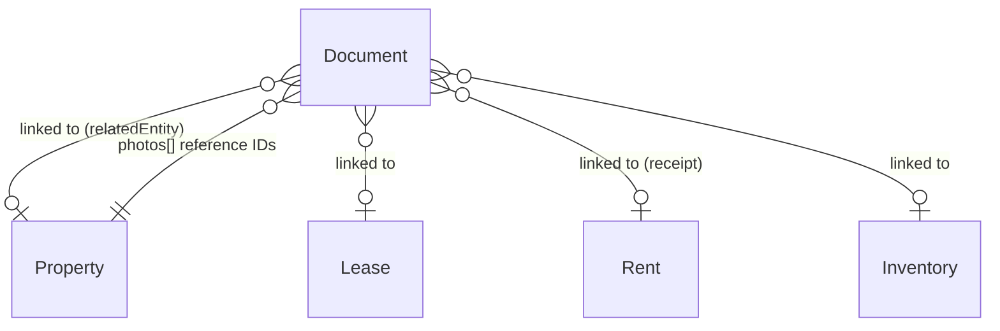

# Documents Specifications

## Overview

The **documents** module manages files attached to any entity in Locapilot. Documents can be lease contracts, receipts, inventory reports, identity documents, payslips, invoices, insurance certificates, photos, diagnostic reports, or miscellaneous files. They store binary content (Blob) directly in IndexedDB alongside metadata for search and filtering.

A separate **TenantDocument** table handles files specifically attached to a tenant (see [Tenants spec](./tenants.md)), but all other entity-linked documents use this central Documents table.

## Data Model

| Field               | Type    | Description                                                               |
| ------------------- | ------- | ------------------------------------------------------------------------- |
| `id`                | number  | Auto-generated primary key                                                |
| `name`              | string  | File name displayed to the user                                           |
| `type`              | enum    | Document category (see types below)                                       |
| `relatedEntityType` | enum?   | `property` \| `tenant` \| `lease` \| `rent` \| `applicant` \| `inventory` |
| `relatedEntityId`   | number? | ID of the linked entity                                                   |
| `mimeType`          | string  | MIME type (e.g. `application/pdf`, `image/jpeg`)                          |
| `size`              | number  | File size in bytes                                                        |
| `data`              | Blob    | Binary file content                                                       |
| `description`       | string? | Optional description or notes                                             |
| `expiresAt`         | Date?   | Optional validity end date (mainly for `diagnostic` documents)            |
| `createdAt`         | Date    | Upload timestamp                                                          |
| `updatedAt`         | Date    | Last update timestamp                                                     |

### Document Types

| Value        | Description                       |
| ------------ | --------------------------------- |
| `lease`      | Rental contract (bail)            |
| `receipt`    | Rent receipt (quittance)          |
| `inventory`  | Inventory / état des lieux report |
| `id`         | Identity document (CNI, passport) |
| `payslip`    | Salary slip (fiche de salaire)    |
| `invoice`    | Invoice                           |
| `insurance`  | Insurance certificate             |
| `photo`      | Property or inventory photo       |
| `diagnostic` | Technical diagnostic (DPE, etc.)  |
| `other`      | Any other document type           |

## Domain Rules

- `name` and `mimeType` are required
- `size` must be > 0
- `data` (Blob) must be provided on creation — documents without binary content are not valid
- When a linked entity (property, lease, etc.) is deleted, associated documents should be cleaned up
- Receipt documents (`type: receipt`) are linked to a specific `Rent` via `relatedEntityType: rent`
- Photo documents (`type: photo`) linked to a property are referenced by `Property.photos[]` (array of IDs)
- `expiresAt` is optional and mainly used for `diagnostic` documents (DPE, électricité, gaz…)
- A document whose `expiresAt` is strictly in the past is considered **expired** — expired diagnostics are surfaced as alerts on the dashboard (see [Dashboard spec](./dashboard.md))
- Documents without `expiresAt` never expire

## Relationships



---

## User Stories

### Story: Upload a document

**As a** landlord  
**I want to** upload a file and categorize it  
**So that** I can access all documents in one place

#### Scenario: Successful document upload

```gherkin
Given I am on the Documents page
When I click "Upload document" or drag a file onto the upload zone
And the file is "contrat-bail.pdf" (application/pdf, 245 KB)
And I select type "lease"
And I optionally fill in description "Bail signé - Studio Belleville 2026"
Then the document appears in the documents list
And it shows name "contrat-bail.pdf", type "lease", size "245 KB", date of today
```

#### Scenario: Upload an image file

```gherkin
Given I upload an image "photo-salon.jpg" (image/jpeg)
And I select type "photo"
Then the document appears with type "Photo"
And a thumbnail or preview indicator is shown
```

#### Scenario: Upload fails for an empty file

```gherkin
Given I try to upload a file with size 0 bytes
Then an error appears: "The file is empty and cannot be uploaded"
And no document record is created
```

---

### Story: Search and filter documents

**As a** landlord  
**I want to** search by document name and filter by type  
**So that** I can quickly find a specific file

#### Scenario: Search by document name

```gherkin
Given documents "contrat-bail-2025.pdf", "quittance-jan.pdf", "dpe-studio.pdf" exist
When I type "bail" in the search input
Then only "contrat-bail-2025.pdf" is shown
```

#### Scenario: Filter by type "receipt"

```gherkin
Given I have documents of various types
When I apply the type filter "Receipt"
Then only documents with type "receipt" are displayed
```

#### Scenario: Filter by type "other"

```gherkin
Given I have documents including several with type "other"
When I apply the type filter "Other"
Then only those documents appear
```

#### Scenario: Combined search and filter

```gherkin
Given I have 20 documents
When I filter by type "invoice" AND search for "EDF"
Then only invoice documents whose name contains "EDF" are shown
```

#### Scenario: Filter by related entity type

```gherkin
Given documents linked to properties, tenants, and leases exist
When I select "Property" in the entity filter
Then only documents with relatedEntityType "property" are displayed
```

#### Scenario: Filter by a specific related entity

```gherkin
Given documents linked to property "Appart Gambetta" and property "Studio Belleville" exist
When I select "Property" in the entity filter
And I select "Appart Gambetta" in the entity selector
Then only documents with relatedEntityType "property" and relatedEntityId matching "Appart Gambetta" are displayed
```

#### Scenario: Reset the entity filter

```gherkin
Given the entity filter is set to "Property" / "Appart Gambetta"
When I reset the entity filter to "All entities"
Then all documents are displayed again (subject to search and type filters)
```

#### Scenario: Combine entity filter with search and type filter

```gherkin
Given I have documents linked to several entities
When I filter by entity "Lease #42" AND type "lease" AND search for "avenant"
Then only lease documents linked to lease #42 whose name contains "avenant" are shown
```

---

### Story: Preview a document inline

**As a** landlord  
**I want to** preview PDFs and images directly in the application  
**So that** I can review a document without downloading it first

#### Scenario: Preview a PDF document inline

```gherkin
Given a document of type "lease" with mimeType "application/pdf" exists
When I click the "Preview" action on the document card
Then a preview modal opens
And the PDF is rendered inline inside the modal (via an object URL, without network access)
And the modal shows the document name and a "Download" action
```

#### Scenario: Preview an image document inline

```gherkin
Given a document with mimeType "image/jpeg" exists
When I click the "Preview" action on the document card
Then a preview modal opens
And the image is displayed at full size inside the modal
```

#### Scenario: Preview unavailable for unsupported file types

```gherkin
Given a document with mimeType "application/vnd.openxmlformats-officedocument.wordprocessingml.document" exists
When I look at the document card
Then no "Preview" action is offered for that document
And the "Download" action remains available
```

#### Scenario: Preview fails when binary data is missing or corrupted

```gherkin
Given a document whose data Blob is missing or unreadable
When I click the "Preview" action
Then an error message appears in the preview modal: "Impossible d'afficher l'aperçu de ce document"
And the "Download" action is still offered as a fallback
```

#### Scenario: Preview a PDF stored without an explicit Blob MIME type

```gherkin
Given a document of type "lease" with mimeType "application/pdf"
And whose stored data Blob has an empty or incorrect ".type" (e.g. seeded, imported, or uploaded via File.slice())
When I click the "Preview" action
Then the preview source is built from a Blob re-typed to "application/pdf"
And the PDF renders inside the iframe instead of showing its raw bytes as text
```

#### Scenario: Close the preview

```gherkin
Given the preview modal is open
When I click the close button or press Escape
Then the modal closes
And the object URL created for the preview is revoked
```

---

### Story: View a document

**As a** landlord  
**I want to** open or download a document  
**So that** I can review its content

#### Scenario: Open a PDF document

```gherkin
Given a document of type "lease" with mimeType "application/pdf" exists
When I click "Preview" on the document card
Then the PDF is previewed inline (see "Preview a document inline")
```

#### Scenario: Download a document

```gherkin
Given any document exists
When I click "Download"
Then the file is downloaded to my local filesystem with its original name
```

---

### Story: Display thumbnails in the documents list

**As a** landlord  
**I want to** see a visual miniature of each document in the list  
**So that** I can identify files at a glance

#### Scenario: Image documents show a thumbnail

```gherkin
Given a document with mimeType "image/png" exists
When I view the documents list
Then the document card displays a thumbnail of the image instead of a generic icon
```

#### Scenario: PDF documents show a first-page thumbnail

```gherkin
Given a document with mimeType "application/pdf" exists
When I view the documents list
Then the document card displays a miniature of the first page of the PDF
And the miniature is rendered locally, without network access
```

#### Scenario: Fallback to type icon when a thumbnail cannot be generated

```gherkin
Given a document whose thumbnail generation fails (corrupted data or unsupported mimeType)
When I view the documents list
Then the document card displays the type icon with the file extension badge
And no error is surfaced to the user
```

---

### Story: Delete a document

**As a** landlord  
**I want to** remove a document I no longer need  
**So that** storage stays clean

#### Scenario: Successful deletion

```gherkin
Given a document "facture-plombier.pdf" exists in the list
When I click "Delete" on that document
And I confirm the deletion dialog
Then the document disappears from the list
And its binary data is removed from the database
```

#### Scenario: Attempt to delete a document linked to a receipt

```gherkin
Given a document of type "receipt" is linked to a paid rent record
When I attempt to delete that document
Then a warning informs me it is linked to a rent record
And I must confirm before proceeding
```

---

### Story: Associate a document with an entity

**As a** landlord  
**I want to** link a document to a specific property, lease, or rent  
**So that** I can find all related documents from the entity's detail page

#### Scenario: Upload a document directly from a lease detail page

```gherkin
Given I am on the detail page of lease #42
When I use the document upload feature on that page
And I upload "avenant-2026.pdf" with type "lease"
Then the document is created with relatedEntityType "lease" and relatedEntityId 42
And it appears in the lease's document list
```

#### Scenario: View all documents linked to a property

```gherkin
Given property "Appart Gambetta" has 3 documents linked (DPE, insurance, plan)
When I navigate to the property's detail page
And I open the Documents tab
Then the 3 documents appear in the list
```

#### Scenario: View and manage all documents linked to a lease

```gherkin
Given lease #42 has documents linked (signed contract, guarantor engagement, insurance)
When I navigate to the lease's detail page
And I open the Documents section
Then the documents with relatedEntityType "lease" and relatedEntityId 42 appear in the list, most recent first
And each document can be downloaded or deleted
```

#### Scenario: Categorize a lease document on upload

```gherkin
Given I upload a document from the detail page of lease #42
When I choose a lease-relevant category (e.g. "Bail signé", "Garant", "Autre")
Then the document is stored with a document type reflecting the category
And with relatedEntityType "lease" and relatedEntityId 42
```

---

### Story: Track diagnostic validity

**As a** landlord  
**I want to** record an expiry date on diagnostic documents  
**So that** I am alerted on the dashboard when a diagnostic must be renewed

#### Scenario: Set an expiry date when uploading a diagnostic

```gherkin
Given I upload a document "DPE-2026.pdf" with type "diagnostic"
When I fill in the expiry date field with 2036-06-01
Then the document is saved with expiresAt 2036-06-01
And the expiry date appears in the document's details
```

#### Scenario: Diagnostic detected as expired

```gherkin
Given a diagnostic document has expiresAt 2026-05-01
And today is 2026-06-01
When the application evaluates document validity
Then the document is considered expired
And an expired-diagnostic alert appears on the dashboard
```

#### Scenario: Diagnostic without expiry date never expires

```gherkin
Given a diagnostic document exists with no expiresAt value
When the application evaluates document validity
Then the document is never considered expired
And no dashboard alert is generated for it
```

#### Scenario: Edit the expiry date of an existing document

```gherkin
Given a diagnostic document exists with expiresAt 2026-05-01
When I edit the document and change the expiry date to 2027-05-01
Then the document is saved with expiresAt 2027-05-01
And the corresponding dashboard alert disappears if the new date is in the future
```
