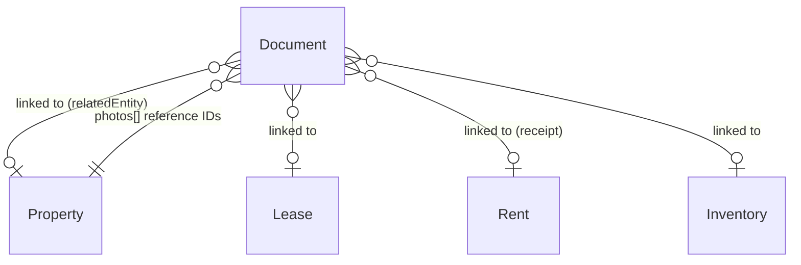

# Documents Specifications

## Overview

The **documents** module manages files attached to any entity in Locapilot. Documents can be lease contracts, receipts, inventory reports, identity documents, payslips, invoices, insurance certificates, photos, diagnostic reports, or miscellaneous files. They store binary content (Blob) directly in IndexedDB alongside metadata for search and filtering.

A separate **TenantDocument** table handles files specifically attached to a tenant (see [Tenants spec](./tenants.md)), but all other entity-linked documents use this central Documents table.

## Data Model

| Field               | Type    | Description                                                               |
| ------------------- | ------- | ------------------------------------------------------------------------- |
| `id`                | number  | Auto-generated primary key                                                |
| `name`              | string  | File name displayed to the user                                           |
| `type`              | enum    | Document category (see types below)                                       |
| `relatedEntityType` | enum?   | `property` \| `tenant` \| `lease` \| `rent` \| `applicant` \| `inventory` |
| `relatedEntityId`   | number? | ID of the linked entity                                                   |
| `mimeType`          | string  | MIME type (e.g. `application/pdf`, `image/jpeg`)                          |
| `size`              | number  | File size in bytes                                                        |
| `data`              | Blob    | Binary file content                                                       |
| `description`       | string? | Optional description or notes                                             |
| `createdAt`         | Date    | Upload timestamp                                                          |
| `updatedAt`         | Date    | Last update timestamp                                                     |

### Document Types

| Value        | Description                       |
| ------------ | --------------------------------- |
| `lease`      | Rental contract (bail)            |
| `receipt`    | Rent receipt (quittance)          |
| `inventory`  | Inventory / état des lieux report |
| `id`         | Identity document (CNI, passport) |
| `payslip`    | Salary slip (fiche de salaire)    |
| `invoice`    | Invoice                           |
| `insurance`  | Insurance certificate             |
| `photo`      | Property or inventory photo       |
| `diagnostic` | Technical diagnostic (DPE, etc.)  |
| `other`      | Any other document type           |

## Domain Rules

- `name` and `mimeType` are required
- `size` must be > 0
- `data` (Blob) must be provided on creation — documents without binary content are not valid
- When a linked entity (property, lease, etc.) is deleted, associated documents should be cleaned up
- Receipt documents (`type: receipt`) are linked to a specific `Rent` via `relatedEntityType: rent`
- Photo documents (`type: photo`) linked to a property are referenced by `Property.photos[]` (array of IDs)

## Relationships



---

## User Stories

### Story: Upload a document

**As a** landlord  
**I want to** upload a file and categorize it  
**So that** I can access all documents in one place

#### Scenario: Successful document upload

```gherkin
Given I am on the Documents page
When I click "Upload document" or drag a file onto the upload zone
And the file is "contrat-bail.pdf" (application/pdf, 245 KB)
And I select type "lease"
And I optionally fill in description "Bail signé - Studio Belleville 2026"
Then the document appears in the documents list
And it shows name "contrat-bail.pdf", type "lease", size "245 KB", date of today
```

#### Scenario: Upload an image file

```gherkin
Given I upload an image "photo-salon.jpg" (image/jpeg)
And I select type "photo"
Then the document appears with type "Photo"
And a thumbnail or preview indicator is shown
```

#### Scenario: Upload fails for an empty file

```gherkin
Given I try to upload a file with size 0 bytes
Then an error appears: "The file is empty and cannot be uploaded"
And no document record is created
```

---

### Story: Search and filter documents

**As a** landlord  
**I want to** search by document name and filter by type  
**So that** I can quickly find a specific file

#### Scenario: Search by document name

```gherkin
Given documents "contrat-bail-2025.pdf", "quittance-jan.pdf", "dpe-studio.pdf" exist
When I type "bail" in the search input
Then only "contrat-bail-2025.pdf" is shown
```

#### Scenario: Filter by type "receipt"

```gherkin
Given I have documents of various types
When I apply the type filter "Receipt"
Then only documents with type "receipt" are displayed
```

#### Scenario: Filter by type "other"

```gherkin
Given I have documents including several with type "other"
When I apply the type filter "Other"
Then only those documents appear
```

#### Scenario: Combined search and filter

```gherkin
Given I have 20 documents
When I filter by type "invoice" AND search for "EDF"
Then only invoice documents whose name contains "EDF" are shown
```

---

### Story: View a document

**As a** landlord  
**I want to** open or download a document  
**So that** I can review its content

#### Scenario: Open a PDF document

```gherkin
Given a document of type "lease" with mimeType "application/pdf" exists
When I click "View" or "Open" on the document card
Then the browser opens or previews the PDF
```

#### Scenario: Download a document

```gherkin
Given any document exists
When I click "Download"
Then the file is downloaded to my local filesystem with its original name
```

---

### Story: Delete a document

**As a** landlord  
**I want to** remove a document I no longer need  
**So that** storage stays clean

#### Scenario: Successful deletion

```gherkin
Given a document "facture-plombier.pdf" exists in the list
When I click "Delete" on that document
And I confirm the deletion dialog
Then the document disappears from the list
And its binary data is removed from the database
```

#### Scenario: Attempt to delete a document linked to a receipt

```gherkin
Given a document of type "receipt" is linked to a paid rent record
When I attempt to delete that document
Then a warning informs me it is linked to a rent record
And I must confirm before proceeding
```

---

### Story: Associate a document with an entity

**As a** landlord  
**I want to** link a document to a specific property, lease, or rent  
**So that** I can find all related documents from the entity's detail page

#### Scenario: Upload a document directly from a lease detail page

```gherkin
Given I am on the detail page of lease #42
When I use the document upload feature on that page
And I upload "avenant-2026.pdf" with type "lease"
Then the document is created with relatedEntityType "lease" and relatedEntityId 42
And it appears in the lease's document list
```

#### Scenario: View all documents linked to a property

```gherkin
Given property "Appart Gambetta" has 3 documents linked (DPE, insurance, plan)
When I navigate to the property's detail page
And I open the Documents tab
Then the 3 documents appear in the list
```
