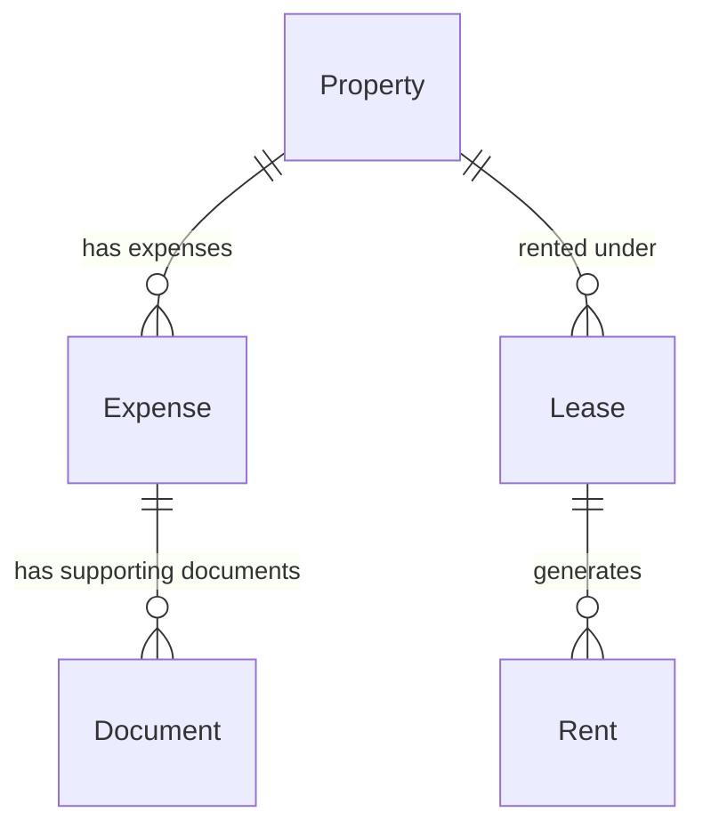

# Expenses Specifications

## Overview

The **expenses** module lets the landlord record the costs they bear on each property (works, property
tax, insurance, maintenance, co-ownership fees, …), attach supporting documents (invoices, tax notices,
insurance certificates) to them, and compute the **real profitability** of each property: income
collected vs. expenses paid over a calendar year, and gross / net yield based on the acquisition price.

Until this module, Locapilot only tracked the **income** side (rents). Without the cost side, the
landlord could not assess what a property actually earns. Expenses are always attached to **one
property**. They are distinct from the tenant charges handled by the
[charges adjustment](./leases.md) workflow: an expense is a cost borne by the landlord. Recoverable
charges that are passed on to the tenant through monthly provisions should **not** be entered as
expenses (or only their non-recoverable share should be).

## Data Model

### Expense

| Field        | Type    | Description                                                        |
| ------------ | ------- | ------------------------------------------------------------------ |
| `id`         | number  | Auto-generated primary key                                         |
| `propertyId` | number  | Id of the property the expense relates to                          |
| `category`   | enum    | Expense category (see table below)                                 |
| `label`      | string  | Short description (e.g. "Remplacement chaudière", "Taxe foncière") |
| `amount`     | number  | Amount paid by the landlord, in € (strictly positive)              |
| `date`       | Date    | Date the expense was paid (or is scheduled to be paid)             |
| `notes`      | string? | Optional free-text notes (supplier, invoice number, …)             |
| `createdAt`  | Date    | Creation timestamp                                                 |
| `updatedAt`  | Date    | Last update timestamp                                              |

Indexed on `id` (auto), `propertyId`, `category`, `date`, and `[propertyId+date]`
(Dexie schema version 11).

Supporting documents are **not** stored on the expense itself. They are `Document` records with
`relatedEntityType: 'expense'` and `relatedEntityId: <expense id>` (same pattern as other
entity-linked documents, see [Documents spec](./documents.md)).

### Expense Categories

| Value          | UI label (FR)          | Default document type of a receipt |
| -------------- | ---------------------- | ---------------------------------- |
| `works`        | Travaux                | `invoice`                          |
| `property-tax` | Taxe foncière          | `invoice`                          |
| `insurance`    | Assurance (PNO)        | `insurance`                        |
| `maintenance`  | Entretien              | `invoice`                          |
| `condo-fees`   | Charges de copropriété | `invoice`                          |
| `other`        | Autre                  | `other`                            |

### Property fields used for profitability

The profitability computation relies on two optional fields added to `Property`
(see [Properties spec](./properties.md)):

| Field              | Type    | Description                                                             |
| ------------------ | ------- | ----------------------------------------------------------------------- |
| `purchasePrice`    | number? | Acquisition price of the property, in € (≥ 0)                           |
| `acquisitionCosts` | number? | Acquisition costs (notary fees, agency fees, initial works), in € (≥ 0) |

### Relationships



There are **no foreign-key constraints** in IndexedDB: the property name and the attached documents
are resolved with manual joins (`get()` / `where('relatedEntityId')`).

## Business Rules

### Expense validation

- `propertyId` is required and must reference an existing property.
- `category` is required and must be one of the categories listed above.
- `label` is required and must be non-empty after trimming whitespace.
- `amount` is required and must be **strictly greater than 0**. Amounts are stored in euros with at
  most two decimals.
- `date` is required. A date in the future is **accepted** (e.g. a property tax already known but due
  later in the year). The expense is then counted in the year of its `date`.
- `notes` is optional.

### Expense lifecycle

- Expenses can be created, edited and deleted at any time, whatever the property status.
- Deleting an expense also deletes **all its supporting documents** (`Document` records with
  `relatedEntityType: 'expense'` and `relatedEntityId` = the expense id), in a single transaction.
- Deleting a property also deletes **all its expenses and their supporting documents**, in the same
  transaction as the property deletion. The rule "a property with an active lease cannot be
  deleted" still applies first.

### Profitability computation (per property, per calendar year)

The landlord selects a calendar year `Y` on the property detail page. It defaults to the current
year, and the selector lists every year that has at least one expense or one collected rent for the
property, plus the current year.

- **Collected rent income (excl. charges)** — `income(Y)`: for every rent of every lease (active or
  ended) whose `propertyId` is the property, with status `paid` or `partial`, and whose `paidDate`
  (falling back to `dueDate` when `paidDate` is empty) falls in year `Y`:
  - status `paid` → counts `amount` (the rent excluding charges)
  - status `partial` → counts the rent share of the payment, computed as
    `paidAmount × amount / (amount + charges)` (proportional allocation between rent and charges),
    rounded to the cent. When `amount + charges` is 0, it counts 0.
  - rents with status `pending` or `late` count 0.
  - charges provisions are **excluded** from income because they offset recoverable charges.
- **Total expenses** — `expenses(Y)`: sum of `amount` of the property's expenses whose `date` falls in
  year `Y`, all categories included. The total per category is also shown.
- **Net result** — `income(Y) − expenses(Y)`, in €. Can be negative.
- **Total investment** — `purchasePrice + (acquisitionCosts ?? 0)`.
- **Gross yield** — `income(Y) / investment × 100`, rounded to 2 decimals and displayed as a percentage.
- **Net yield** — `(income(Y) − expenses(Y)) / investment × 100`, rounded to 2 decimals. Can be
  negative and is then displayed with the danger color.
- When `purchasePrice` is empty or 0, the yields **cannot be computed**: they are displayed as "—"
  with the hint "Renseignez le prix d'acquisition pour calculer la rentabilité". The income,
  expenses and net result are still displayed.
- Rents whose lease no longer exists, or whose lease belongs to another property, are ignored and
  no error is thrown.
- All computations are pure functions (service layer), independent of the UI and of the current time
  except for the default selected year.

### Backup / Restore

- The `expenses` table is included in the backup export, the restore import and the P2P
  synchronisation (see [Data Transfer spec](./data-transfer.md)).
- A backup produced before this module (no `expenses` key) remains importable: the missing table
  defaults to an empty array.

---

## User Stories

### Story: Record an expense on a property

**As a** landlord
**I want to** record a cost I paid for one of my properties
**So that** I keep track of everything a property costs me

#### Scenario: Successful expense creation

```gherkin
Given a property "Appart Gambetta T2" exists
And I am on the detail page of "Appart Gambetta T2"
When I click "Ajouter une dépense" in the "Dépenses & rentabilité" section
And I select category "Taxe foncière"
And I fill in label "Taxe foncière 2026"
And I fill in amount "1250"
And I fill in date "2026-10-15"
And I click "Enregistrer"
Then an expense of category "property-tax" and amount 1250 is created for "Appart Gambetta T2"
And it appears in the expenses list of the year 2026
And the total expenses of 2026 increase by 1 250,00 €
And a success notification appears
```

#### Scenario: Record an expense for each supported category

```gherkin
Given a property exists
When I record one expense for each category "Travaux", "Taxe foncière", "Assurance (PNO)", "Entretien", "Charges de copropriété" and "Autre"
Then the six expenses are created with categories "works", "property-tax", "insurance", "maintenance", "condo-fees" and "other"
And the per-category breakdown shows one line per category with its total
```

#### Scenario: Attempt to create an expense with a zero or negative amount

```gherkin
Given I am filling the "Ajouter une dépense" form
When I fill in amount "0"
And I submit the form
Then a validation error appears: "Le montant doit être supérieur à 0"
And no expense is created
When I fill in amount "-50"
And I submit the form
Then the same validation error appears
And no expense is created
```

#### Scenario: Attempt to create an expense without label

```gherkin
Given I am filling the "Ajouter une dépense" form
When I leave the label empty or containing only spaces
And I submit the form
Then a validation error appears on the label field
And no expense is created
```

#### Scenario: Attempt to create an expense without category or date

```gherkin
Given I am filling the "Ajouter une dépense" form
When I leave the category or the date empty
And I submit the form
Then validation errors highlight the missing fields
And no expense is created
```

#### Scenario: Service rejects an expense referencing a non-existent property

```gherkin
Given no property with id 999 exists
When the expenses service is asked to create an expense with propertyId 999
Then it throws an error "Bien introuvable"
And no expense is created
```

#### Scenario: Record an expense dated in the future

```gherkin
Given today is 2026-03-10
When I record an expense dated 2026-10-15
Then the expense is created without validation error
And it is counted in the expenses of year 2026
```

#### Scenario: Record an expense with a decimal amount

```gherkin
Given I am filling the "Ajouter une dépense" form
When I fill in amount "89.90"
And I submit the form
Then the expense is stored with amount 89.9
And it is displayed as "89,90 €"
```

---

### Story: Attach supporting documents to an expense

**As a** landlord
**I want to** attach an invoice, a tax notice or an insurance certificate to an expense
**So that** I keep the proof of every cost in one place

#### Scenario: Attach a document when creating an expense

```gherkin
Given I am filling the "Ajouter une dépense" form with category "Travaux"
When I select a PDF file "facture-chaudiere.pdf" as supporting document
And I submit the form
Then the expense is created
And a Document is created with relatedEntityType "expense", relatedEntityId equal to the new expense id and type "invoice"
And the expense row shows a document indicator
```

#### Scenario: Attach a document to an existing expense

```gherkin
Given an expense of category "Assurance (PNO)" exists without document
When I open the expense and add the file "attestation-pno.pdf"
Then a Document of type "insurance" linked to that expense is created
And the expense row shows a document indicator
```

#### Scenario: Attach several documents to one expense

```gherkin
Given an expense of category "Travaux" exists
When I attach a quote "devis.pdf" and an invoice "facture.pdf"
Then two Documents linked to that expense exist
And both are listed on the expense and can be previewed and downloaded
```

#### Scenario: Preview and download a supporting document

```gherkin
Given an expense has an attached document "taxe-fonciere-2026.pdf"
When I click the document from the expense row
Then the document opens in the inline preview modal
And I can download it
```

#### Scenario: Remove a supporting document

```gherkin
Given an expense has an attached document
When I remove the document from the expense and confirm
Then the Document record is deleted
And the expense itself is kept
```

#### Scenario: Supporting documents appear in the Documents module

```gherkin
Given an expense "Remplacement chaudière" has an attached invoice
When I open the Documents page
And I filter by related entity type "Dépense"
Then the invoice is listed
And its related entity label shows "Remplacement chaudière"
```

#### Scenario: Attempt to attach an empty file

```gherkin
Given I am attaching a document to an expense
When I select a file of size 0 bytes
Then the upload is rejected with an error
And no Document is created
```

---

### Story: Edit an expense

**As a** landlord
**I want to** correct an expense I recorded
**So that** my figures stay accurate

#### Scenario: Successful expense edit

```gherkin
Given an expense "Entretien chaudière" of 120 € dated 2026-02-01 exists
When I edit it, change the amount to 135 and save
Then the expense shows 135,00 €
And its updatedAt timestamp is refreshed
And the totals and yields of 2026 are recomputed
```

#### Scenario: Move an expense to another year

```gherkin
Given an expense of 500 € dated 2025-12-28 exists
When I change its date to 2026-01-03 and save
Then the expense is no longer counted in 2025
And it is counted in 2026
```

#### Scenario: Attempt to save an edit with invalid values

```gherkin
Given I am editing an expense
When I set the amount to "0" or clear the label
And I save
Then a validation error appears
And the stored expense is unchanged
```

---

### Story: Delete an expense

**As a** landlord
**I want to** delete an expense recorded by mistake
**So that** it no longer distorts the profitability of the property

#### Scenario: Delete an expense with its supporting documents

```gherkin
Given an expense with two attached documents exists
When I click "Supprimer" on the expense
And I confirm the deletion dialog
Then the expense is deleted
And its two Document records are deleted in the same transaction
And the totals and yields are recomputed
```

#### Scenario: Cancel an expense deletion

```gherkin
Given an expense exists
When I click "Supprimer" on the expense
And I cancel the confirmation dialog
Then the expense and its documents are kept
```

#### Scenario: Deleting a property deletes its expenses

```gherkin
Given a vacant property without active lease has 3 expenses, one of them with an attached document
When I delete the property and confirm
Then the property is deleted
And its 3 expenses are deleted
And the document attached to the expense is deleted
And the expenses of other properties are untouched
```

---

### Story: Consult the expenses of a property

**As a** landlord
**I want to** see the expenses of a property year by year
**So that** I know what the property costs me

#### Scenario: List the expenses of the selected year

```gherkin
Given a property has expenses dated 2025-06-10, 2026-01-15 and 2026-04-02
When I open the property detail page
And the selected year is 2026
Then the "Dépenses & rentabilité" section lists the 2 expenses of 2026, most recent first
And each row shows the date, category, label, amount and a document indicator when a document is attached
And the 2025 expense is not listed
```

#### Scenario: Totals per category

```gherkin
Given in 2026 a property has a "Travaux" expense of 2 000 €, a "Taxe foncière" expense of 1 250 € and an "Entretien" expense of 150 €
When I view the 2026 expenses of the property
Then the total expenses show 3 400,00 €
And the breakdown shows Travaux 2 000,00 €, Taxe foncière 1 250,00 € and Entretien 150,00 €
And categories without expense are not shown in the breakdown
```

#### Scenario: Switch the selected year

```gherkin
Given a property has expenses in 2025 and 2026
And today is in 2026
When I open the property detail page
Then the selected year defaults to 2026
And the year selector offers 2025 and 2026
When I select 2025
Then only the 2025 expenses and the 2025 profitability figures are shown
```

#### Scenario: Property without any expense

```gherkin
Given a property has no expense
When I open its detail page
Then the "Dépenses & rentabilité" section shows an empty state "Aucune dépense enregistrée pour cette année"
And an "Ajouter une dépense" button is available
And the total expenses show 0,00 €
```

#### Scenario: Expenses of other properties are not shown

```gherkin
Given properties "A" and "B" each have expenses in 2026
When I open the detail page of "A"
Then only the expenses of "A" are listed and counted
```

---

### Story: View the profitability of a property

**As a** landlord
**I want to** see the income, expenses, net result and yields of a property for a given year
**So that** I know the real profitability of each of my properties

#### Scenario: Compute gross and net yield

```gherkin
Given a property has purchasePrice 180 000 € and acquisitionCosts 15 000 €
And in 2026 its rents paid in full total 9 600 € excluding charges (12 rents of 800 € rent + 50 € charges)
And its 2026 expenses total 2 400 €
When I view the 2026 profitability of the property
Then the collected income shows 9 600,00 €
And the total expenses show 2 400,00 €
And the net result shows 7 200,00 €
And the total investment is 195 000 €
And the gross yield shows 4,92 %
And the net yield shows 3,69 %
```

#### Scenario: Charges provisions are excluded from income

```gherkin
Given a rent of amount 800 and charges 50 has status "paid" with paidAmount 850 and paidDate in 2026
When the 2026 income of its property is computed
Then that rent contributes 800 to the income
```

#### Scenario: Partial payment is allocated proportionally between rent and charges

```gherkin
Given a rent of amount 800 and charges 200 has status "partial" with paidAmount 500 and paidDate in 2026
When the 2026 income of its property is computed
Then that rent contributes 400 to the income (500 × 800 / 1000)
```

#### Scenario: Unpaid rents are not counted

```gherkin
Given a property has a rent with status "late" and a rent with status "pending" due in 2026
When the 2026 income of the property is computed
Then neither rent contributes to the income
```

#### Scenario: Income is attributed to the year of payment

```gherkin
Given the rent due on 2025-12-05 was paid on 2026-01-08
When the income is computed
Then the rent is counted in 2026 and not in 2025
```

#### Scenario: Rent without paid date falls back to its due date

```gherkin
Given a rent with status "paid", no paidDate and dueDate 2026-03-05
When the income is computed
Then the rent is counted in 2026
```

#### Scenario: Rents of ended leases are counted

```gherkin
Given a property had a lease that ended on 2026-06-30 and a new lease starting on 2026-08-01
And rents were paid under both leases in 2026
When I view the 2026 profitability of the property
Then the collected income includes the rents of both leases
```

#### Scenario: Rents of other properties or orphan rents are ignored

```gherkin
Given a rent references a lease of another property
And another rent references a lease that no longer exists
When the income of the property is computed
Then neither rent is counted
And no error is thrown
```

#### Scenario: Negative net result

```gherkin
Given a property with purchasePrice 150 000 € and no acquisitionCosts
And in 2026 its collected income is 3 000 € and its expenses total 12 000 € (major works)
When I view the 2026 profitability
Then the net result shows -9 000,00 € in the danger color
And the net yield shows -6,00 % in the danger color
And the gross yield shows 2,00 %
```

#### Scenario: Yields cannot be computed without purchase price

```gherkin
Given a property has no purchasePrice (empty or 0)
And it has collected income and expenses in 2026
When I view the 2026 profitability
Then the gross yield and net yield show "—"
And the hint "Renseignez le prix d'acquisition pour calculer la rentabilité" is displayed
And the collected income, total expenses and net result are still displayed
```

#### Scenario: Acquisition costs are optional

```gherkin
Given a property has purchasePrice 200 000 € and no acquisitionCosts
And its 2026 collected income is 10 000 €
When I view the 2026 profitability
Then the total investment is 200 000 €
And the gross yield shows 5,00 %
```

#### Scenario: Year without income nor expense

```gherkin
Given a property with a purchasePrice has neither collected rent nor expense in the selected year
When I view the profitability of that year
Then the income, expenses and net result show 0,00 €
And the gross and net yields show 0,00 %
```

---

### Story: Back up and restore expenses

**As a** landlord
**I want to** keep my expenses and their documents in my backups and synchronisations
**So that** I never lose my cost history

#### Scenario: Expenses are exported and restored

```gherkin
Given 4 expenses exist, one with an attached document
When I export a backup
Then the file contains an "expenses" array with the 4 expenses
And the attached document is included with relatedEntityType "expense"
When I import that backup on an empty installation
Then the 4 expenses and the document are restored with the same values
```

#### Scenario: Legacy backup without expenses table

```gherkin
Given a backup file produced before the expenses module (no "expenses" key)
When I import it
Then the import succeeds
And the expenses table is empty
```

#### Scenario: Backup with an invalid expense is rejected

```gherkin
Given a backup file contains an expense with a negative amount or an unknown category or an extra unknown field
When I import it
Then the strict validation fails before any table is cleared
And the existing data is untouched
```

#### Scenario: Expenses are transferred by P2P synchronisation

```gherkin
Given a host device has expenses with attached documents
When a client device completes a P2P synchronisation with the host
Then the client has the same expenses and the same expense documents
```
