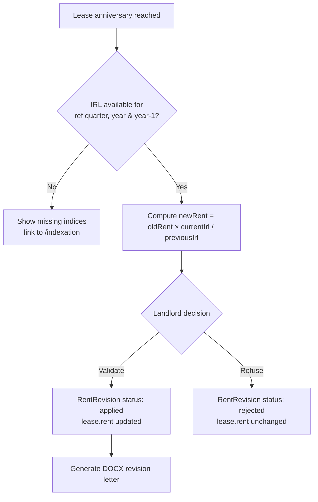
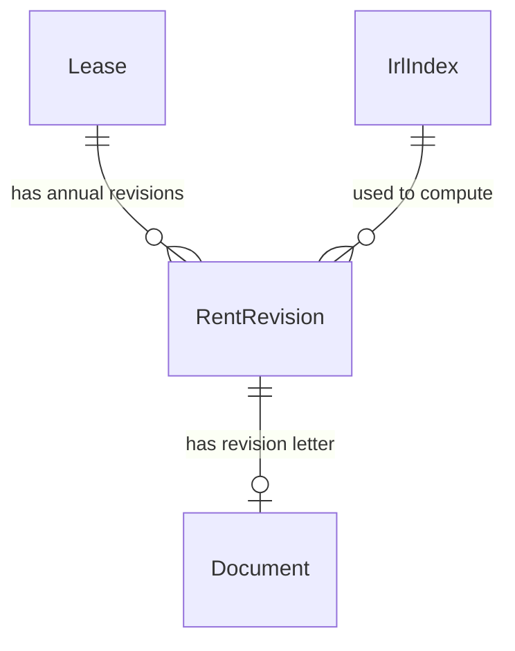

# Indexation (IRL) Specifications

## Overview

The **indexation** module handles the legally-mandated **annual rent revision** based on the INSEE
Rental Reference Index (_Indice de Référence des Loyers_, IRL). Each year, on the lease anniversary
date, a landlord may revise the rent according to the formula:

> **new rent = old rent × (IRL of the reference quarter / IRL of the same quarter the previous year)**

The reference quarter is derived from the quarter of the lease start date. Quarterly IRL values are
entered manually by the landlord (the official values are published by INSEE on
[service-public.gouv.fr — F13723](https://www.service-public.gouv.fr/particuliers/vosdroits/F13723)).
A direct automatic fetch is not possible in this offline-first, backend-less PWA (CORS), so the
indexation view links to the official source for manual entry.

Once an IRL value is available for both the reference quarter of the revision year and the previous
year, the app proposes a revised rent. The landlord validates manually (which updates the lease
rent) or refuses. A DOCX revision letter can be generated from the proposal.

## Data Model

### IrlIndex (quarterly INSEE reference index)

| Field       | Type             | Description                   |
| ----------- | ---------------- | ----------------------------- |
| `id`        | number           | Auto-generated primary key    |
| `year`      | number           | Year of the index             |
| `quarter`   | 1 \| 2 \| 3 \| 4 | Quarter (T1–T4)               |
| `value`     | number           | INSEE IRL value (e.g. 145.17) |
| `createdAt` | Date             | Creation timestamp            |
| `updatedAt` | Date             | Last update timestamp         |

A unique compound index `[year+quarter]` guarantees at most one value per quarter.

### RentRevision (annual revision record per lease)

| Field              | Type             | Description                                 |
| ------------------ | ---------------- | ------------------------------------------- |
| `id`               | number           | Auto-generated primary key                  |
| `leaseId`          | number           | Reference to the revised lease              |
| `year`             | number           | Year of the revision (anniversary)          |
| `anniversaryDate`  | Date             | Lease anniversary date for this revision    |
| `effectiveDate`    | Date             | Effective date of the new rent              |
| `referenceQuarter` | 1 \| 2 \| 3 \| 4 | IRL reference quarter (from lease start)    |
| `oldRent`          | number           | Rent before revision (€)                    |
| `newRent`          | number           | Revised rent, rounded to cents (€)          |
| `currentIrl`       | number           | IRL of the reference quarter, revision year |
| `previousIrl`      | number           | IRL of the same quarter, previous year      |
| `charges`          | number           | Monthly charges provision (unchanged)       |
| `status`           | enum             | `pending` \| `applied` \| `rejected`        |
| `documentId`       | number?          | Reference to the generated revision letter  |
| `createdAt`        | Date             | Creation timestamp                          |
| `updatedAt`        | Date             | Last update timestamp                       |

A unique compound index `[leaseId+year]` guarantees one revision per lease per year (upsert).

## Domain Rules

- An IRL `value` must be strictly greater than 0.
- A `year` + `quarter` pair is unique: re-saving the same pair updates the existing value.
- The reference quarter is the quarter of the lease `startDate`.
- A revision proposal can only be computed when **both** the IRL of the reference quarter for the
  revision year **and** the same quarter of the previous year are present.
- `newRent` is rounded to two decimals (the nearest cent).
- Applying a revision sets its status to `applied` and updates the lease `rent` to `newRent`.
- Refusing a revision sets its status to `rejected` and leaves the lease rent unchanged.
- A revision is only relevant for an `active` lease that has passed at least one anniversary.
- Charges (provision) are not affected by the revision.

## Calculation Flow



## Relationships



---

## User Stories

### Story: Record a quarterly IRL index

**As a** landlord
**I want to** enter the quarterly IRL values published by INSEE
**So that** the app can compute annual rent revisions

#### Scenario: Successful IRL entry

```gherkin
Given I am on the "Indexation IRL" page
And no IRL index exists yet
When I click "Ajouter un IRL"
And I set year "2026", quarter "T1" and value "147.05"
And I save
Then the IRL index "T1 2026 — 147,05" appears in the indices table
```

#### Scenario: Update an existing quarter (no duplicate)

```gherkin
Given an IRL index "T1 2026" with value "147.05" exists
When I add an IRL index for year "2026" quarter "T1" with value "147.20"
Then the existing index is updated to "147,20"
And no duplicate row is created
```

#### Scenario: Reject a non-positive value

```gherkin
Given I am entering an IRL index
When I set the value to "0"
Then a validation error appears: "La valeur de l'IRL doit être strictement positive"
And no index is saved
```

#### Scenario: Open the official source

```gherkin
Given I am on the "Indexation IRL" page
Then a link "Consulter les IRL (service-public.fr)" points to the INSEE F13723 page
And it opens in a new browser tab
```

---

### Story: Propose an annual rent revision

**As a** landlord
**I want to** see the computed revised rent at the lease anniversary
**So that** I can decide whether to apply the legal increase

#### Scenario: Proposal computed when indices are available

```gherkin
Given an active lease starting "2023-03-15" with rent "750 €" and charges "80 €"
And an IRL index "T1 2025" with value "143.46"
And an IRL index "T1 2026" with value "147.05"
When I open the lease detail page and select revision year "2026"
Then the revision proposal shows old rent "750 €"
And a new rent of "768,77 €"
And the reference quarter is "T1"
And the total is "848,77 € / mois"
```

#### Scenario: Missing indices block the proposal

```gherkin
Given an active lease starting "2023-03-15"
And only the IRL index "T1 2025" exists
When I open the lease detail page and select revision year "2026"
Then a message lists the missing index "T1 2026"
And a link invites me to enter the IRL values
```

#### Scenario: No anniversary reached yet

```gherkin
Given an active lease starting "2026-05-01"
And today is "2026-06-30"
When I open the lease detail page
Then the revision card shows that no anniversary has been reached
And no proposal is displayed
```

---

### Story: Validate or refuse a revision

**As a** landlord
**I want to** validate the proposed revision
**So that** the lease rent is updated to the indexed amount

#### Scenario: Validate the revision

```gherkin
Given a revision proposal of "750 €" to "768,77 €" for year "2026"
When I click "Valider la révision" and confirm
Then a RentRevision for 2026 is saved with status "applied"
And the lease rent becomes "768,77 €"
And the revision appears in the revision history as "Appliquée"
```

#### Scenario: Refuse the revision

```gherkin
Given a revision proposal of "750 €" to "768,77 €" for year "2026"
When I click "Refuser" and confirm
Then a RentRevision for 2026 is saved with status "rejected"
And the lease rent remains "750 €"
And the revision appears in the history as "Refusée"
```

---

### Story: Generate the rent revision letter

**As a** landlord
**I want to** generate a DOCX revision letter
**So that** I can formally notify the tenant of the new rent

#### Scenario: Generate and save the revision letter

```gherkin
Given a revision proposal for lease #42 year "2026"
When I click "Générer le courrier"
And I choose "Sauvegarder et télécharger"
Then a DOCX file "<date>_revisionLoyer_2026.docx" is downloaded
And a Document with description "Courrier révision loyer 2026" is linked to lease #42
And the letter header lists the landlord (name, address, email, phone), the tenant and the property
And the letter body lists the old rent, the new rent, both IRL values and the effective date
```

#### Scenario: Download an already generated letter

```gherkin
Given a revision letter for lease #42 year "2026" already exists in the documents
When I open the revision card for year "2026"
Then the button reads "Télécharger le courrier"
And clicking it downloads the existing document
```
