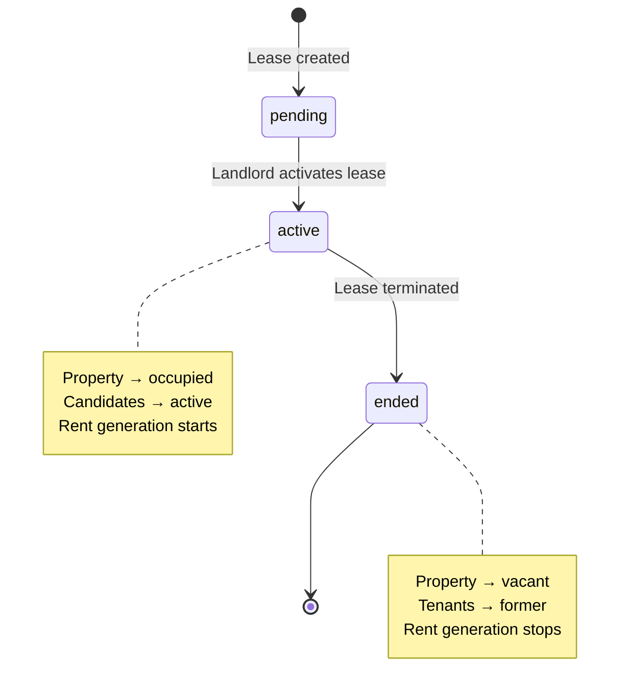
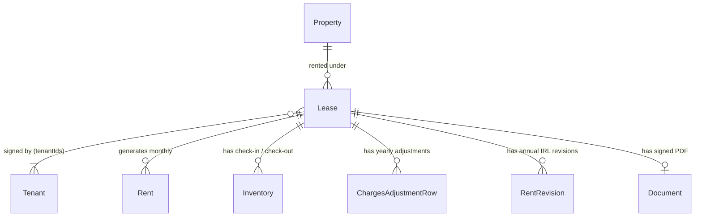

# Leases Specifications

## Overview

A **lease** (bail) is the central contractual entity linking a property to one or more tenants for a defined rental period. Creating a lease activates the rental relationship: the property status changes to `occupied`, candidate tenants become `active`, and monthly rent records begin being generated. Terminating a lease reverses these effects.

Leases also support a **charges adjustment** system that allows yearly reconciliation of utility charges between the provision collected monthly and actual annual expenses.

## Data Model

| Field                   | Type     | Description                                                                                                   |
| ----------------------- | -------- | ------------------------------------------------------------------------------------------------------------- |
| `id`                    | number   | Auto-generated primary key                                                                                    |
| `propertyId`            | number   | Reference to the rented property                                                                              |
| `tenantIds`             | number[] | One or more tenant IDs (co-tenants supported)                                                                 |
| `startDate`             | Date     | Lease start date                                                                                              |
| `endDate`               | Date?    | Lease end date (optional for open-ended leases)                                                               |
| `rent`                  | number   | Monthly rent amount (€)                                                                                       |
| `charges`               | number   | Monthly charges provision (€)                                                                                 |
| `deposit`               | number   | Security deposit amount (€)                                                                                   |
| `depositReceivedDate`   | Date?    | Date the security deposit was received from the tenant. Empty means "not yet received".                       |
| `depositReturnedDate`   | Date?    | Date the security deposit was returned to the tenant at the end of the lease. Empty means "not yet returned". |
| `depositReturnedAmount` | number?  | Amount actually returned to the tenant (may be less than `deposit` when deductions apply).                    |
| `paymentDay`            | number   | Day of month for rent payment (1–31)                                                                          |
| `status`                | enum     | `pending` \| `active` \| `ended`                                                                              |
| `documentId`            | number?  | Reference to the signed lease PDF (Document)                                                                  |
| `createdAt`             | Date     | Creation timestamp                                                                                            |
| `updatedAt`             | Date     | Last update timestamp                                                                                         |

### ChargesAdjustmentRow (yearly charges reconciliation)

| Field                  | Type                      | Description                                 |
| ---------------------- | ------------------------- | ------------------------------------------- |
| `id`                   | number                    | Auto-generated                              |
| `leaseId`              | number                    | Reference to lease                          |
| `year`                 | number                    | Year of the reconciliation                  |
| `monthlyRent`          | number                    | Rent amount for that year                   |
| `annualCharges`        | number?                   | Actual annual charges total (€)             |
| `chargesProvisionPaid` | number                    | Total provision collected for the year      |
| `rentsPaidCount`       | number                    | Number of rents paid that year              |
| `rentsPaidTotal`       | number                    | Total rent amount collected that year       |
| `customCharges`        | Record\<string, number\>? | Named charge columns for detailed breakdown |

## Status Lifecycle



## Side Effects on Activation

When a lease status moves to `active`:

1. The linked property's status changes to `occupied`
2. All linked tenants with status `candidate` change to `active`
3. Monthly rent records begin being generated for each `paymentDay`

## Side Effects on Termination

When a lease is terminated:

1. The linked property's status changes back to `vacant`
2. All linked tenants change to `former`
3. No further rents are generated for this lease

## Domain Rules

- `endDate`, if provided, must be strictly after `startDate`
- `rent` must be strictly greater than 0
- `charges` must be ≥ 0
- `deposit` must be ≥ 0
- `depositReturnedAmount`, if provided, must be ≥ 0 and ≤ `deposit`
- `depositReturnedDate`, if provided, must be on or after `depositReceivedDate`
- A deposit can only be marked as returned once it has been marked as received
- `paymentDay` must be between 1 and 31
- A property can only have one `active` lease at a time
- A lease must reference at least one tenant
- All referenced `tenantIds` must correspond to existing tenants
- The referenced `propertyId` must correspond to an existing property

## Relationships



> Annual IRL rent revision is documented in its own domain — see [indexation.md](./indexation.md).

---

## User Stories

### Story: Create a lease

**As a** landlord  
**I want to** create a rental contract linking a property to one or more tenants  
**So that** the rental relationship is formally recorded and rent generation begins

#### Scenario: Successful lease creation

```gherkin
Given a property "Studio Belleville" with status "vacant" exists
And a tenant "Marie Dupont" with status "active" exists
When I click "Create lease"
And I select property "Studio Belleville"
And I select tenant "Marie Dupont"
And I fill in startDate "2026-01-01"
And I fill in endDate "2026-12-31"
And I fill in rent "750"
And I fill in charges "80"
And I fill in deposit "750"
And I fill in paymentDay "5"
And I save
Then the lease appears in the active leases list
And property "Studio Belleville" status changes to "occupied"
And "Marie Dupont" status remains "active"
```

#### Scenario: Create lease with a candidate tenant

```gherkin
Given a tenant "Paul Bernard" has status "candidate"
When I create a lease linking "Paul Bernard" to a vacant property
And I activate the lease
Then Paul's status changes to "active"
And a TenantAudit entry with action "validated" is recorded for Paul
```

#### Scenario: Create lease with multiple co-tenants

```gherkin
Given property "T3 Nation" is vacant
And tenants "Alice" and "Bob" exist
When I create a lease selecting both "Alice" and "Bob" as tenants
Then the lease has tenantIds containing both Alice's and Bob's IDs
And both tenants are linked to the lease
```

#### Scenario: Attempt to create lease on an already occupied property

```gherkin
Given property "Appart Gambetta" has status "occupied" with an active lease
When I try to create a new active lease for "Appart Gambetta"
Then an error appears: "This property already has an active lease"
And no new lease is created
```

#### Scenario: Attempt to create lease with endDate before startDate

```gherkin
Given I am filling in the lease creation form
When I set startDate to "2026-06-01" and endDate to "2026-01-01"
Then a validation error appears: "End date must be after start date"
And the form is not submitted
```

#### Scenario: Attempt to create lease with rent of 0

```gherkin
Given I am filling in the lease creation form
When I set rent to "0"
Then a validation error appears: "Rent must be greater than 0"
```

---

### Story: Edit a lease

**As a** landlord  
**I want to** update lease details (rent amount, end date, payment day)  
**So that** the contract reflects any amendments agreed with the tenant

#### Scenario: Update the end date of an active lease

```gherkin
Given an active lease for "Studio Belleville" ending "2026-12-31"
When I edit the lease and change endDate to "2027-06-30"
And I save
Then the lease detail shows the new end date "30/06/2027"
And the updatedAt timestamp is refreshed
```

#### Scenario: Update rent amount

```gherkin
Given an active lease with rent "750"
When I update the rent to "800"
Then the lease shows rent "800 €"
But existing already-generated rent records are NOT retroactively modified
```

---

### Story: Terminate a lease

**As a** landlord  
**I want to** formally end a lease when the tenant leaves  
**So that** the property becomes available and the tenants are marked as former

#### Scenario: Successful lease termination

```gherkin
Given an active lease linking property "Studio Belleville" to tenant "Marie Dupont"
When I navigate to the lease detail page
And I click "Terminate lease"
And I confirm the termination dialog
Then the lease status changes to "ended"
And property "Studio Belleville" status changes to "vacant"
And tenant "Marie Dupont" status changes to "former"
And the lease appears in the "Ended" filter
And no further rents are generated for this lease
```

#### Scenario: Terminate lease with multiple co-tenants

```gherkin
Given an active lease with tenants "Alice" and "Bob"
When I terminate the lease
Then both "Alice" and "Bob" statuses change to "former"
And the property returns to "vacant"
```

---

### Story: View expiring leases

**As a** landlord  
**I want to** see leases expiring within the next 30 days  
**So that** I can prepare for renewals or vacancy

#### Scenario: View upcoming expiries

```gherkin
Given today is 2026-06-01
And a lease ends on 2026-06-20 (19 days away)
And another lease ends on 2026-08-01 (61 days away)
When I view the "Expiring soon" section on the dashboard or leases list
Then only the lease ending 2026-06-20 appears in the expiring leases list
```

---

### Story: Filter and search leases

**As a** landlord  
**I want to** filter leases by status and search by property or tenant name  
**So that** I can quickly locate a specific rental contract

#### Scenario: Filter by status "active"

```gherkin
Given I have 3 active leases and 2 ended leases
When I apply the filter "Active"
Then only the 3 active leases are displayed
```

#### Scenario: Filter by status "ended"

```gherkin
Given I apply the filter "Ended"
Then only terminated leases are shown
And they are sorted by termination date descending
```

#### Scenario: Search by property name

```gherkin
Given a lease is linked to property "Studio Belleville"
When I type "Belleville" in the search input
Then that lease appears in the results
```

---

### Story: Manage yearly charges adjustments

**As a** landlord  
**I want to** record the annual charges reconciliation for a lease  
**So that** I can calculate whether tenants owe additional charges or are entitled to a refund

#### Scenario: Create a charges adjustment for a year

```gherkin
Given an active lease with monthly charges provision of "80 €"
When I navigate to the lease's charges adjustment tab
And I click "Add adjustment for 2025"
And I fill in annualCharges "1050" (actual charges total)
And I save
Then a ChargesAdjustmentRow for 2025 is saved
And the UI shows that the tenant paid 12 × 80 = 960 € in provisions
And the balance shows −90 € (tenant owes 90 €)
```

#### Scenario: Add custom charge columns

```gherkin
Given I am editing a charges adjustment row for 2025
When I add a custom column named "Water" with value "240"
And another column "Heating" with value "810"
Then the breakdown table shows Water: 240 € and Heating: 810 €
And the total custom charges sum is displayed
```

#### Scenario: Prevent duplicate year entry

```gherkin
Given a charges adjustment for 2025 already exists on a lease
When I try to create another adjustment for 2025 on the same lease
Then the existing record is updated (upsert behavior)
And no duplicate row is created
```

---

### Story: Generate lease documents with multiple tenants

**As a** landlord  
**I want to** generated documents (mandat de location, quittance de loyer, attestation de remise des clés, courrier de régularisation) to list every tenant on the lease  
**So that** the documents are legally complete when a lease has co-tenants

#### Scenario: Generate a document for a single-tenant lease

```gherkin
Given an active lease linking property "Studio Belleville" to tenant "M. Dupont Jean"
When I generate the mandat de location for that lease
Then the tenant field shows "M. Dupont Jean"
```

#### Scenario: Generate a document for a lease with two co-tenants

```gherkin
Given an active lease with co-tenants "M. Dupont Jean" and "Mme Martin Marie"
When I generate the mandat de location for that lease
Then the tenant full-name field shows "M. Dupont Jean et Mme Martin Marie"
And the tenant email field lists both tenants' emails separated by commas
And the tenant phone field lists both tenants' phone numbers separated by commas
```

#### Scenario: Generate a document for a lease with three or more co-tenants

```gherkin
Given an active lease with co-tenants "Dupont", "Martin" and "Bernard"
When I generate any lease document
Then the tenant names are joined as "Dupont, Martin et Bernard"
```

#### Scenario: Regulation letter short names list all co-tenants

```gherkin
Given an active lease with co-tenants "M. Dupont Jean" and "Mme Martin Marie"
When I generate the courrier de régularisation
Then the short tenant-name field shows "M. Dupont et Mme Martin"
```

### Story: Attach documents to a lease

**As a** landlord  
**I want to** attach and manage arbitrary files on a lease (garant, signed contract, riders, and other supporting documents)  
**So that** all documents related to a rental contract live on the lease's detail page — as I can already do for properties and tenants

#### Scenario: Upload a document from the lease detail page

```gherkin
Given I am on the detail page of lease #42
When I open the "Documents" section
And I choose a category (e.g. "Bail signé", "Garant", "Autre")
And I select the file "bail-signe.pdf" (application/pdf)
And I click "Ajouter"
Then a Document is created with relatedEntityType "lease" and relatedEntityId 42
And the document appears in the lease's document list with its name, category and upload date
```

#### Scenario: List documents attached to a lease

```gherkin
Given lease #42 has 3 attached documents (signed contract, guarantor engagement, insurance)
When I open the "Documents" section of the lease detail page
Then the 3 documents are listed, most recent first
And each document can be downloaded
```

#### Scenario: Empty state when a lease has no attached documents

```gherkin
Given lease #42 has no attached documents
When I open the "Documents" section of the lease detail page
Then an empty state is shown with a call to action to add a document
```

#### Scenario: Delete a document attached to a lease

```gherkin
Given lease #42 has an attached document "bail-signe.pdf"
When I click "Delete" on that document and confirm
Then the document is removed from the lease's list
And its binary data is removed from the database
```

#### Scenario: Generated lease documents coexist with manual attachments

```gherkin
Given lease #42 has a generated "Attestation de remise des clés" and a manually uploaded "garant.pdf"
When I open the "Documents" section of the lease detail page
Then the manually attached documents are listed alongside the generated ones without duplication
And both uploading and generation target relatedEntityType "lease" with relatedEntityId 42
```

---

### Story: Record security deposit reception

**As a** landlord  
**I want to** mark the security deposit as received on a lease, with the date it was received  
**So that** I can track that the tenant has paid the deposit (usually equal to one month's rent)

#### Scenario: Mark the deposit as received

```gherkin
Given an active lease "Studio Belleville" with a deposit of "750 €" and no reception recorded
When I open the "Dépôt de garantie" section of the lease detail page
And I click "Marquer comme reçu"
And I fill in the reception date "2026-01-03"
And I confirm
Then the lease's depositReceivedDate is set to "2026-01-03"
And the section shows the deposit as received on "03/01/2026"
And the updatedAt timestamp is refreshed
```

#### Scenario: Reception date defaults to today

```gherkin
Given today is "2026-01-05"
And an active lease with a deposit of "750 €" and no reception recorded
When I open the deposit reception dialog
Then the reception date field is pre-filled with "2026-01-05"
```

#### Scenario: Deposit reception status is visible at a glance

```gherkin
Given a lease whose deposit has not been received
When I view the lease detail page
Then the deposit is flagged as "Non reçu"
And a call to action "Marquer comme reçu" is offered
```

#### Scenario: Correct a wrongly recorded reception

```gherkin
Given a lease with depositReceivedDate "2026-01-03"
When I edit the reception date to "2026-01-04"
And I confirm
Then the lease's depositReceivedDate is updated to "2026-01-04"
```

---

### Story: Record security deposit restitution

**As a** landlord  
**I want to** mark the security deposit as returned at the end of a lease, with the date and the amount actually returned  
**So that** I can track the restitution and any deductions retained for repairs or unpaid rent

#### Scenario: Return the full deposit

```gherkin
Given an ended lease with a deposit of "750 €" received on "2026-01-03"
When I open the "Dépôt de garantie" section
And I click "Enregistrer la restitution"
And I fill in the restitution date "2027-01-15"
And I fill in the returned amount "750"
And I confirm
Then the lease's depositReturnedDate is set to "2027-01-15"
And the lease's depositReturnedAmount is set to "750"
And the section shows the deposit as returned in full on "15/01/2027"
```

#### Scenario: Return a partial deposit with deductions

```gherkin
Given an ended lease with a deposit of "750 €" received on "2026-01-03"
When I record a restitution date "2027-01-15" and a returned amount of "600"
Then the lease's depositReturnedAmount is set to "600"
And the section shows that "150 €" were retained
```

#### Scenario: Attempt to return more than the deposit

```gherkin
Given a lease with a deposit of "750 €"
When I set the returned amount to "800"
Then a validation error appears: "Le montant restitué ne peut pas dépasser le dépôt"
And the restitution is not saved
```

#### Scenario: Attempt to record restitution before reception

```gherkin
Given a lease whose deposit has not been marked as received
When I open the deposit restitution dialog
Then the restitution action is disabled
And a hint explains that the deposit must first be marked as received
```

#### Scenario: Attempt a restitution date before the reception date

```gherkin
Given a lease with depositReceivedDate "2026-01-03"
When I set the restitution date to "2025-12-01"
Then a validation error appears: "La date de restitution doit être postérieure à la réception"
And the restitution is not saved
```

---

### Story: Generate a deposit reception receipt document

**As a** landlord  
**I want to** generate a document acknowledging receipt of the security deposit and the first month's rent  
**So that** the tenant has a written proof of the sums paid at the start of the lease

#### Scenario: Generate the reception receipt

```gherkin
Given an active lease "Studio Belleville" for tenant "M. Dupont Jean"
And a rent of "750 €", charges of "80 €" and a deposit of "750 €"
And the deposit has been marked as received on "2026-01-03"
When I click "Reçu dépôt de garantie et 1er loyer" in the lease documents actions
Then a DOCX is generated from the "templateReceptionDepot.docx" template
And it lists the landlord, the property, all tenants of the lease
And it shows the deposit amount "750 €", the first month rent "750 €" and charges "80 €"
And it shows the total sum received and the reception date "03/01/2026"
And the generated document is attached to the lease with relatedEntityType "lease"
```

#### Scenario: Reception receipt lists all co-tenants

```gherkin
Given an active lease with co-tenants "M. Dupont Jean" and "Mme Martin Marie"
When I generate the deposit reception receipt
Then the tenant field shows "M. Dupont Jean et Mme Martin Marie"
```

#### Scenario: Reception receipt requires a recorded reception

```gherkin
Given a lease whose deposit has not been marked as received
When I look at the lease documents actions
Then the "Reçu dépôt de garantie et 1er loyer" action is disabled
And a hint explains the deposit must be marked as received first
```

---

### Story: Generate a deposit restitution document

**As a** landlord  
**I want to** generate a document confirming the restitution of the security deposit at the end of the lease  
**So that** the tenant has written proof of the returned amount and of any deductions

#### Scenario: Generate the restitution document

```gherkin
Given an ended lease "Studio Belleville" for tenant "M. Dupont Jean"
And a deposit of "750 €" returned in full on "2027-01-15"
When I click "Restitution dépôt de garantie" in the lease documents actions
Then a DOCX is generated from the "templateRestitutionDepot.docx" template
And it lists the landlord, the property and all tenants of the lease
And it shows the original deposit "750 €", the returned amount "750 €" and any deductions
And it shows the restitution date "15/01/2027"
And the generated document is attached to the lease with relatedEntityType "lease"
```

#### Scenario: Restitution document reflects deductions

```gherkin
Given an ended lease with a deposit of "750 €" and a returned amount of "600 €"
When I generate the deposit restitution document
Then it shows a returned amount of "600 €" and deductions of "150 €"
```

#### Scenario: Restitution document requires a recorded restitution

```gherkin
Given a lease whose deposit restitution has not been recorded
When I look at the lease documents actions
Then the "Restitution dépôt de garantie" action is disabled
And a hint explains the restitution must be recorded first
```
