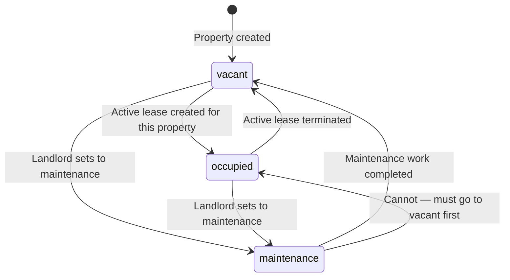
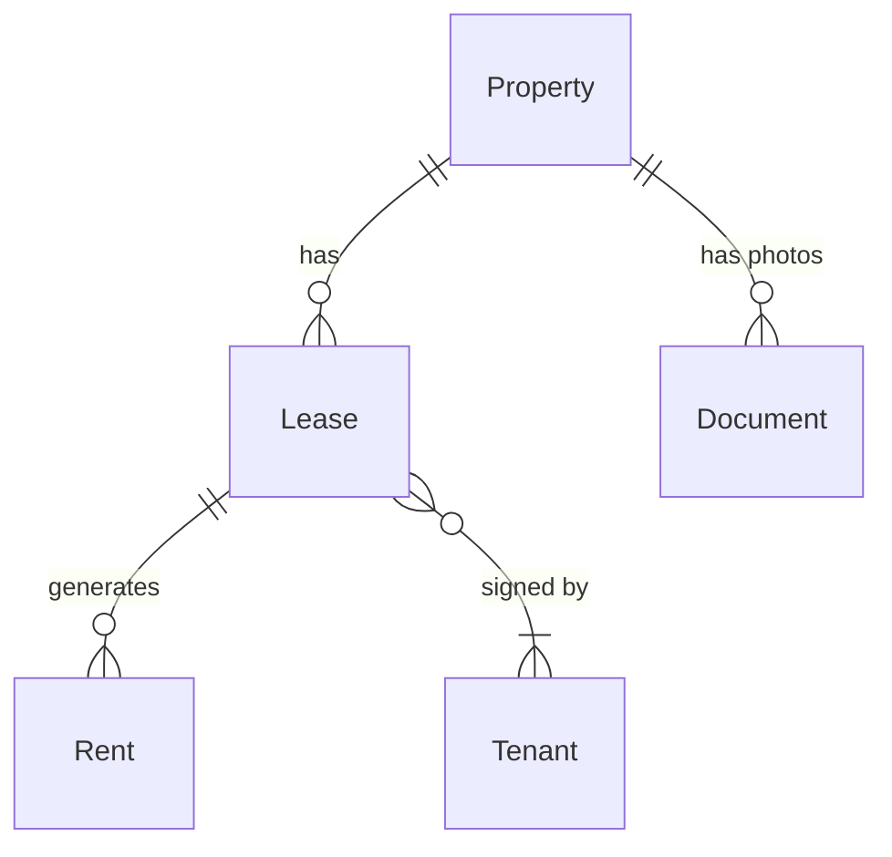

# Properties Specifications

## Overview

A **property** is the central entity of Locapilot. It represents a real estate asset managed by the landlord — an apartment, house, studio, commercial space, parking slot, or other type. Properties track their physical characteristics, financial terms, and current occupancy status. The property lifecycle drives the activation and termination of leases.

## Data Model

| Field         | Type      | Description                                                                |
| ------------- | --------- | -------------------------------------------------------------------------- |
| `id`          | number    | Auto-generated primary key                                                 |
| `name`        | string    | Display name (e.g. "Appart Gambetta T2")                                   |
| `address`     | string    | Street address                                                             |
| `postalCode`  | string?   | Postal code                                                                |
| `town`        | string?   | City/town                                                                  |
| `type`        | enum      | `apartment` \| `house` \| `studio` \| `commercial` \| `parking` \| `other` |
| `surface`     | number    | Living area in m²                                                          |
| `rooms`       | number    | Total number of rooms                                                      |
| `bedrooms`    | number?   | Number of bedrooms                                                         |
| `bathrooms`   | number?   | Number of bathrooms                                                        |
| `rent`        | number    | Base monthly rent amount (€)                                               |
| `charges`     | number?   | Monthly charges amount (€)                                                 |
| `deposit`     | number?   | Security deposit amount (€)                                                |
| `annonce`     | string?   | Rich-text rental listing announcement                                      |
| `description` | string?   | Internal notes/description                                                 |
| `features`    | string[]? | List of features (e.g. "parking", "balcony")                               |
| `photos`      | number[]? | Array of Document IDs (photo type)                                         |
| `status`      | enum      | `vacant` \| `occupied` \| `maintenance`                                    |
| `createdAt`   | Date      | Creation timestamp                                                         |
| `updatedAt`   | Date      | Last update timestamp                                                      |

## Status Lifecycle



**Rules:**

- A newly created property always starts as `vacant`
- Status transitions to `occupied` happen automatically when an active lease is created for the property
- Status transitions back to `vacant` automatically when the lease is terminated
- `maintenance` is a manual status set by the landlord
- A property in `maintenance` cannot have an active lease created

## Domain Rules

- `name` is required and must be non-empty
- `rent` must be strictly greater than 0
- `surface` must be strictly greater than 0
- `rooms` must be at least 1
- A property with an active lease cannot be deleted
- Photos are stored as Document records with type `photo` linked to this property

## Relationships



---

## User Stories

### Story: Create a property

**As a** landlord  
**I want to** add a new property with its characteristics  
**So that** I can start managing its rental lifecycle

#### Scenario: Successful property creation

```gherkin
Given I am on the Properties page
When I click "Add property"
And I fill in name "Appart Gambetta T2"
And I select type "apartment"
And I fill in address "12 rue Gambetta"
And I fill in postalCode "75020"
And I fill in town "Paris"
And I fill in surface "42"
And I fill in rooms "2"
And I fill in rent "850"
And I click "Save"
Then the property "Appart Gambetta T2" appears in the properties list
And its status badge shows "Vacant"
And the total property count increases by 1
```

#### Scenario: Attempt to create with missing required fields

```gherkin
Given I am on the "Add property" form
When I submit the form without filling in the name
Then validation errors highlight the required fields
And the form is not submitted
And no property is created
```

#### Scenario: Attempt to create with rent equal to zero

```gherkin
Given I am on the "Add property" form
When I fill in rent as "0"
And I submit the form
Then a validation error appears: "Rent must be greater than 0"
And no property is created
```

#### Scenario: Attempt to create with negative surface

```gherkin
Given I am on the "Add property" form
When I fill in surface as "-10"
And I submit the form
Then a validation error appears indicating surface must be positive
And no property is created
```

---

### Story: Edit a property

**As a** landlord  
**I want to** update the details of an existing property  
**So that** the information stays accurate over time

#### Scenario: Successful property edit

```gherkin
Given a property "Studio Belleville" exists
When I open the property detail or edit modal
And I change the name to "Studio Belleville — refait"
And I save
Then the property card displays "Studio Belleville — refait"
And the updatedAt timestamp is refreshed
```

#### Scenario: Edit financial terms of a property with an active lease

```gherkin
Given a property has an active lease
When I change the base rent on the property
Then the property is updated
But the existing lease rent is NOT automatically modified (lease rent is independent)
```

---

### Story: Delete a property

**As a** landlord  
**I want to** remove a property I no longer manage  
**So that** my property list stays clean

#### Scenario: Successful deletion of a vacant property

```gherkin
Given a property "Parking Oberkampf" with status "vacant" exists
And the property has no active lease
When I click "Delete" on the property
And I confirm the deletion dialog
Then "Parking Oberkampf" disappears from the properties list
And its associated documents are removed
```

#### Scenario: Attempt to delete a property with an active lease

```gherkin
Given a property has status "occupied" with an active lease
When I attempt to delete the property
Then the system shows an error: "Cannot delete a property with an active lease"
And the property remains in the list
```

---

### Story: Filter and search properties

**As a** landlord  
**I want to** filter my properties by status or type and search by name  
**So that** I can quickly find specific assets

#### Scenario: Filter by status "vacant"

```gherkin
Given I have 5 properties: 3 vacant, 1 occupied, 1 in maintenance
When I apply the filter "Vacant"
Then only the 3 vacant properties are shown
And the count reflects 3 results
```

#### Scenario: Filter by type "apartment"

```gherkin
Given I have a mix of apartment, house, and parking properties
When I select type filter "apartment"
Then only apartment-type properties are displayed
```

#### Scenario: Search by name

```gherkin
Given multiple properties exist
When I type "Gambetta" in the search input
Then only properties whose name contains "Gambetta" are displayed
```

#### Scenario: Combined filter and search

```gherkin
Given I have 10 properties
When I filter by "vacant" AND search for "Paris"
Then only vacant properties matching "Paris" in their name or address are shown
```

---

### Story: Change property status manually

**As a** landlord  
**I want to** set a property to maintenance mode  
**So that** it is excluded from active rental management while being refurbished

#### Scenario: Set a vacant property to maintenance

```gherkin
Given a property has status "vacant"
When I change its status to "maintenance"
Then the property card shows the "Maintenance" status badge
And the property is excluded from vacant property count
```

#### Scenario: Cannot directly set an occupied property to vacant

```gherkin
Given a property has status "occupied"
When I view its status options
Then "vacant" is not a selectable direct transition
And the user is informed they must terminate the lease first
```

---

### Story: Add photos to a property

**As a** landlord  
**I want to** attach photos to a property  
**So that** I can visually document its condition and use them in listings

#### Scenario: Upload a photo

```gherkin
Given I am on the property detail page
When I click "Add photo"
And I select an image file (jpeg/png)
Then the photo appears in the property's photo gallery
And a Document record of type "photo" is created linked to this property
```

#### Scenario: Remove a photo

```gherkin
Given a property has 3 photos
When I delete one photo from the gallery
Then that photo no longer appears in the gallery
And the associated Document record is deleted
```

---

### Story: Write a rental listing announcement

**As a** landlord  
**I want to** write a rich-text listing announcement for a property  
**So that** I can copy it when posting on rental platforms

#### Scenario: Save a listing announcement

```gherkin
Given I am editing a property
When I fill in the "Annonce" rich-text field with formatted content
And I save
Then the announcement is saved with the property
And I can retrieve and copy it from the property detail page
```

---

### Story: View property statistics on the list

**As a** landlord  
**I want to** see a summary of my portfolio at a glance  
**So that** I can assess occupancy and revenue without opening each property

#### Scenario: View occupancy rate and total revenue

```gherkin
Given I have 4 properties: 3 occupied at €800, €1000, €1200, and 1 vacant at €600
When I view the Properties page
Then the stats panel shows:
  - Total properties: 4
  - Occupied: 3
  - Vacant: 1
  - Occupancy rate: 75%
  - Total monthly revenue: €3,000 (occupied only)
```
