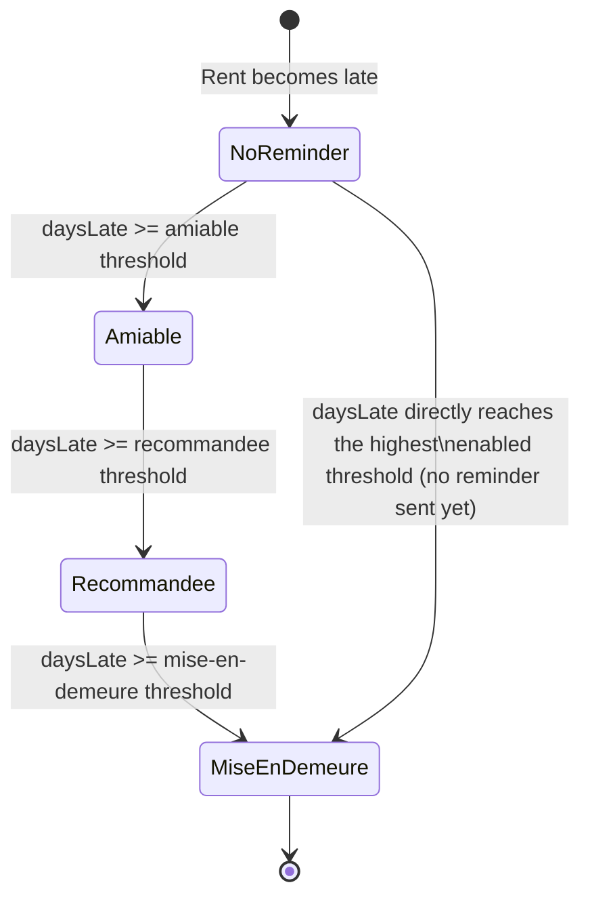
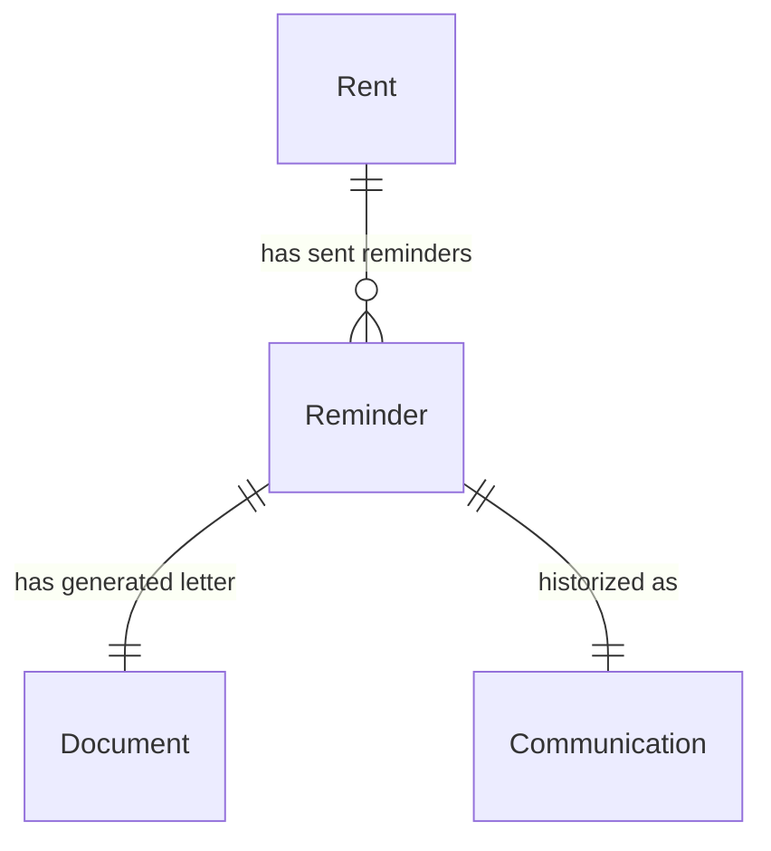

# Reminders (Relances) Specifications

## Overview

The **reminders** module automates the landlord's follow-up on unpaid rent. Late-payment detection
already exists (a `Rent` becomes `late` once its `dueDate` has passed — see [Rents spec](./rents.md)),
but until this module nothing acted on it. Reminders close that loop with a configurable escalation
schedule, DOCX letter generation, and historization through the Communications entity.

Because Locapilot is a fully offline, backend-less PWA, "automatic" does not mean auto-emailing —
there is no mail server. It means: the app automatically **detects** which overdue rents have crossed
a configured day threshold without yet having had that level's letter sent, surfaces this on the
dashboard and on the rent row, and the landlord clicks a button to generate, download, and log the
letter — the same UX as the existing rent receipt and IRL revision letters.

Three fixed, independently configurable escalation levels are supported, from softest to most formal:

1. **Relance amiable** (friendly reminder) — default threshold: 1 day late (i.e. as soon as a rent is overdue)
2. **Relance recommandée** (firmer reminder, mentions registered mail) — default: 31 days late (~1 month later)
3. **Mise en demeure** (formal notice) — default: 61 days late (~1 month after that)

> The wording of the three DOCX templates (`templateRelanceAmiable.docx`,
> `templateRelanceRecommandee.docx`, `templateMiseEnDemeure.docx`) is a best-effort draft and is not
> legal advice — it should be reviewed (ideally by a legal professional) before being used for a real
> "mise en demeure", which has specific legal-formality expectations under French law.

## Data Model

### Reminder (one row per letter actually sent)

| Field             | Type   | Description                                                         |
| ----------------- | ------ | ------------------------------------------------------------------- |
| `id`              | number | Auto-generated primary key                                          |
| `rentId`          | number | Reference to the overdue rent                                       |
| `level`           | enum   | `amiable` \| `recommandee` \| `mise-en-demeure`                     |
| `thresholdDays`   | number | Day threshold configured at the time the letter was sent (snapshot) |
| `sentDate`        | Date   | Date the letter was generated/sent                                  |
| `documentId`      | number | Reference to the generated DOCX letter (Document)                   |
| `communicationId` | number | Reference to the historization entry (Communication)                |
| `createdAt`       | Date   | Creation timestamp                                                  |

A compound index `[rentId+level]` supports efficient lookup of what has already been sent for a rent.

### Communication (extended)

`Communication.relatedEntityType` now also accepts `'rent'` (in addition to `property` \| `tenant` \|
`lease` \| `applicant`), so a reminder letter can be historized as an outbound `letter` communication
linked to the rent it concerns — this is the "module Communications" link referenced by the feature
request. See [Documents spec](./documents.md) for the underlying `Document` record (type `other`,
`relatedEntityType: 'rent'`).

### ReminderThresholdConfig (stored under the `reminderThresholds` setting)

| Field     | Type    | Description                                     |
| --------- | ------- | ----------------------------------------------- |
| `level`   | enum    | `amiable` \| `recommandee` \| `mise-en-demeure` |
| `days`    | number  | Number of days late that triggers this level    |
| `enabled` | boolean | Whether this level is offered at all            |

See [Settings spec](./settings.md) for how this is persisted and edited.

## Escalation Logic



For each overdue, unpaid rent, the app proposes **the highest enabled threshold reached by the current
delay that has not already been sent** — not necessarily the next level in sequence. A rent that has
gone unnoticed for 94 days with no reminder ever sent is proposed directly at "Mise en demeure"; it does
not force the landlord to send the amiable and recommandée letters first. Once the most formal letter
(highest threshold) has been sent for a rent, no further reminder is ever proposed for it, even if a
lower level was skipped along the way.

A rent stops being eligible for reminders as soon as it is fully `paid`; a `partial` payment does not
clear eligibility (the remaining balance is still late).

## Domain Rules

- The 3 levels are fixed (amiable, recommandée, mise en demeure); each has its own day threshold
  (default 1 / 31 / 61 — the amiable letter is offered as soon as a rent is overdue, then a level
  roughly every 30 days) and can be individually enabled or disabled in Settings.
- A disabled threshold is never proposed, even if its day count has been reached.
- A rent with status `paid` is never proposed for a reminder.
- A rent with status `partial` remains eligible (the outstanding balance is still overdue).
- The amount due on the letter is `amount + charges - paidAmount` (0 if no partial payment recorded).
- Sending a reminder creates, in order: a generated DOCX `Document` (`relatedEntityType: 'rent'`), a
  `Communication` (`type: 'letter'`, `direction: 'outbound'`, `relatedEntityType: 'rent'`) referencing
  that document, and a `Reminder` row linking the two and marking the level as sent for that rent.
- The dashboard highlights the total count of rents currently awaiting a reminder (i.e. for which
  `computePendingReminders` returns an entry).

## Relationships



---

## User Stories

### Story: Configure the reminder schedule

**As a** landlord
**I want to** configure the day thresholds for each reminder level
**So that** the escalation matches how strict I want to be with late payments

#### Scenario: Update the default thresholds

```gherkin
Given I am on the Settings page, "Relances des impayés" section
And the default thresholds are 1 / 31 / 61 days
When I change the "Relance amiable" threshold to "15" days
And I save
Then the new threshold of 15 days is used for future reminder proposals
And the setting persists after a page reload
```

#### Scenario: Disable a reminder level

```gherkin
Given the "Relance recommandée" level is enabled at 31 days
When I uncheck it and save
Then a rent 40 days late is not proposed a "Relance recommandée"
And it is proposed a "Mise en demeure" instead once 61 days are reached
```

---

### Story: Send a reminder letter for an overdue rent

**As a** landlord
**I want to** generate and download the appropriate reminder letter for a late rent
**So that** I can formally notify the tenant and keep a record of it

#### Scenario: First reminder for a newly-late rent

```gherkin
Given a rent is 3 days late and has never had a reminder sent
And the "Relance amiable" threshold is 1 day
When I open the Rents page
Then the rent row shows a "Relance amiable" button
When I click it and confirm
Then a DOCX letter is generated and downloaded
And a Document is saved with relatedEntityType "rent" for this rent
And a Communication of type "letter" is created, linked to that document
And the "Relance amiable" button no longer appears for this rent until the next threshold is reached
```

#### Scenario: Escalating to the next level

```gherkin
Given a rent already had its "Relance amiable" sent 30 days ago
And the rent is now 35 days late
And the "Relance recommandée" threshold is 31 days
When I open the Rents page
Then the rent row shows a "Relance recommandée" button
```

#### Scenario: Jumping directly to the most formal level

```gherkin
Given a rent is 65 days late and has never had any reminder sent
And thresholds are 1 / 31 / 61 days, all enabled
When I open the Rents page
Then the rent row shows a "Mise en demeure" button, not "Relance amiable"
```

#### Scenario: No reminder proposed once fully paid

```gherkin
Given a rent was 40 days late with a "Relance amiable" already sent
When the tenant pays the full outstanding amount
Then the rent status becomes "paid"
And no reminder button appears on that rent row anymore
```

#### Scenario: No reminder proposed once the highest level has been sent

```gherkin
Given a rent had its "Mise en demeure" sent when it was 61 days late
And the rent is now 90 days late, still unpaid
When I open the Rents page
Then no reminder button appears for this rent — the most formal letter was already sent
```

---

### Story: See overdue rents needing follow-up on the dashboard

**As a** landlord
**I want to** see, at a glance, how many rents currently need a reminder
**So that** I don't have to check every rent manually

#### Scenario: Dashboard highlights pending reminders

```gherkin
Given 2 rents are currently eligible for a reminder (per their thresholds and send history)
When I open the dashboard
Then a "Relances à envoyer" stat card shows the value "2"
```
