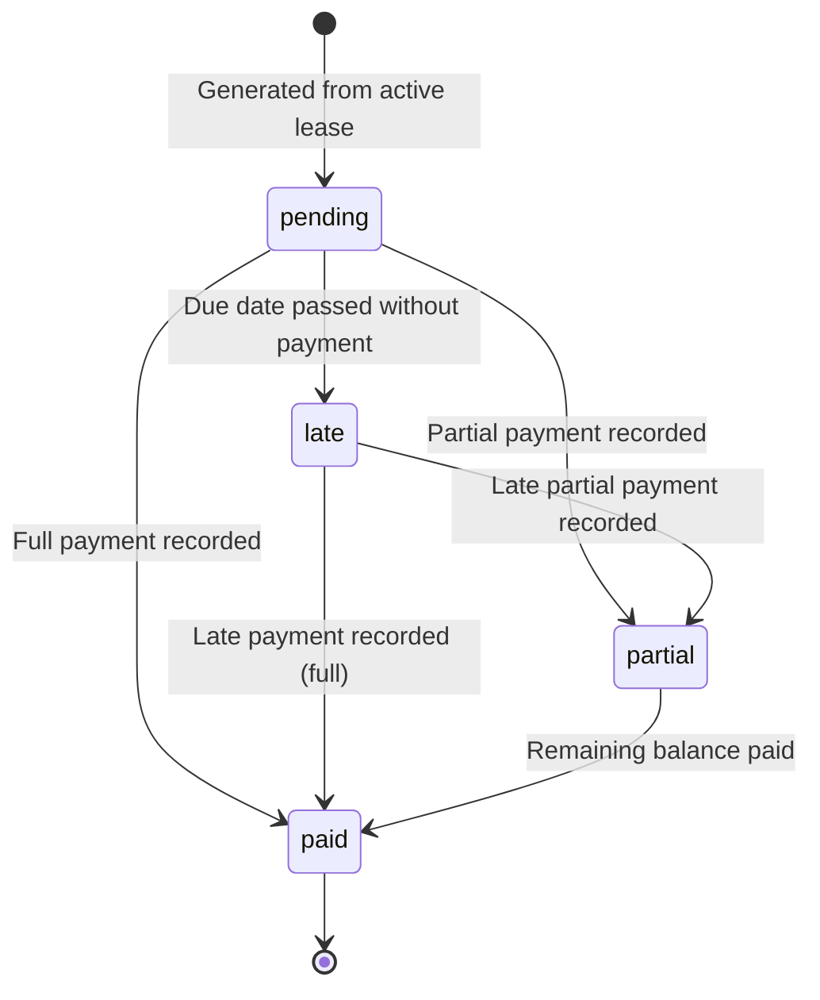
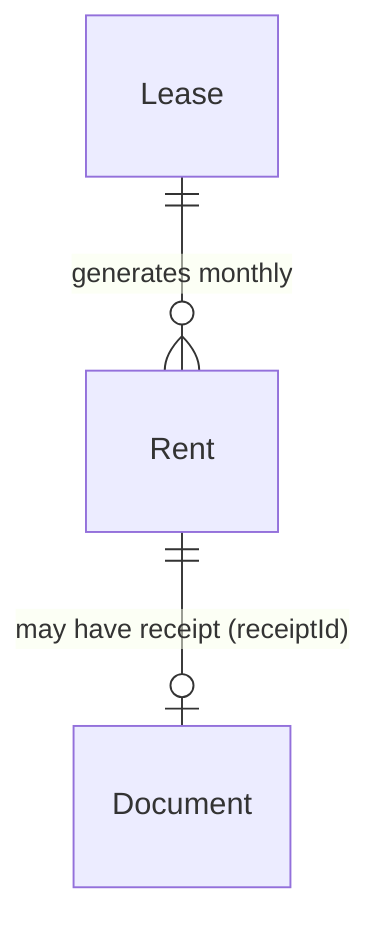

# Rents Specifications

## Overview

A **rent** record represents a monthly payment due or made under a lease. Rents are generated automatically from active leases and track the full payment lifecycle — from pending to paid (including partial payments and overdue detection). The rent system is the financial core of Locapilot, providing visibility into cash flow, overdue situations, and payment history.

## Data Model

| Field           | Type    | Description                                                 |
| --------------- | ------- | ----------------------------------------------------------- |
| `id`            | number  | Auto-generated primary key                                  |
| `leaseId`       | number  | Reference to the parent lease                               |
| `dueDate`       | Date    | Date the payment is due                                     |
| `amount`        | number  | Rent amount due (€)                                         |
| `charges`       | number  | Charges amount due (€)                                      |
| `paidDate`      | Date?   | Date payment was actually received                          |
| `paidAmount`    | number? | Amount actually paid (may differ from `amount` for partial) |
| `paymentMethod` | enum?   | `cash` \| `check` \| `transfer` \| `card`                   |
| `status`        | enum    | `pending` \| `paid` \| `late` \| `partial`                  |
| `receiptId`     | number? | Reference to a generated receipt Document                   |
| `createdAt`     | Date    | Creation timestamp                                          |
| `updatedAt`     | Date    | Last update timestamp                                       |

## Status Lifecycle



**Overdue detection:** A background process (`updateOverdueRents`) automatically transitions `pending` rents to `late` when their `dueDate` is in the past. This runs on every `fetchRents()` call.

## Virtual Rent Generation

Rents can be **generated virtually** from active leases when a month's rent record is missing. The `generateVirtualRents` action:

1. Iterates all active leases
2. For each lease, computes the expected due date for the current (or reference) month using `paymentDay`
3. If no rent record exists for that month/lease combination, creates a `pending` rent record
4. Already-existing records are not duplicated

## Domain Rules

- `amount` must be strictly greater than 0
- `charges` must be ≥ 0
- `dueDate` must be set
- `paidDate` is required when marking a rent as `paid` or `partial`
- `paidAmount` is required when status is `partial`; for `paid`, it defaults to `amount + charges`
- A `paid` rent can have its `receiptId` set once a receipt document is generated
- Rents cannot be deleted if they have a linked receipt (`receiptId` set)
- Overdue detection runs on every `fetchRents()` call — `pending` rents past their `dueDate` automatically become `late`

## Relationships



---

## User Stories

### Story: View rents

**As a** landlord  
**I want to** see all rent records with their status  
**So that** I can track what has been paid, what is pending, and what is overdue

#### Scenario: View all rents

```gherkin
Given I have 3 active leases with rents generated for the current month
When I navigate to the Rents page
Then I see a list of rent records with their property name, due date, amount, and status badge
```

#### Scenario: Filter by status "pending"

```gherkin
Given rents exist with statuses: 2 paid, 1 pending, 1 late
When I apply the filter "Pending"
Then only the 1 pending rent is displayed
```

#### Scenario: Filter by status "late"

```gherkin
Given today is 2026-06-15
And a rent was due 2026-06-05 with status "pending"
When I open the Rents page
Then the overdue detection runs
And that rent's status is now "late"
And it appears in the "Late" filter
```

#### Scenario: Filter rents by month

```gherkin
Given I have rents from January, February, and March 2026
When I select month filter "February 2026"
Then only rents with a dueDate in February 2026 are displayed
```

#### Scenario: View summary statistics

```gherkin
Given I have rents totalling €2,400 paid, €800 pending, €600 late
When I view the Rents page header stats
Then I see:
  - Total paid: €2,400
  - Total pending: €800
  - Total late: €600
  - Payment rate: (e.g.) 67%
```

---

### Story: Pay a rent

**As a** landlord  
**I want to** record that a tenant has paid their monthly rent  
**So that** the payment is tracked and I can generate a receipt

#### Scenario: Record a full payment

```gherkin
Given a rent for property "Studio Belleville" is in status "pending"
When I click "Pay" on the rent row
And I select payment method "transfer"
And I confirm the payment date (default today)
Then the rent status changes to "paid"
And the paidDate is set to today
And the paymentMethod is set to "transfer"
And a "Receipt" button appears on the rent row
```

#### Scenario: Record a full payment for a late rent

```gherkin
Given a rent has status "late"
When I record a full payment
Then the rent status changes to "paid"
And the late overdue flag is cleared
```

#### Scenario: Record a payment with a specific past date

```gherkin
Given a pending rent
When I click "Pay"
And I change the payment date to "2026-05-28" (a past date)
And I confirm
Then paidDate is set to 2026-05-28
And status is "paid"
```

#### Scenario: The Word document generator loads its heavy dependency on demand

```gherkin
Given I open the application without triggering any document generation
Then the Word document generation libraries (docxtemplater, pizzip) are NOT included in the initial JavaScript bundle
When I click "Receipt" on a paid rent (or trigger any .docx generation such as a notice or inventory)
Then the document generation libraries are loaded on demand as a separate code-split chunk
And the receipt is generated once the chunk has loaded
```

#### Scenario: Document generation still works offline

```gherkin
Given the application has been installed as a PWA and loaded at least once while online
And the code-split chunk containing the document generation libraries has been precached by the service worker
When I go offline and click "Receipt" on a paid rent
Then the on-demand generation chunk is served from the service worker cache
And the receipt .docx is generated without any network access
```

---

### Story: Record a partial payment

**As a** landlord  
**I want to** record when a tenant pays only part of their rent  
**So that** I can track the outstanding balance

#### Scenario: Record a partial payment

```gherkin
Given a rent has amount "800 €" and charges "80 €" (total: 880 €) with status "pending"
When I click "Pay"
And I enter paidAmount "500"
And I select payment method "cash"
And I confirm
Then the rent status changes to "partial"
And paidAmount is stored as "500 €"
And the rent row displays the partial status badge
```

#### Scenario: Complete a partial payment

```gherkin
Given a rent has status "partial" with paidAmount "500 €" out of "880 €"
When I record the remaining payment of "380 €"
Then the rent status changes to "paid"
And total paidAmount is "880 €"
```

---

### Story: Auto-generate rent records from active leases

**As a** landlord  
**I want to** have rent records automatically created each month  
**So that** I don't need to manually create them for each lease

#### Scenario: Generate rents for a new month

```gherkin
Given an active lease with paymentDay "5" and rent "750 €" and charges "80 €"
And no rent record exists for June 2026 for this lease
When I open the Rents page (or trigger generation)
Then a new rent record is created with:
  - leaseId: this lease
  - dueDate: 2026-06-05
  - amount: 750
  - charges: 80
  - status: pending
```

#### Scenario: No duplicate generation

```gherkin
Given a rent record already exists for June 2026 for a lease
When rent generation runs again for June 2026
Then no duplicate rent record is created
And the existing record is unchanged
```

#### Scenario: Ended lease does not generate rents

```gherkin
Given a lease with status "ended"
When rent generation runs
Then no rent record is created for that lease
```

---

### Story: View rents on a calendar

**As a** landlord  
**I want to** see upcoming rent due dates on a calendar view  
**So that** I can plan cash flow month by month

#### Scenario: View calendar events

```gherkin
Given I have 3 active leases with various payment days (5th, 10th, 15th)
When I navigate to the Rents Calendar view
Then each lease's rent due date appears as an event on the corresponding day
And events are color-coded by payment status (pending, paid, late)
```

#### Scenario: Click a calendar event

```gherkin
Given a rent event appears on the 5th of June
When I click that event
Then I see the rent details: property name, amount, status
And I can navigate to the rent record or pay from there
```

---

### Story: View upcoming rents

**As a** landlord  
**I want to** see rents coming due in the next 30 days  
**So that** I can follow up with tenants proactively

#### Scenario: View upcoming payment list

```gherkin
Given today is 2026-06-01
And rent A is due 2026-06-10 (pending)
And rent B is due 2026-07-10 (pending)
When I view the "Upcoming rents" widget (dashboard or rents page)
Then only rent A appears (within 30 days)
And rent B does not appear (beyond 30 days)
```
