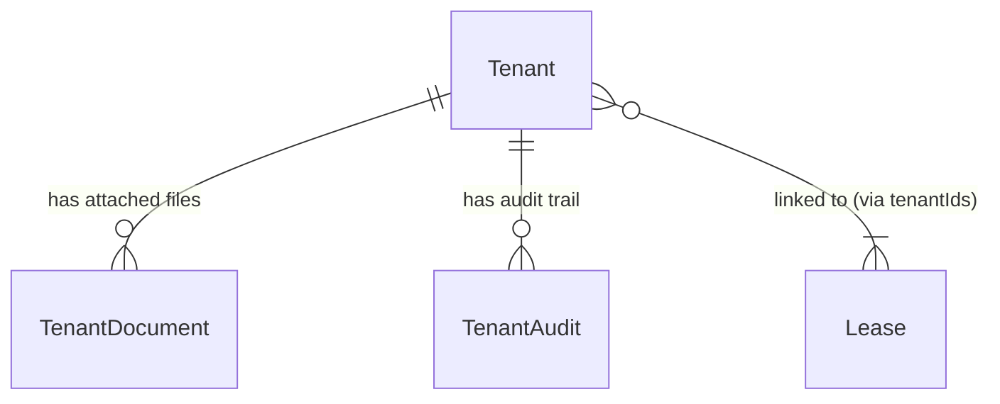

# Tenants Specifications

## Overview

A **tenant** represents a person who rents or has applied to rent a property. Tenants have a lifecycle status that tracks their relationship with the landlord — from initial candidacy through active tenancy to former tenant. The system records an audit trail of all status transitions and allows attaching supporting documents (ID, payslips, etc.) directly to a tenant record.

## Data Model

| Field            | Type    | Description                                                  |
| ---------------- | ------- | ------------------------------------------------------------ |
| `id`             | number  | Auto-generated primary key                                   |
| `civility`       | enum?   | `mr` \| `mme`                                                |
| `firstName`      | string  | First name                                                   |
| `lastName`       | string  | Last name                                                    |
| `email`          | string  | Contact email — **must be unique**                           |
| `phone`          | string  | Contact phone number                                         |
| `birthDate`      | Date?   | Date of birth                                                |
| `currentAddress` | string? | Current residential address                                  |
| `occupation`     | string? | Professional occupation                                      |
| `employer`       | string? | Employer name                                                |
| `income`         | number? | Monthly net income (€)                                       |
| `notes`          | string? | Internal notes                                               |
| `status`         | enum    | `active` \| `candidate` \| `former` \| `candidature-refusee` |
| `createdAt`      | Date    | Creation timestamp                                           |
| `updatedAt`      | Date    | Last update timestamp                                        |

### TenantDocument (attached files)

| Field        | Type    | Description                             |
| ------------ | ------- | --------------------------------------- |
| `id`         | number  | Auto-generated                          |
| `tenantId`   | number  | Reference to tenant                     |
| `name`       | string  | File name                               |
| `mimeType`   | string  | MIME type                               |
| `size`       | number  | File size in bytes                      |
| `uploadedAt` | Date    | Upload timestamp                        |
| `notes`      | string? | Notes about this document               |
| `data`       | Blob?   | File binary content                     |
| `documentId` | number? | Cross-reference to main documents table |

### TenantAudit (status change history)

| Field         | Type      | Description                                        |
| ------------- | --------- | -------------------------------------------------- |
| `id`          | number    | Auto-generated                                     |
| `tenantId`    | number    | Reference to tenant                                |
| `action`      | enum      | `created` \| `updated` \| `validated` \| `refused` |
| `timestamp`   | Date      | When the action occurred                           |
| `reason`      | string?   | Reason for refusal or note                         |
| `documentIds` | number[]? | Supporting documents used as evidence              |

## Status Lifecycle

```mermaid
stateDiagram-v2
    [*] --> candidate : Created as candidate
    [*] --> active : Created directly as active
    candidate --> active : Validated (lease created or manual validation)
    candidate --> candidature-refusee : Refused by landlord
    active --> former : Active lease terminated
    candidature-refusee --> candidate : Re-opened for reconsideration
    former --> [*] : (terminal unless manually re-activated)
```

**Rules:**

- `email` must be unique across all tenants
- Status transitions are recorded in `TenantAudit`
- When a candidate is validated, their status changes to `active`
- When a candidate is refused, a reason and optional supporting documents can be recorded
- When an active lease is terminated, all tenants linked to that lease transition to `former`
- A `former` tenant can still be viewed and their documents accessed

## Domain Rules

- `firstName`, `lastName`, `email`, `phone` are required
- `email` must be unique — duplicate emails are rejected
- A tenant with an active lease cannot be deleted
- Audit entries are immutable — they cannot be edited or deleted
- The refusal message has a default template that can be customized

## Relationships



---

## User Stories

### Story: Create a tenant

**As a** landlord  
**I want to** register a new tenant or rental candidate  
**So that** I can manage their application or active tenancy

#### Scenario: Successful tenant creation as active

```gherkin
Given I am on the Tenants page
When I click "Add tenant"
And I fill in firstName "Marie"
And I fill in lastName "Dupont"
And I fill in email "marie.dupont@example.com"
And I fill in phone "0612345678"
And I select status "active"
And I save
Then tenant "Marie Dupont" appears in the tenants list
And a TenantAudit entry with action "created" is recorded
And the active tenants count increases by 1
```

#### Scenario: Successful tenant creation as candidate

```gherkin
Given I am on the "Add tenant" form
When I fill in all required fields with status "candidate"
And I save
Then the tenant appears with a "Candidate" status badge
And they appear in the Candidates filter
```

#### Scenario: Attempt to create tenant with duplicate email

```gherkin
Given a tenant with email "jean.martin@example.com" already exists
When I try to create another tenant with email "jean.martin@example.com"
Then a validation error appears: "This email address is already in use"
And no tenant is created
```

#### Scenario: Attempt to create tenant with missing required fields

```gherkin
Given I am on the "Add tenant" form
When I submit without filling in the email field
Then a validation error highlights the email field as required
And the form is not submitted
```

---

### Story: Edit a tenant

**As a** landlord  
**I want to** update a tenant's personal or financial information  
**So that** their profile stays accurate

#### Scenario: Successful edit

```gherkin
Given tenant "Marie Dupont" exists
When I open her profile
And I update her income to "2500"
And I save
Then her income shows "2 500 €" on her profile
And a TenantAudit entry with action "updated" is recorded
And the updatedAt timestamp is refreshed
```

#### Scenario: Edit email to an already-used address

```gherkin
Given tenant A has email "a@example.com" and tenant B has email "b@example.com"
When I try to change tenant A's email to "b@example.com"
Then a validation error appears: "This email address is already in use"
And tenant A's email remains "a@example.com"
```

---

### Story: Delete a tenant

**As a** landlord  
**I want to** remove a tenant who is no longer relevant  
**So that** my tenant list stays clean

#### Scenario: Successful deletion of a former tenant

```gherkin
Given a tenant with status "former" has no active lease
When I click "Delete" on the tenant
And I confirm the deletion dialog
Then the tenant no longer appears in the list
And their TenantDocuments and TenantAudit records are removed
```

#### Scenario: Attempt to delete a tenant with an active lease

```gherkin
Given a tenant with status "active" is linked to an active lease
When I attempt to delete the tenant
Then the system shows an error: "Cannot delete a tenant linked to an active lease"
And the tenant remains in the list
```

---

### Story: Search and filter tenants

**As a** landlord  
**I want to** search by name or email and filter by status  
**So that** I can quickly find a specific person

#### Scenario: Filter by status "active"

```gherkin
Given I have 5 tenants: 3 active, 1 candidate, 1 former
When I apply the filter "Active"
Then only the 3 active tenants are displayed
```

#### Scenario: Filter by status "candidate"

```gherkin
Given I have tenants with various statuses
When I apply the filter "Candidate"
Then only tenants with status "candidate" are shown
```

#### Scenario: Search by name

```gherkin
Given multiple tenants exist
When I type "Dupont" in the search input
Then only tenants whose first or last name contains "Dupont" are shown
```

#### Scenario: Search by email

```gherkin
Given tenant "marie.dupont@example.com" exists
When I search for "marie.dupont"
Then that tenant appears in the results
```

---

### Story: Validate a rental candidate

**As a** landlord  
**I want to** formally validate a candidate's application  
**So that** their status is updated and I can create a lease for them

#### Scenario: Validate a candidate

```gherkin
Given a tenant "Paul Martin" has status "candidate"
When I open his profile
And I click "Validate candidate"
And I confirm the action
Then Paul's status changes to "active"
And a TenantAudit entry with action "validated" and timestamp is recorded
And Paul appears in the "Active" filter
And Paul no longer appears in the "Candidate" filter
```

---

### Story: Refuse a rental candidate

**As a** landlord  
**I want to** formally refuse a candidate's application with a reason  
**So that** the decision is recorded and the candidate can be informed

#### Scenario: Refuse with reason

```gherkin
Given a tenant "Alice Bernard" has status "candidate"
When I open her profile
And I click "Refuse candidate"
And I type a refusal reason in the dialog
And I confirm
Then Alice's status changes to "candidature-refusee"
And a TenantAudit entry with action "refused" and the reason is recorded
And Alice no longer appears in the "Candidate" filter
And Alice appears in the "Refused" filter
```

#### Scenario: Refuse using the default refusal message

```gherkin
Given I open the refusal dialog for a candidate
When I view the refusal message field
Then it is pre-filled with the default rejection message template
And I can edit it before confirming
```

#### Scenario: Re-open a refused application

```gherkin
Given a tenant has status "candidature-refusee"
When I change their status back to "candidate"
Then their status badge changes to "Candidate"
And a TenantAudit entry records the re-opening
```

---

### Story: Attach documents to a tenant

**As a** landlord  
**I want to** upload supporting documents (ID, payslips, insurance) to a tenant's file  
**So that** all required documents are in one place

#### Scenario: Upload a document

```gherkin
Given I am on tenant "Marie Dupont"'s detail page
When I go to the Documents tab
And I upload a PDF file "fiche-salaire.pdf"
And I add notes "Fiche de salaire mars 2026"
Then the document appears in Marie's document list
And its size and name are displayed
```

#### Scenario: Upload multiple documents

```gherkin
Given I am on a tenant's document page
When I upload 3 files successively
Then all 3 documents appear in the list ordered by upload date
```

#### Scenario: Delete a tenant document

```gherkin
Given tenant "Paul Martin" has 2 documents attached
When I delete one document
And I confirm the deletion
Then only 1 document remains in the list
And the deleted file's data is removed from the database
```

---

### Story: View a tenant's audit trail

**As a** landlord  
**I want to** see the history of all status changes for a tenant  
**So that** I have a complete record of decisions made

#### Scenario: View audit history

```gherkin
Given tenant "Alice Bernard" has been created, validated, then had their lease terminated
When I navigate to the "History" tab on Alice's profile
Then I see chronological entries:
  - "created" on [creation date]
  - "validated" on [validation date]
  - "updated" on [lease termination date] (status changed to former)
And each entry shows the timestamp
```
