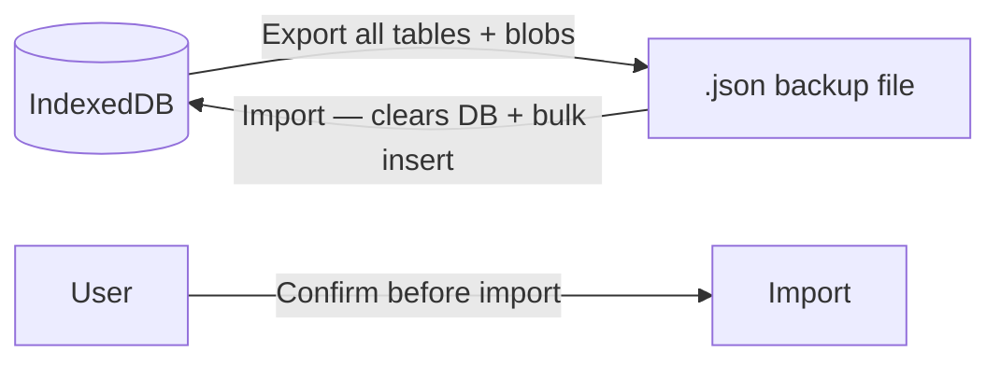

# Data Transfer Specifications

## Overview

The **data transfer** module allows the landlord to export all application data as a backup file and import it later to restore the application state. Since Locapilot is an offline-first PWA with no backend, this is the primary mechanism for data safety, device migration, and disaster recovery. The export includes binary document blobs to ensure full fidelity of the backup.

## Domain Rules

- **Export** serializes all tables (properties, tenants, leases, rents, documents, tenantDocuments, tenantAudits, inventories, communications, chargesAdjustments, settings) into a single file
- **Import** completely replaces the current database content — it is a destructive operation
- The user must explicitly confirm before an import proceeds
- Document `Blob` data is included in the export to preserve attached files
- The raw `exportData()` function (from schema.ts) does NOT include Blob data — only the `dataTransferService` export does full binary preservation
- Import is transactional: if it fails, the database is not left in a partial state

## Export Format

```json
{
  "version": 1,
  "exportDate": "2026-06-28T10:00:00.000Z",
  "properties": [...],
  "tenants": [...],
  "leases": [...],
  "rents": [...],
  "documents": [...],
  "tenantDocuments": [...],
  "tenantAudits": [...],
  "inventories": [...],
  "communications": [...],
  "chargesAdjustments": [...],
  "settings": [...]
}
```

## Data Flow



---

## User Stories

### Story: Export data as a backup

**As a** landlord  
**I want to** download all my data as a JSON backup file  
**So that** I can store it safely and restore it if needed

#### Scenario: Successful full export

```gherkin
Given I have properties, tenants, leases, rents, and documents in the database
When I navigate to Settings and click "Export data"
Then a JSON file is downloaded to my filesystem
And the filename contains the export date (e.g. "locapilot-export-2026-06-28.json")
And the file contains all entity tables including document binary data
```

#### Scenario: Export with an empty database

```gherkin
Given the database contains no data
When I trigger an export
Then a valid JSON file is downloaded
And it contains empty arrays for all tables
And it includes the schema version and export date
```

#### Scenario: Export progress feedback

```gherkin
Given I have a large dataset with many document attachments
When I click "Export data"
Then a loading indicator appears while the export is being prepared
And a success notification appears when the download starts
```

---

### Story: Import data from a backup

**As a** landlord  
**I want to** restore my data from a previously exported backup  
**So that** I can recover from data loss or migrate to a new device

#### Scenario: Successful import

```gherkin
Given I have a valid "locapilot-export-2026-06-28.json" backup file
When I navigate to Settings and click "Import data"
And I select the backup file
And I read the warning: "This will replace ALL current data"
And I confirm the import
Then the current database is completely cleared
And all data from the backup file is loaded into IndexedDB
And a success notification appears: "Data imported successfully"
And I can navigate to Properties and see the restored properties
```

#### Scenario: Import is cancelled by the user

```gherkin
Given I am on the import dialog
When I see the confirmation warning
And I click "Cancel"
Then no data is modified
And the current database remains intact
```

#### Scenario: Import with an invalid or corrupted file

```gherkin
Given I select a file that is not a valid Locapilot export (wrong format, truncated)
When the import process begins
Then an error appears: "Invalid backup file — import aborted"
And the database is NOT modified (transaction rollback)
And a notification suggests using a valid backup file
```

#### Scenario: Import on a device with existing data

```gherkin
Given my database has 5 properties and 10 tenants
When I import a backup that has 3 properties and 7 tenants
And I confirm the overwrite
Then my existing 5 properties and 10 tenants are deleted
And the 3 properties and 7 tenants from the backup are loaded
```

---

### Story: Migrate data to a new device

**As a** landlord  
**I want to** transfer my data from one device to another  
**So that** I can continue working on a different computer or browser

#### Scenario: Full migration workflow

```gherkin
Given I am on device A with all my data
When I export from device A (downloads "locapilot-export-2026-06-28.json")
And I copy the file to device B
And I open Locapilot on device B (fresh install, empty database)
And I import the backup file on device B
Then device B has all the same properties, tenants, leases, documents, and settings as device A
And photos and other binary documents are also present
```

---

### Story: Synchronise data between two devices via P2P

**As a** landlord  
**I want to** transfer my data directly from one browser to another without a file  
**So that** I can switch devices quickly without going through a manual export/import

> ⚠️ This feature is experimental. Authentication uses a shared PIN communicated out-of-band.

#### Scenario: Successful P2P synchronisation with correct PIN

```gherkin
Given I am on device A (host) and open Settings > Synchronisation P2P
When I click "Héberger"
Then a session ID and a 6-digit PIN are displayed
And the PIN is NOT included in the session ID

Given I am on device B (client) and open Settings > Synchronisation P2P
When I enter the session ID and the PIN communicated verbally by device A
And I click "Se connecter"
Then a WebRTC connection is established
And device B sends an auth message containing the PIN
And device A verifies the PIN matches

Given the PIN matches
When device A confirms the transfer in the confirmation dialog
Then device A encrypts its full export payload (AES-GCM) and sends it
And device B decrypts the payload
And device B shows a confirmation dialog before importing
And device B imports the data, replacing its local database
And a success message is shown: "Données synchronisées avec succès !"
```

#### Scenario: Connection rejected with wrong PIN

```gherkin
Given device A is hosting with PIN "123456"
When device B connects and sends PIN "000000"
Then device A sends an auth_failed message and closes the connection
And device A shows status: "Connexion rejetée — PIN incorrect"
And device B shows status: "Authentification échouée — PIN incorrect"
And no data is transferred
```

#### Scenario: Host rejects the transfer after authentication

```gherkin
Given device B has authenticated successfully with the correct PIN
When device A is prompted "Un appareil vient de s'authentifier..."
And device A clicks "Annuler"
Then no data is sent
And device A shows status: "Transfert annulé par l'hôte"
And no data is transferred to device B
```

#### Scenario: Client cancels import after receiving data

```gherkin
Given device B has received the encrypted payload from device A
When device B is prompted "Recevoir des données... va remplacer vos données locales"
And device B clicks "Annuler"
Then no import is performed
And device B's local database remains unchanged
```

#### Scenario: Version mismatch between devices

```gherkin
Given device A runs version "1.0.0" and device B runs version "1.1.0"
When device B enters device A's session ID
Then an error is shown: "Version mismatch: remote=... local=..."
And the connection is not attempted
```

#### Scenario: Second device attempts to connect while host is busy

```gherkin
Given device A is already connected to device B
When device C attempts to connect to device A's session ID
Then device A closes device C's connection immediately
And device C receives a connection error
```
