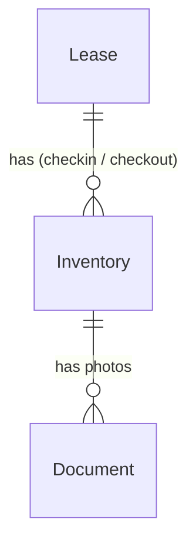
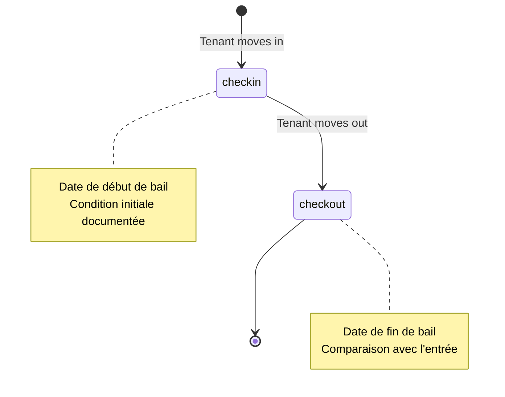

# Inventories Specifications

## Overview

An **inventory** (état des lieux) is a property condition report created at the start or end of a tenancy. It documents the state of each room and item at a specific date, allowing comparison between check-in and check-out to assess wear and potential damage. Inventories are linked to a specific lease and can include photos and item-level condition assessments organized by room.

## Data Model

### Inventory

| Field          | Type                   | Description                                     |
| -------------- | ---------------------- | ----------------------------------------------- |
| `id`           | number                 | Auto-generated primary key                      |
| `leaseId`      | number                 | Reference to the parent lease                   |
| `type`         | enum                   | `checkin` \| `checkout`                         |
| `date`         | Date                   | Date of the inventory inspection                |
| `observations` | string?                | General free-text observations                  |
| `photos`       | number[]?              | Array of Document IDs (photo type)              |
| `rooms`        | InventoryRoom[]?       | Structured per-room inspection data (preferred) |
| `roomsData`    | Record\<string, any\>? | _Deprecated_ flexible per-room item data        |
| `signature`    | InventorySignature?    | Timestamped acceptance record                   |
| `createdAt`    | Date?                  | Creation timestamp                              |
| `updatedAt`    | Date?                  | Last update timestamp                           |

### InventoryRoom

| Field   | Type                | Description                          |
| ------- | ------------------- | ------------------------------------ |
| `name`  | string              | Room name (e.g. "Séjour", "Cuisine") |
| `items` | InventoryRoomItem[] | Inspected elements within the room   |

### InventoryRoomItem

| Field       | Type      | Description                                            |
| ----------- | --------- | ------------------------------------------------------ |
| `label`     | string    | Element name (e.g. "Murs", "Sol", "Fenêtres")          |
| `condition` | enum      | `excellent` \| `good` \| `fair` \| `poor` \| `damaged` |
| `notes`     | string?   | Additional notes for this element                      |
| `photos`    | number[]? | Document IDs for element-specific photos               |

### InventorySignature

| Field              | Type    | Description                                     |
| ------------------ | ------- | ----------------------------------------------- |
| `tenantAccepted`   | boolean | Tenant accepted/certified the inventory         |
| `landlordAccepted` | boolean | Landlord accepted/certified the inventory       |
| `acceptedAt`       | Date?   | Timestamp set as soon as one party accepts      |
| `tenantName`       | string? | Optional free-text name of the accepting tenant |

### InventoryItem (legacy, embedded in roomsData)

| Field       | Type      | Description                                            |
| ----------- | --------- | ------------------------------------------------------ |
| `room`      | string    | Room name (e.g. "Living room", "Kitchen")              |
| `item`      | string    | Item name (e.g. "Walls", "Floor", "Window")            |
| `condition` | enum      | `excellent` \| `good` \| `fair` \| `poor` \| `damaged` |
| `notes`     | string?   | Additional notes for this item                         |
| `photos`    | number[]? | Document IDs for item-specific photos                  |

## Condition Scale & Comparison

Conditions are ordered from best to worst: `excellent` (4) > `good` (3) > `fair` (2) > `poor` (1) > `damaged` (0).

When comparing a check-in and a check-out inventory element by element, the drop in
score determines the status:

| Drop (levels) | Status          | Meaning                                   |
| ------------- | --------------- | ----------------------------------------- |
| improvement   | `improved`      | Condition is better at check-out          |
| 0             | `unchanged`     | Identical condition                       |
| 1             | `normal-wear`   | Normal rental wear and tear               |
| ≥ 2           | `deterioration` | **Abnormal** wear — appears in the report |
| —             | `added`         | Element only present at check-out         |
| —             | `removed`       | Element only present at check-in          |

The **abnormal wear report** lists only elements with a drop ≥ 2 levels, sorted by severity.

## Inventory Types

| Type       | French | Description                         |
| ---------- | ------ | ----------------------------------- |
| `checkin`  | Entrée | Performed when the tenant moves in  |
| `checkout` | Sortie | Performed when the tenant moves out |

## Domain Rules

- Each inventory is linked to exactly one `leaseId`
- `date` is required
- `type` must be either `checkin` or `checkout`
- A lease can have at most one `checkin` inventory and one `checkout` inventory
- Photos are stored as Document records with type `photo` linked via `relatedEntityType: inventory`
- `rooms` holds the structured inspection (preferred); `roomsData` is kept for backward compatibility
- A pre-filled **standard template** (calqué sur un constat réel : Relevé des compteurs, Liste des clés, Boîte aux lettres / annexes, Accès / entrée, Cuisine + séjour, Salle de bains, Chambre, Balcon) can be applied; every element starts at `good`
- Comparison requires both a `checkin` **and** a `checkout` inventory on the same lease
- Abnormal wear = an element dropping ≥ 2 condition levels between check-in and check-out
- Acceptance is recorded via `signature`; `acceptedAt` is set automatically as soon as a party accepts

## Relationships





---

## User Stories

### Story: Create a check-in inventory

**As a** landlord  
**I want to** document the property condition when a tenant moves in  
**So that** I have a reference state for the end-of-lease comparison

#### Scenario: Successful check-in inventory creation

```gherkin
Given a lease for property "Studio Belleville" is active
When I navigate to the Inventories page
And I click "New inventory"
And I select the lease for "Studio Belleville"
And I select type "check-in"
And I fill in date "2026-01-02"
And I fill in observations "Property in good condition, freshly painted"
And I save
Then the inventory appears in the inventories list
And it shows type "Check-in", date "02/01/2026", linked to "Studio Belleville"
```

#### Scenario: Check-in inventory with room items

```gherkin
Given I am creating a check-in inventory
When I add a room "Living room"
And I add item "Walls" with condition "good" and notes "Minor scuff near entrance"
And I add item "Floor" with condition "excellent"
And I save
Then the inventory contains the room "Living room" with 2 items
And each item's condition is stored
```

#### Scenario: Attempt to create a second check-in for the same lease

```gherkin
Given a check-in inventory already exists for lease #42
When I try to create another check-in inventory for lease #42
Then a warning appears: "A check-in inventory already exists for this lease"
And creation is blocked or requires explicit override confirmation
```

---

### Story: Create a check-out inventory

**As a** landlord  
**I want to** document the property condition when a tenant moves out  
**So that** I can assess any damage relative to the check-in state

#### Scenario: Successful check-out inventory creation

```gherkin
Given a lease has a check-in inventory dated 2026-01-02
And the lease is being terminated
When I create a check-out inventory
And I fill in date "2026-12-31"
And I add observations "Crack in bathroom tiles, noted"
Then a checkout inventory is created linked to the same lease
And I can compare room conditions side by side with the check-in (if the UI supports it)
```

---

### Story: Add photos to an inventory

**As a** landlord  
**I want to** attach photos to an inventory  
**So that** the condition is visually documented

#### Scenario: Upload photos to an inventory

```gherkin
Given I am editing or viewing an inventory
When I upload 3 photos (jpeg images)
Then the photos appear in the inventory's photo gallery
And each photo is stored as a Document with type "photo" linked to this inventory
```

#### Scenario: Add item-level photos

```gherkin
Given an inventory item "Bathroom tiles" has condition "damaged"
When I attach a photo specifically to that item
Then the photo is linked to that item within roomsData
And it appears in the item detail
```

---

### Story: Filter and search inventories

**As a** landlord  
**I want to** filter inventories by type and search by property or tenant name  
**So that** I can quickly find a specific état des lieux

#### Scenario: Filter by type "check-in"

```gherkin
Given I have 4 inventories: 2 check-in and 2 check-out
When I apply the filter "Check-in"
Then only the 2 check-in inventories are displayed
```

#### Scenario: Filter by type "check-out"

```gherkin
Given I have mixed inventory types
When I apply the filter "Check-out"
Then only checkout inventories appear
```

#### Scenario: Search by property name

```gherkin
Given an inventory is linked to a lease for property "Studio Belleville"
When I type "Belleville" in the search field
Then that inventory appears in the results
```

---

### Story: View inventory detail

**As a** landlord  
**I want to** see the complete details of an inventory  
**So that** I can review room conditions and photos

#### Scenario: Navigate to inventory detail

```gherkin
Given an inventory exists for "Studio Belleville"
When I click on the inventory card
Then I am taken to the inventory detail page
And I can see: type, date, lease/property info, observations, room items with conditions, and photos
```

---

### Story: Delete an inventory

**As a** landlord  
**I want to** remove an inventory created in error  
**So that** only valid états des lieux are kept

#### Scenario: Successful deletion

```gherkin
Given an inventory exists for a lease
When I click "Delete" on the inventory card
And I confirm the deletion dialog
Then the inventory disappears from the list
And its associated photos are removed from storage
```

#### Scenario: Deletion warning if lease is active

```gherkin
Given an inventory is the only check-in record for an active lease
When I attempt to delete it
Then a warning message indicates this is the check-in record for an active lease
And deletion requires explicit confirmation
```

---

### Story: Apply a standard room template

**As a** landlord
**I want to** pre-fill an inventory with standard rooms and elements
**So that** I don't have to type every room and element by hand

#### Scenario: Apply the standard template

```gherkin
Given I am creating a new inventory
When I click "Modèle standard"
Then the rooms editor is filled with the standard sections (Relevé des compteurs, Liste des clés, Boîte aux lettres / annexes, Accès / entrée, Cuisine + séjour, Salle de bains, Chambre, Balcon)
And every element is initialised with condition "Bon état"
```

#### Scenario: Add a single standard room

```gherkin
Given I am editing the rooms of an inventory
When I click the "+ Chambre" chip
Then a "Chambre" room is appended with its standard elements
```

#### Scenario: Replace existing rooms confirmation

```gherkin
Given the rooms editor already contains rooms
When I click "Modèle standard"
Then I am asked to confirm replacing the current rooms
And the rooms are replaced only if I confirm
```

---

### Story: Compare check-in and check-out states

**As a** landlord
**I want to** compare the entry and exit inventories side by side
**So that** I can identify deterioration beyond normal wear

#### Scenario: Comparison highlights abnormal deterioration

```gherkin
Given a lease has a check-in inventory where "Cuisine / Évier" is "Bon état"
And a check-out inventory where "Cuisine / Évier" is "Mauvais état"
When I open the comparison for that lease
Then the row "Cuisine / Évier" is flagged as "Dégradation"
And it is highlighted as abnormal wear
```

#### Scenario: Single-level drop counted as normal wear

```gherkin
Given an element is "Excellent" at check-in and "Bon état" at check-out
When I open the comparison
Then the element is flagged as "Usure normale"
And it does not appear in the abnormal wear report
```

#### Scenario: Comparison unavailable without both states

```gherkin
Given a lease has a check-in inventory but no check-out inventory
When I open the comparison view
Then a message states the comparison requires both an entry and an exit state
And it indicates which state is missing
```

---

### Story: Generate an abnormal wear report

**As a** landlord
**I want to** produce a report of abnormal wear
**So that** I can justify withholding part of the deposit

#### Scenario: Wear report lists only abnormal deteriorations

```gherkin
Given a comparison contains 1 abnormal deterioration and 3 normal-wear elements
When I view the abnormal wear report
Then only the 1 abnormal deterioration is listed
And items are sorted by severity (largest drop first)
```

#### Scenario: Print the wear report

```gherkin
Given a comparison is available
When I click "Imprimer le rapport"
Then the browser print dialog opens with the report content
```

#### Scenario: No abnormal wear

```gherkin
Given check-in and check-out conditions are identical
When I view the abnormal wear report
Then it states no abnormal deterioration was detected
```

---

### Story: Record acceptance of an inventory

**As a** landlord
**I want to** record a timestamped acceptance of the inventory
**So that** both parties acknowledge the documented condition

#### Scenario: Timestamped acceptance

```gherkin
Given I am editing an inventory
When I check "Le bailleur accepte et certifie cet état des lieux"
Then a timestamp of the acceptance is recorded and displayed
And the acceptance is saved with the inventory
```

#### Scenario: Removing all acceptances clears the timestamp

```gherkin
Given an inventory has a recorded acceptance
When I uncheck all acceptance boxes
Then the acceptance timestamp is cleared
```
